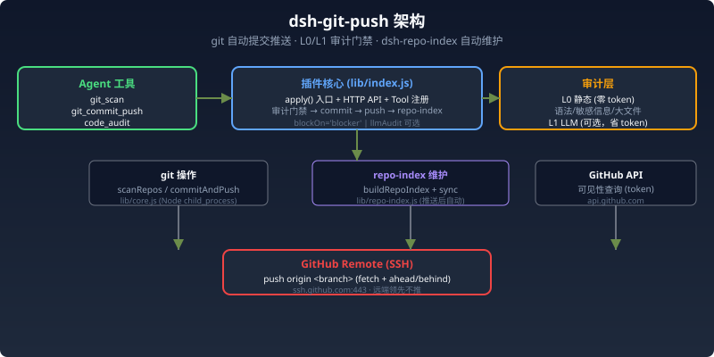

# dsh-git-push

DSH（DeepSeek Harness）git 自动提交推送插件 v1.5.0。把"扫描仓库 → **审计** → 一键 commit + push → **自动维护 dsh-repo-index 源码索引**"固化为 agent 工具与 HTTP API，**执行零 token 消耗、确定性输出**（相比每次让 AI 手敲 git 命令）。

## 功能



- **git_scan**：扫描 DSH workspace 下全部 git 仓库，返回分支 / remote / 未提交变更数 / 最近活动
- **git_commit_push**：对指定仓库一键 `git add -A → commit → push`，自动处理：
  - **推送前代码审计**（v1.1.0 内置，默认开）：L0 静态检查（语法 / JSON / YAML / 敏感信息硬编码 / 凭据入库 / npm 包文件入库 / 二进制大文件 / debugger 残留 / 文档对话类措辞），发现严重问题**拦截提交**
  - 可选 **L1 LLM 深度审查**（默认关，省 token）：diff 喂便宜模型（如 agnes-2.5-flash / deepseek-chat）找逻辑/安全问题，实测可精准检出越界、空值、除零等 bug
  - 自动识别当前分支（master / main 不硬编码）
  - push 前 `fetch` + `rev-list` 检查 ahead/behind，**远端领先时不推**
  - 无变更自动跳过（不产生空提交）
  - `-c safe.directory=` 兼容 CIFS 只读卷（如 /vol02）
- **dsh-repo-index 自动维护**（v1.3.0 新增）：`git_commit_push` **推送成功后**自动重新生成 `dsh-repo-index.md`（本机全部 DSH 插件/项目的唯一权威源码索引 skill）：
  - 仓库清单来自 git remote，自动分「GitHub 仓库」与「本地 only」两部分
  - 「对应 skill」列自动填充：读各项目 `package.json dsh.skills` + `skills/*.md` frontmatter
  - 可见性（公开/私有）用 GitHub API（token）查询，查不到回退手工标注/标「未知」
  - 权威源 = 插件项目 `skills/dsh-repo-index.md`（随 git 版本管理），同步副本 = 运行实例用户级 skills 目录
- **code_audit**：手动审计指定仓库（`llm=true` 追加深度审查）
- **文档对话类措辞拦截**（v1.4.0 新增）：L0 审计对文档文件（md/markdown/mdx/txt）的**新增行**检查「AI 与用户沟通过程」类措辞（会话引用 / 用户决策来源 / AI 许可表述 / 商量转述等），命中即 blocker——公开仓库只提交「做了什么」，沟通/需求/移交/待办类文档统一放 `data/沟通文档`
- **审计豁免类型**（v1.5.0 新增）：①**说明类**——文档/示例代码里用于举例的**假凭据**不报敏感信息（值含 假/fake/示例/演示/占位符 your- 等，或行内含「例如/举例/示例」等示例词）；②**备份类**——配置 `exemptRepos` 白名单（私有/备份仓库）跳过敏感内容规则（secret / 凭据文件 / 对话措辞），其余规则（语法/JSON/YAML/大文件）照常，结果标注 `exempted:true`
- **HTTP API**：`status` / `scan` / `audit` / `commit`，curl 即可调用，便于外部脚本/定时任务接入

## 安装

```bash
# 1. 源码放 node_modules_local/ 或 workspace 独立目录，注册三要素：
#    package.json 加 "dsh-git-push": "file:./node_modules_local/dsh-git-push"（或相对路径）
#    node_modules 补软链
#    cordis.patch.yml 追加：
- insert:
    - id: git-push
      name: dsh-git-push
      config:
        workspaceRoot: '/vol1/@appshare/DeepSeekHarness/workspace'
        extraRepos: ['/vol02/1000-0-1789e550/gamebanana-mods-downloader']
        # llmAuditProvider: "free"          # 可选：LLM 审查用便宜模型
        # llmAuditModel: "agnes-2.5-flash"  # 如 agnes / deepseek-chat
        # llmAudit: true                    # 默认 false（省钱）
        # blockOn: "blocker"                # 'blocker'=仅严重问题拦截（默认）| 'any'=任何问题拦截
        # repoIndexTokenPath: '~/.dsh/git-rescue/token'   # 可选：GitHub 可见性查询 token
        # repoIndexSyncTarget: ''           # 可选：索引同步副本路径（默认探测 DSH_HOME/skills）
# 2. 重启 DSH（改 patch 必须重启）
```

## API

| 接口 | 说明 |
|---|---|
| `GET /api/git-push/status` | 插件状态（版本 + 配置 + 审计开关 + repoIndex + git 版本） |
| `GET /api/git-push/scan` | 扫描全部仓库状态 |
| `GET /api/git-push/audit?repo=<路径>&llm=true` | 审计指定仓库（llm=true 追加 LLM 深度审查） |
| `POST /api/git-push/commit` | `{repo, message, push?, dryRun?, audit?, llmAudit?}` 审计通过后一键提交推送（推送成功自动维护 dsh-repo-index） |

```bash
# 查看插件状态
curl -s http://127.0.0.1:3083/api/git-push/status

# 扫描全部仓库
curl -s http://127.0.0.1:3083/api/git-push/scan

# 审计一个仓库（L0 静态）
curl -s 'http://127.0.0.1:3083/api/git-push/audit?repo=/vol1/@appshare/DeepSeekHarness/workspace/ai-work-archive'

# 追加 LLM 深度审查
curl -s 'http://127.0.0.1:3083/api/git-push/audit?repo=/vol1/@appshare/DeepSeekHarness/workspace/ai-work-archive&llm=true'

# 提交（默认先审计，发现严重问题拦截返回 findings）
curl -s -X POST http://127.0.0.1:3083/api/git-push/commit -H 'Content-Type: application/json' \
  -d '{"repo":"/vol1/@appshare/DeepSeekHarness/workspace/ai-work-archive","message":"feat: xxx","audit":true}'
```

预期输出（status）：

```json
{
  "ok": true,
  "plugin": "dsh-git-push",
  "version": "1.5.0",
  "audit": { "auditEnabled": true, "blockOn": "blocker", "llmAudit": false },
  "repoIndex": { "enabled": true }
}
```

## 工具（agent 会话内直接调用）

- `git_scan`：查看哪些仓库有未提交/未推送改动
- `git_commit_push`：`{repo, message, push?, dryRun?, audit?, llmAudit?}` 提交推送（默认先审计；推送成功后自动维护 dsh-repo-index）
- `code_audit`：`{repo, llm?}` 手动审计仓库

## 配置

| 字段 | 默认 | 说明 |
|---|---|---|
| `workspaceRoot` | `process.cwd()` | 扫描根目录 |
| `extraRepos` | `[]` | 额外仓库绝对路径（find 范围外） |
| `depth` | `3` | find 深度 |
| `auditEnabled` | `true` | 提交前 L0 静态审计开关 |
| `blockOn` | `'blocker'` | 拦截策略：`blocker`=仅严重问题拦截（语法/敏感信息/凭据/大文件）| `any`=任何问题（含 warning）拦截 |
| `llmAudit` | `false` | L1 LLM 深度审查开关（**默认关，省钱**） |
| `llmAuditProvider` / `llmAuditModel` | `''` | LLM 审查用的便宜模型，如 `free`/`agnes-2.5-flash`、`deepseek`/`deepseek-chat` |
| `maxDiffBytes` | `6000` | LLM 审查的 diff 截断上限 |
| `repoIndexEnabled` | `true` | dsh-repo-index 自动维护开关 |
| `repoIndexTokenPath` | `''` | GitHub token 文件路径（可见性查询；不配则标「未知」/用手工标注） |
| `repoIndexSyncTarget` | `探测` | 索引同步副本路径（默认 `DSH_HOME/skills/dsh-repo-index.md`） |
| `repoIndexLocalOnly` | `[]` | 额外纳入「本地 only」清单的目录名 |
| `exemptRepos` | `[]` | **备份类豁免**：私有/备份仓库清单（绝对路径或目录名），命中的仓库跳过敏感内容规则（secret / 凭据文件 / 对话措辞），其余规则照常 |

## 开发与测试

```bash
node --check lib/core.js && node --check lib/index.js   # 语法
node test-core.mjs    # 核心逻辑 13 项（真实 git 临时仓库）
node test-audit.mjs   # 审计规则 36 项（L0 静态，含 npm 包文件检测 + 文档措辞检查 + 豁免类型）
node test-apply.mjs   # apply mock 16 项（路由 + 工具 + 审计门禁端到端）
node test-repo-index.mjs  # repo-index 维护 20 项（frontmatter/skills 收集/可见性/生成/同步）
```

真机验证：测试实例 3083 加载 v1.2.0，`status/scan/audit/commit` 全通；LLM 审计（agnes-2.5-flash）真实检出越界/空值/除零等逻辑 bug；commit 对含密钥文件/npm lock 文件审计拦截。repo-index 模块单测 20/20（v1.3.0）。

## 已知边界

- push 依赖 SSH remote（本机 git 缺 `remote-https`，SSH 已全局配置）；HTTPS remote 仓库会 push 失败
- 远端领先时拒绝推送（防覆盖），需先 pull
- L1 LLM 审查依赖 DSH llm 服务可用且已配置 `llmAuditProvider/Model`；不可用时自动跳过（不阻断），L0 不受影响
- dsh-repo-index 可见性查询需 GitHub token（`repoIndexTokenPath`）；无 token/网络失败时标「未知」或保留手工标注
- 只做"管道"：commit message 等判断留给 LLM
- docs-conversation 规则只扫描文档类文件（md/markdown/mdx/txt）的**新增行**，代码/配置不查；文档里描述本规则时用「对话类措辞」等概括表述，避免字面写出禁用措辞被自身规则拦下

## 版本记录

| 版本 | 内容 |
|---|---|
| 1.5.0 | **审计豁免类型**：①说明类——示例凭据不报敏感信息（假值 假/fake/示例/占位符 自动识别 + 「例如/举例/示例」示例词上下文整行豁免）；②备份类——`exemptRepos` 白名单仓库跳过敏感内容规则（secret/凭据文件/对话措辞），结果标注 `exempted`；单测 36 项 |
| 1.4.1 | **修复工具结果无法回显 bug（严重）**：git_scan / git_commit_push / code_audit 三个 agent 工具缺 `output.render`（dsh-tools rc.6 起契约必填），触发 `userRender is not a function`——工具执行正常但结果回不来；补齐 render 返回内容块数组（对齐 dsh-session-manager 写法）；status API 版本号同步 |
| 1.4.0 | **文档对话类措辞拦截**：L0 审计对文档文件（md/markdown/mdx/txt）新增行检查「AI 与用户沟通过程」类措辞（会话引用 / 用户决策来源 / AI 许可表述 / 商量转述等），命中即 blocker，防沟通/需求/移交/待办类文档入库；配套约定见 release-docs-rule |
| 1.3.0 | **dsh-repo-index 自动维护**：推送成功后自动生成/同步唯一权威源码索引 skill（仓库清单 + 对应 skill 列 + GitHub API 可见性 + 本地 only）；索引权威源移入本插件 `skills/dsh-repo-index.md` |
| 1.2.0 | **npm 包文件入库拦截**：`package-lock.json` / `yarn.lock` / `pnpm-lock.yaml` / `bun.lock` / `node_modules/` 内容入库时触发 blocker，阻止提交推送；防 CI/CD 误推 node_modules |
| 1.1.0 | 内置代码审计门禁（L0 静态 + L1 LLM 可选）：`git_commit_push` 推送前审计拦截、`code_audit` 工具、`/api/git-push/audit` 端点 |
| 1.0.0 | git 扫描 / 一键提交推送 / HTTP API |

