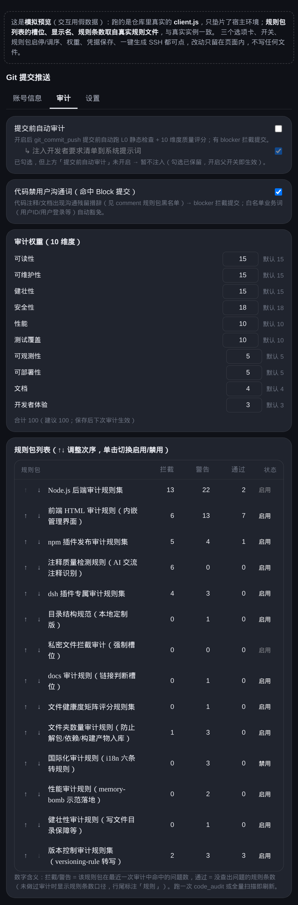
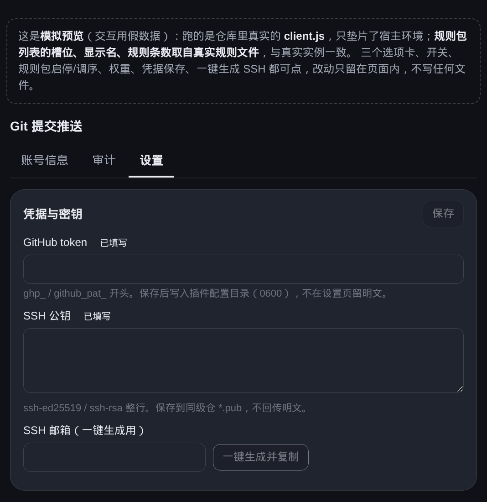

# dsh-git-push

DSH（DeepSeek Harness）git 提交推送与代码审计插件——提交前自动审计门禁，提交推送全链路自动化。


审计面板（14 个规则包 + 按包命中数，上下调次序、单击启停）：



设置面板（凭据 / SSH 公钥 / 审计开关与 10 维度权重）：



> **公开仓库**：EIGHTfs/dsh-git-push（2026-09-13 转 public）｜全量测试 490 全绿（`npm test` 一条命令可复现）
> **界面模拟页**：`assets/preview.html`（单文件自包含，双击即可打开；跑的是真实 `client.js` + 假数据，三选项卡全部可点）
> **截图声明**：`screenshots.json`（仓库根、与 `package.json` 同级，列出 `assets/panel-*.png`）——DSH 插件榜单按此文件自动收录截图，作者推自己的仓库即生效，无需到榜单仓库提 PR

## 目录

- [功能总览](#功能总览)
- [一、提交推送](#一提交推送)
- [二、代码审计](#二代码审计)
- [三、系统提示词注入](#三系统提示词注入)
- [侧边栏设置](#侧边栏设置)
- [独立 CLI（git-sluice）](#独立-cligit-sluice)
- [独立脚本：清洗用户沟通措辞](#独立脚本清洗用户沟通措辞)
- [独立脚本：运行时检测（三层审计 L3）](#独立脚本运行时检测三层审计-l3)
- [安装与要求](#安装与要求)
- [版本列表](#版本列表)
- [注意事项](#注意事项)

## 功能总览

插件围绕 DSH 日常开发的两个高频动作，分为**提交推送**与**代码审计**两大块：

| 功能块 | 做什么 | 入口 |
|---|---|---|
| **提交推送** | token / SSH 密钥管理、提交、推送、clone、建仓、可见性切换、force 强推、版本历史 | `git_commit_push` 工具 / CLI / 侧边栏 |
| **代码审计** | 提交前自动审计门禁、14 个规则槽位 107 条规则、10 维度质量评分、豁免机制、链接检查、**三层审计管线（L1 正则初筛 / L2 AST 数据流 / L3 运行时检测）** | `code_audit` 工具 / CLI / 侧边栏 / 输入框 `/git-audit` |

## 一、提交推送

Git 全链路自动化，token / SSH 凭据管理 + 提交推送，无需手动敲 git 命令。

### 凭据管理

- **Token**：GitHub token（`ghp_` / `github_pat_` 开头），保存即写入插件配置目录 `credentialsDir()/github-token`（**0600 权限**），不落 settings.yaml 明文
- **SSH 公钥**：保存写入 `credentialsDir()/*.pub`（按类型 id_rsa.pub / id_ed25519.pub）；**一键生成密钥对**（邮箱 → `ssh-keygen` 4096 位，公钥自动填入并复制剪贴板，私钥只落本机）
- **账号检测**：`GET /api/git-push/account-check` 在线校验（token 调 api.github.com + SSH 指纹 + 绑定关系），侧边栏账号面板实时显示登录态

### 提交推送能力

| 能力 | 说明 |
|---|---|
| `git_commit_push` | 一键提交+推送（审计门禁默认开启；敏感文件自动 .gitignore；`--push/--no-push/--dry-run/--force/--req-confirm/--json`） |
| 推送通道 | `ssh（默认）`= 只走 SSH 私钥 / `token`= 先走 Git Data API（用 token 推）失败回落 SSH / `auto`= 先 ssh 失败回落 token；远端分叉时不静默回落，如实报错 |
| force 强推 | API 通道重建 commit 去旧 parent / SSH 通道 `git push --force` |
| clone / 建仓 | `cloneViaApi`（trees+blobs 写文件转 git 仓）/ `ensureRemoteRepo`（建仓+设 origin） |
| 可见性 | `setVisibility` PATCH 切换 public/private |
| 网络硬闸 | 只允许 api.github.com（`githubFetch` 拒绝非该域名，不跟随 302） |

### 提交前自动门禁

提交推送前自动跑代码审计（见下节）：**有 blocker 拦截提交**（退出码 2），warning 只提示不拦截。审计通过才执行 commit + push。

## 二、代码审计

提交前自动审计 + 独立全量扫描，规则可扩展，质量可评分。

### 审计入口

- `auditChanged`：变动范围（git diff）——提交前默认
- `auditFull`：全量扫描（非 git 目录可查）
- `code_audit` 工具 / `git-sluice audit` CLI：强度、规则包、权重全覆盖

### 扫描忽略语义（黑名单初筛 + 白名单补充）

全量/变更扫描的目录跳过分三层（lib/skip-dirs.js 统一）：

1. **硬编码基线**（只允许 `node_modules`、`.git`）——机器依赖/内部元数据，**绝对跳过**，不受 gitignore 影响；
2. **yml 黑名单关键词**（规则 yml 的 `exclude_dirs` 并集，如 folder 规则的 `dist/build/vendor/.dsh/.trash` 等）——候选跳过，但若 gitignore 用 `!` 白名单恢复了该目录（如 `server/project/*` + `!server/project/blueprint/`、`/build/*` + `!/build/keep/`），则保留进入（黑名单不压过白名单）；
3. **gitignore 忽略判定**（`git check-ignore`）——被忽略目录整棵跳过；被 `!` 恢复的目录照常进入。

**`.auditignore` 审计豁免文件（2026-09-16，2026-09-18 补非 git 兜底）**：仓库根放一个 `.auditignore`，用 **gitignore 语法**声明「不审计但可入库」的文件/目录：

```
# .auditignore 示例：以下内容照常 git 跟踪/提交，但审计扫描跳过
generated/          # 整棵目录豁免审计
src/vendor.js       # 单文件豁免审计
*.lock              # 匹配 yarn.lock 等 .lock 结尾文件
*.sh                # 按文件类型豁免：所有层级的 .sh（gitignore 语义：无 / 的模式匹配任意深度）
```

- **目录规则**（`generated/`）在遍历时整棵剪枝；**文件级规则**（`src/vendor.js`、`*.lock`、`*.sh`）收集后判定剔除
- **按扩展名豁免**：`*.sh` / `*.png` / `*.min.js` 均可，语义与 gitignore 一致——`*.sh` 匹配**任意层级**的 `.sh`（不是只根目录）；只要根目录用 `/*.sh`。实测 `*.sh` 能命中 `deep/nested/dir/run.sh`
- **否定与恢复**：`!` 前缀恢复审计，且**后面的规则覆盖前面的**（`*.sh` + `!keep.sh` = 只豁免 keep.sh 之外的 .sh）
- **git 仓库**：走 `git check-ignore -c core.excludesFile`，语义与 git 100% 一致
- **非 git 目录（2026-09-18 新增兜底）**：解压的源码包、临时导出目录、未 `git init` 的工程同样生效——改用纯 JS 匹配器 `lib/audit/gitignore-match.js`（零依赖，语义逐条与真 git 对拍，见 `test/test-gitignore-match.mjs`）。此前这类目录下 `.auditignore` **形同不存在**，同一个规则在 `git init` 前后行为相反
- 与 `.gitignore` **叠加生效**（各自独立、互不覆盖）：`.gitignore` 管「不入库」，`.auditignore` 管「不入审计」
- **豁免的文件依旧能入库**——`.auditignore` 只作用于审计扫描，不写进任何 git 配置，`git add` 照常跟踪
- **CLI 与插件天然一致**：`git-sluice audit` / 插件 `code_audit` 共用同一 collector，同一份 `.auditignore` 双端生效
- 与 yml `exclude_dirs` 黑名单的区别：yml 黑名单是**全局规则**（所有仓库都跳）；`.auditignore` 是**仓库级**（仅本仓库豁免，且仍可入库）

新增跳过目录一律改 yml（exclude_dirs），不改代码。要调整各层行为见 `lib/skip-dirs.js` 顶部注释。

### 规则引擎（yml 管理）

规则槽位由目录文件驱动：目录里每个 `audit-rules-<名>.yml` 即一个槽位，**放文件即生效、删文件即移除**，无需改代码。内置 14 个槽位：

| 槽位 | 规则数 | 检查内容 |
|---|---|---|
| nodejs | 37 | 凭据硬编码 / 路径穿越 / 魔数 / 依赖 / 异步等 |
| frontend | 19 | 前端安全 / a11y / 依赖 |
| npm | 10 | 依赖声明 / npmrc 凭据 / 测试入口 |
| version | 8 | 版本号规范 |
| dsh | 7 | DSH 插件契约 / 注入通道 |
| comment | 6 | 注释措辞 / 对话残留 |
| folder | 6 | 目录总数 / 单目录文件数 / 解包特征 / .gitignore / cd 到可能不存在的目录 / 写文件到 .gitignore 忽略目录 |
| i18n | 3 | 硬编码文案 / 插值 / 语言包 |
| performance | 2 | memory-bomb / busy-wait |
| docs / robustness / structure / template / private | 各 0-4 | 链接检查 / 写前 mkdir / 循环依赖 / 规则模板 / 私密文件拦截 |

**加规则 = 放文件**；**加字段类型（新 kind）才需加函数**（compilers.js 注册制：`registerCompiler(kind, detect, compile)`，加字段=加函数+注册一行，`compileRule` 主体永不修改）。

### 目录结构（自动生成）

> 由 `scripts/tree-doc.mjs` 维护：`gen` 生成 / `check` 查漂移 / `apply` 覆盖本节 / `sync` 索引自动同步。
> 注释来源 `tree-doc.json`（路径 → 一句话介绍）：**键集合自动同步**（`sync`/`gen --write` 新增文件自动补键、删除文件自动删键），**描述由 AI/人补**（新键标「（待注释）」）。

<!-- dshgp-tree:start -->
```text
dsh-git-push/
├── lib/ — 核心实现（10 总入口 + 审计引擎 + git 执行层 + 规则编译层）
│   ├── ARCHITECTURE.md — 架构说明文档
│   ├── BUGFIX-NOTES-2026-09-14.md — Bug 修复说明（diff 审计提速 / 凭据文件拦截三层根因）
│   ├── commit-push.js — 审计提交总入口（commitWithAudit + runAudit 同步审计）
│   ├── fsx.js — 文件系统适配层（CIFS/SMB 兼容：copyFile 读写回退、chmod 尽力而为、元数据能力探测）
│   ├── index.js — 插件入口（DSH 接线，再导出全部能力）
│   ├── skip-dirs.js — 跳过目录统一判定（硬编码基线 + yml exclude_dirs 并集 + gitignore 白名单恢复）
│   ├── user-requirements.json — 开发者特殊要求清单（提交推送前逐条核对）
│   ├── app/ — 插件入口层（apply/HTTP 处理/工具调用分发/注入文本/默认扫描根）
│   │   ├── apply.js — 插件装载入口（注册 schema/工具/HTTP/注入钩子）
│   │   ├── constants.js — 插件名与设置命名空间常量
│   │   ├── http-handlers.js — HTTP 路由分发（全部 /api/git-push/* 端点）
│   │   ├── index.js — 插件入口再导出（宿主 main 指向）
│   │   ├── inject-text.js — 注入文本（工具用法提示 FUNCTION_USAGE_HINT）
│   │   ├── scan-root.js — 默认扫描根解析（配置优先→DSH 家根自动识别）
│   │   ├── schema.js — 配置 schema（宿主导出缺失时兜底）
│   │   ├── settings-bridge.js — 设置读写桥（host scope 共享；绕开 client isLoopback=memory 落盘陷阱）
│   │   ├── slash-commands.js — 用户输入框斜杠命令（目前只注册 /git-audit）
│   │   ├── slot-stats.js — 规则槽位命中统计（模块级状态）
│   │   ├── tool-call.js — 工具调用分发（git_scan/commit_push/audit/status 等全部工具）
│   │   ├── tools.js — 工具定义清单（名称/描述/参数 schema）
│   ├── ast/ — AST 实现层（token 级判定：括号/控制流/数据流/凭据/魔数/命名/规模/分词）
│   │   ├── brace.js — 括号配对与区间包含工具
│   │   ├── code-lines.js — 代码行判定（真代码 vs 注释/字符串）+ 字符串字面量提取
│   │   ├── control-flow.js — 控制流检查（同步 fs/空 catch/圈复杂度/嵌套深度）
│   │   ├── credential.js — 凭据标识符判定（硬编码/引用/类型检查）
│   │   ├── dataflow.js — 数据流检查（清空后访问，三层审计 L2）
│   │   ├── index.js — AST 层统一出口
│   │   ├── io-risk-const.js — IO 风险分级·常量与档位工具：fs 调用名集/操作类别/风险标签/搜索窗口与阈值 + raise 升档
│   │   ├── io-risk-fn.js — IO 风险分级·函数边界识别与 token 配对：认普通/箭头/方法简写/类方法，圆括号花括号方括号前后向配对
│   │   ├── io-risk-loop.js — IO 风险分级·循环判定：循环内/迭代器表达式（只执行一次）/小字面量数组降级/collectRanges 范围收集
│   │   ├── io-risk.js — IO 风险分级（四级）判定与评分：scanIoRiskAst 判定上下文/类别 → summarizeIoRisk 统计 → rankIoFixList 优先级清单；并再导出下列三个从属模块的公共符号
│   │   ├── magic-number.js — 硬编码魔数识别（豁免版本号/日期/状态码）
│   │   ├── naming.js — 命名检查（标识符长度/函数名过短/受控小文件读取）
│   │   ├── shell.js — shell 精筛（cd 动态路径/写操作命中 .gitignore）
│   │   ├── size.js — 规模检查（函数长度/文件长度/重复字符串）
│   │   ├── tokenizer.js — 分词器（token 流 + LRU 缓存）
│   ├── audit/ — 审计编排层（文件收集/逐文件检查/槽位聚合/审计出口）
│   │   ├── audit-file.js — 单文件审计执行（跑检查+豁免）
│   │   ├── checks.js — 检查器入口（纯引用表）
│   │   ├── collector.js — 文件收集（gitignore 感知）
│   │   ├── file-context.js — 文件上下文豁免（外部调用超时/mkdir 同函数/版本路径）
│   │   ├── finding.js — 统一问题对象构造器（makeFinding）
│   │   ├── gitignore-match.js — gitignore 语法匹配器（非 git 目录 .auditignore 兜底，语义与 git 对拍）
│   │   ├── glob.js — glob→RegExp 转换（**/*/? 子集）
│   │   ├── index.js — 审计层统一出口（auditFull/auditChanged）
│   │   ├── orchestrate.js — 审计编排（收集→检查→汇总）
│   │   ├── repo-level.js — 仓库级语义规则
│   │   ├── report-yaml.js — （待注释）
│   │   ├── slot.js — 按规则包聚合审计命中（拦截/警告/通过）
│   ├── audit-rules/ — 规则包 yml（nodejs/npm/frontend/comment/dsh/private/structure 等动态槽位）
│   │   ├── audit-rules-comment.yml — 注释类规则（黑名单措辞/对话残留）（规则包 comment）
│   │   ├── audit-rules-docs.yml — 文档类规则（README/文档措辞）（规则包 docs）
│   │   ├── audit-rules-dsh.yml — DSH 生态规则（宿主/插件约定）（规则包 dsh）
│   │   ├── audit-rules-filehealth.yml — 文件健康度规则（三维分级）（规则包 filehealth）
│   │   ├── audit-rules-folder.yml — 目录级规则（目录数/单目录文件数）（规则包 folder）
│   │   ├── audit-rules-frontend.yml — 前端规则（按钮绑定/魔数）（规则包 frontend）
│   │   ├── audit-rules-i18n.yml — i18n 规则（文案硬编码检查）（规则包 i18n）
│   │   ├── audit-rules-nodejs.yml — Node.js 规则（同步 fs/空 catch）（规则包 nodejs）
│   │   ├── audit-rules-npm.yml — npm 规则（package.json 规范）（规则包 npm）
│   │   ├── audit-rules-performance.yml — 性能规则（规则包 performance）
│   │   ├── audit-rules-private.yml — 私密文件规则（凭据/私密清单）（规则包 private）
│   │   ├── audit-rules-robustness.yml — 健壮性规则（规则包 robustness）
│   │   ├── audit-rules-structure.yml — 结构规则（命名/规模/复杂度）（规则包 structure）
│   │   ├── audit-rules-template.yml — 规则模板（新规则包起点）（规则包 template）
│   │   ├── audit-rules-version.yml — 版本规则（版本一致性）（规则包 version）
│   ├── checks/ — 检查层（按 kind 调用检查器：正则/语义/结构/文件健康/按钮绑定/私密文件）
│   │   ├── button-bind.js — 按钮事件绑定交叉比对（声明了但没绑定）
│   │   ├── common.js — 检查器公共设施（豁免提示/severity 封顶/分组）
│   │   ├── credential-file.js — 凭据文件检查（.env/密钥文件）
│   │   ├── dataflow.js — 数据流规则包装（L2 token 级→finding）
│   │   ├── dispatch.js — 调度（runChecks 按 kind 分发汇总）
│   │   ├── file-health.js — 文件健康度（行数/字节/行长三维打分）
│   │   ├── filter.js — 规则作用域过滤（exts/exclude_paths）
│   │   ├── folder.js — 目录级检查（文件夹数/单目录文件数/解包特征）
│   │   ├── index.js — 检查层统一出口
│   │   ├── io.js — IO 风险分级包装：checkIoRisk → lib/ast/io-risk.js（转 warning finding，取代 quality/sync-fs）
│   │   ├── magic-number.js — 魔数检查包装（token 判定→finding）
│   │   ├── npm-json.js — package.json 检查（依赖版本/私有包豁免）
│   │   ├── private.js — 私密文件检查（私有仓可见性核对）
│   │   ├── regex.js — 正则类规则执行（regex/path-regex/blacklist）
│   │   ├── semantic.js — 语义类规则执行（patch insert/仓库级语义）
│   │   ├── structural.js — 结构类规则（函数长度/复杂度/嵌套/同步 fs）
│   ├── client/ — 客户端配置（DEFAULT_CONFIG + SETTINGS_SCHEMA 侧边栏设置项定义）
│   │   ├── index.js — 侧边栏设置 UI 总入口（DEFAULT_CONFIG + SETTINGS_SCHEMA）
│   ├── context/ — 上下文注入（给 AI 会话注入环境：目录映射/工具路径/skill 入口）
│   │   ├── index.js — 上下文注入入口（环境注入文本）
│   ├── exempt/ — 豁免机制（dsh-skip-* 注释标记解析与文件头/行内语义）
│   │   ├── index.js — 豁免注册表（dsh-skip-* 全标记消费）
│   ├── git/ — Git 执行层（runGit/账号/API/克隆/凭据/推送/扫描/索引维护/敏感扫描/传输通道）
│   │   ├── account-status.js — （待注释）
│   │   ├── account.js — 账号校验（token 在线 + SSH 公钥指纹，输出账号状态块）
│   │   ├── api.js — GitHub REST 调用（githubFetch 统一 token/错误识别）
│   │   ├── atomic-json.js — 统一 JSON 原子读写（readJson/writeJsonAtomic/updateJsonAtomic/writeTextAtomic）
│   │   ├── browse.js — 目录浏览（账号卡片路径选择器后端）
│   │   ├── clone-download.js — 并发下载 + .part 断点续传 + 体积守卫 + 进度回调
│   │   ├── clone-jobs.js — clone 进度/预览内存态（供前端轮询）
│   │   ├── clone.js — 克隆（Git Data API，不依赖本地凭据）
│   │   ├── cloud.js — 云端仓库列表（/user/repos 供手动 clone）
│   │   ├── config.js — 路径与配置（PLUGIN_ROOT + 开发者要求清单读取）
│   │   ├── credentials.js — 凭据解析（token/SSH 私钥：环境变量→凭据文件→settings）
│   │   ├── exec.js — git 进程调用（runGit 统一超时/错误规整 + gitRaw 原始字节）
│   │   ├── ignore.js — .gitignore 兜底（DEFAULT_IGNORE_PATTERNS 补齐）
│   │   ├── index.js — Git 执行层统一出口
│   │   ├── post-push.js — 推送后增强（remote-tracking ref/aux remote/tag）
│   │   ├── push.js — 提交推送编排（commitAndPush 全流程：敏感扫描→add/commit→推送）
│   │   ├── remote.js — 远端仓库管理（建仓默认 private/可见性切换）
│   │   ├── repo-index.js — dsh-repo-index 自动维护（扫描 workspace 生成索引 JSON）
│   │   ├── repos.js — 仓库扫描与展示（describeRepo 分支/远端/领先落后/未提交）
│   │   ├── scan-runner.js — （待注释）
│   │   ├── sensitive.js — 敏感信息扫描（提交前拦截密钥/凭据/私密文件）
│   │   ├── transport.js — 推送通道（dispatchPush 决策：SSH/API/auto + 结果核对）
│   ├── http/ — HTTP 总入口（鉴权中间件 + 端点处理器骨架）
│   │   ├── index.js — HTTP 总入口（Origin/CSRF/写确认/413/路由分发）
│   ├── link-check/ — 链接判断（文档链接有效性，只 warning 永不 blocker）
│   │   ├── index.js — 链接判断总入口（分级扣分，断网不拦）
│   ├── plugin/ — Host 侧接线层（插件注册到 DSH：工具/HTTP/配置 schema）
│   │   ├── index.js — Host 侧接线（插件注册：工具/HTTP/配置注入宿主）
│   ├── readme-gen/ — README 生成（git_gen_readme 工具模板渲染）
│   │   ├── index.js — README 生成总入口（git_gen_readme 模板渲染）
│   ├── readme-templates/ — README 模板 yml
│   │   ├── readme.yml — README 章节模板（git_gen_readme 用）
│   ├── rule/ — 规则引擎（yml 装载/编译注册表/同形字符检测/槽位启停）
│   │   ├── compilers.js — 规则编译器注册表（纯引用文件）
│   │   ├── homoglyph.js — 同形字符检测（yml kind/id 防 ASCII 混淆）
│   │   ├── loader.js — 规则总入口（yml 装载/解析/槽位启停）
│   │   ├── registry.js — 规则编译注册表核心（compileRule 主体）
│   │   └── …（12 个更深文件）
│   ├── score/ — 10 维度加权评分总入口
│   │   ├── index.js — 评分总入口（10 维度加权）
│   ├── self/ — 插件自身总入口（VERSION/versionInfo/CLI 帮助）
│   │   ├── index.js — 自身总入口（VERSION 一致性/versionInfo）
│   ├── vendor/ — （待注释）
│   │   └── …（2 个更深文件）
├── scripts/ — 开发工具脚本（版本校验/双副本同步/预览服务/README 目录树维护）
│   ├── audit-runtime-check.mjs — 三层审计 L3 运行时检测脚本
│   ├── check.mjs — 语法检查脚本（npm run check）
│   ├── func-index.js — （待注释）
│   ├── preview-server.mjs — 本地真实后端测试服务（preview.html 接真实 handleHttp）
│   ├── probe-recheck.mjs — 探针：「重新检测」按钮链路实测（在线校验 token/SSH）
│   ├── rule-switch.mjs — 规则槽位手动启停 CLI
│   ├── scan-file-io.mjs — 文件读写扫描器（列出所有 fs 读写调用位置 + 路径参数）
│   ├── scan-repos.mjs — （待注释）
│   ├── scan-version.mjs — 版本一致性校验脚本
│   ├── scrub-user-wording.mjs — 清理「用户沟通措辞」独立脚本
│   ├── sync-plugin.mjs — 双副本同步脚本（源仓库 → 部署安装副本）
│   ├── tree-doc.mjs — README 目录结构维护脚本（gen/check/apply）
│   ├── watch-preview.mjs — preview.html 自动重生成监听（源码变更即重建）
├── assets/ — 预览页与配图（preview.html 交互模拟页 + 面板截图）
│   ├── panel-account.png — 账号卡片面板截图（README 配图）
│   ├── panel-audit.png — 审计面板截图（README 配图）
│   ├── panel-settings.png — 设置面板截图（README 配图）
│   ├── preview-gen.mjs — 生成 preview.html（真 client.js + 假数据垫片）
│   ├── preview.html — 侧边栏交互模拟页（可点，支持 ?backend= 接真实后端）
├── test/ — node:test 全量单元测试（541+ 条，覆盖审计/推送/账号/HTTP/后台任务）
│   ├── .test — 空文件豁免标记（目录级豁免 .test 目录）
│   ├── test-account-ssh.mjs — 账号检查 + SSH 密钥测试
│   ├── test-audit-bad-file.mjs — 审计拦截门禁测试（硬编码密码/API key/.env 凭据文件）
│   ├── test-audit-empty.mjs — （待注释）
│   ├── test-audit-scope.mjs — 审计作用域/凭据占位符回归测试
│   ├── test-audit.mjs — 审计总入口测试（auditFull/changed/豁免/gitignore）
│   ├── test-auditignore.mjs — （待注释）
│   ├── test-button-bind.mjs — 按钮绑定交叉比对（jsx 工厂形态/注释过滤/行号归属）
│   ├── test-client.mjs — 侧边栏测试（手写 DOM/零外部资源/开关默认）
│   ├── test-clone-preview-buttons.mjs — clone 预览确认框按钮可点（真渲染+真点击）
│   ├── test-context.mjs — 上下文注入测试
│   ├── test-dataflow.mjs — 三层审计 L2 数据流测试
│   ├── test-exempt.mjs — 豁免总入口测试（7 标记 + 位置语义）
│   ├── test-false-positive-fixes.mjs — 误报修复回归测试
│   ├── test-file-health.mjs — 文件健康度矩阵评分测试
│   ├── test-folder-scope.mjs — 目录级审计作用域回归测试
│   ├── test-git.mjs — git 总入口测试（runGit/commitAndPush/凭据/克隆）
│   ├── test-gitignore-match.mjs — gitignore 兜底匹配（与真 git 对拍 + 非 git 端到端）
│   ├── test-http.mjs — HTTP 总入口测试（Origin/CSRF/413/路由）
│   ├── test-inject-switch.mjs — 注入开发者要求清单子开关回归
│   ├── test-inject-system-prompt.mjs — 注入系统提示词回归
│   ├── test-io-risk.mjs — IO 风险分级测试（四级判定/字段完整性/汇总/排序/finding 转换）
│   ├── test-link-check.mjs — 链接判断测试（分级扣分/断网不拦）
│   ├── test-magic-number.mjs — 硬编码魔数检测测试
│   ├── test-persist-credentials.mjs — 凭据持久化测试
│   ├── test-plugin.mjs — 插件接线测试（入口导出/工具清单/双副本同步）
│   ├── test-push-transport.mjs — 推送通道回归（SSH 优先/一致性语义）
│   ├── test-quality.mjs — 评分总入口测试（AST 质量检查器）
│   ├── test-readme-gen.mjs — README 生成测试（模板渲染/版本表）
│   ├── test-repo-list.mjs — 仓库列表测试（本地扫描/索引读写/HTTP 端点/远端状态）
│   ├── test-rule-packs.mjs — 规则总入口测试（编译注册/字段指派）
│   ├── test-rule-slots-render.mjs — 规则包列表统计渲染回归
│   ├── test-self.mjs — 自身总入口测试（VERSION/CLI/help 比对）
│   ├── test-settings-persistence.mjs — 设置侧边栏持久化专项测试（L1 提交/L2 白名单/L3 回读/L4 消费四层断言）
│   ├── test-sidebar-interaction.mjs — 侧边栏规则包列表交互自检
│   ├── test-sidebar-state.mjs — 设置侧边栏状态自检（设置键回读/凭据已填写判断/统一刷新入口/产物同步）
│   ├── test-slash-commands.mjs — 用户输入框 /git-audit 斜杠命令（解析/接线/对本仓库跑 quick）
│   ├── test-smart-hint.mjs — 扫描智能提示 + 评分对数衰减测试
│   ├── test-status-secret.mjs — token 明文不下发安全回归
│   ├── test-task-queue.mjs — 后台化回归测试（官方 job 注册 / 无 jobs 同步保底 / blocker 拦截）
│   ├── test-tree-doc.mjs — README 目录树脚本测试（gen/check/apply 闭环）
├── docs/ — 开发文档
│   ├── DETAILS-EXEMPT-AND-RULES.md — 细节补充：豁免注释与规则 yml 用法全录
├── skills/ — 插件权威 skill（功能手册/规则/使用说明，安装副本的 skills/ 同步）
│   ├── dsh-git-push-functions.md — 插件功能说明书（工具参数/HTTP API/源码定位）
│   ├── dsh-git-push.md — 插件手册（工具/规则包/设置 UI/安装实录）
│   ├── dsh-repo-index.md — dsh-repo-index skill（源码索引权威说明）
│   ├── git-push-live-fix.md — git-push 工具问题当场提出并改插件的规则
│   ├── task-completion-report.md — 任务收尾汇报规则（✅+交付/验证/遗留）
│   ├── git-workflow-gitpush/ — git-workflow-gitpush 工作流 skill（dsh-git-push 提交纪律）
│   │   ├── README.md — git 工作流 skill 子目录说明
│   │   ├── commit-checkpoint-before-push-reorg.md — 推送重组前提交检查点规则
│   │   ├── file-organize-git-first.md — 文件整理前先 git 提交规则
│   │   ├── git-collab-conflict.md — git 协作冲突审查规则
│   │   ├── git-commit-before-batch-ops.md — 批量操作前先 git 提交规则
│   │   ├── git-commit-feature-progress.md — 功能进度三态提交规则
│   │   ├── git-project-read-history.md — 进项目先读提交历史规则
│   │   ├── git-rebuild-process.md — git 重建流程规则
│   │   ├── git-remote-align-first.md — 远端对齐优先规则
│   │   ├── github-api-only.md — 只走 GitHub API 规则
│   │   ├── github-fallback-restore.md — GitHub 回退恢复规则
│   │   ├── github-pin-repos.md — GitHub 固定仓库规则
│   │   ├── move-delete-git-checkpoint.md — 移动删除前 git 检查点规则
│   │   ├── readme-sync-git-md.md — README 同步 git 提交规则
│   │   ├── skill-every-change-commit-repo.md — 每次变更提交仓库规则
│   │   ├── versioning-rule.md — 版本规范规则
├── .auditignore — 审计豁免清单（不影响 git 入库，仅跳过审计扫描）——排除内置第三方代码
├── .gitignore — 忽略规则（node_modules/产物/备份/回收站等）
├── README.md — 插件 README（功能总览/用法/版本记录）
├── cli.mjs — 独立 CLI（git-sluice，不依赖宿主可独立运行）
├── client.js — 侧边栏设置 UI 源码（账号卡片/审计/规则包三选项卡，零依赖手写 DOM）
├── cordis.patch.yml — DSH 插件组合 patch（loader 注入定义）
├── package.json — 包声明（零依赖、files 白名单、scripts）
├── screenshots.json — 截图清单（README 配图引用）
├── tree-doc.json — 目录结构注释映射（路径→一句话介绍，AI 维护）
```
<!-- dshgp-tree:end -->

### 代码架构：lib/ 各文件夹各司其职

> 分层速查文档：`lib/ARCHITECTURE.md`（三层审计架构四层落地位置：规则声明 → AST 实现 → 检查包装 → 编排调度）

`lib/` 下**每个文件夹只负责一件事**，改审计逻辑前先分清所属层，避免在错误的层里打补丁
（尤其不要用「跳过某类行」的补丁去修误报）：

| 层 | 位置 | 职责 |
|---|---|---|
| ① 规则声明 | `lib/audit-rules/*.yml` | 阈值 / severity / 豁免清单 / 上下文关键字 / `astConfirm` 开关——**改阈值先改 yml，不改代码** |
| ② 具体实现（AST） | `lib/ast/*.js` | **token 级精准判断**：轻量 tokenizer（区分 ident / num / str / tmpl / comment）→ 括号平衡 → 判定 |
| ③ 调用包装 | `lib/checks/*.js` | **把判定转成 finding**：统一 `file/line/rule/severity/message/dimensions/exemptHint/scoreImpact`，不重复造检查逻辑 |
| ④ 编排调度 | `lib/audit/*.js` | 采集文件（`collector.js`）、glob 转换（`glob.js`）、单文件审计（`audit-file.js`）、豁免消费与汇总（`finding.js`/`slot.js`）、入口编排（`orchestrate.js`）；`index.js` 只做再导出 |
| — 插件入口 | `lib/app/*.js` | 宿主接线：配置 schema（含 schemastery 兜底）、工具声明、注入文本、工具与 HTTP 处理、`apply` 注册编排（`lib/index.js` 只做再导出） |
| — 规则编译器 | `lib/rule/compilers/*.js` | yml 字段类型 → 编译函数（注册制，按维度分模块；`compilers.js` 只做引用） |
| — git 能力 | `lib/git/*.js` | 命令执行 / 凭据 / GitHub API / 传输（SSH+API）/ 提交推送 / 克隆 / 仓库与可见性 / 账号校验 |
| — 规则装载 | `lib/rule/*.js` | 规则加载 / 编译 / 注册（yml → 编译后规则对象） |
| — 评分 | `lib/score/index.js` | 10 维度对数衰减评分 + 权重（**本目录只放评分，不含 AST**） |
| — 呈现 / 交互 | `lib/client/` | 侧边栏 UI、审计面板、规则包列表 |

**为什么拆这么细**：原先 `lib/score/ast.js`（1029 行）与 `lib/audit/checks.js`（1259 行）把「评分」「实现」「调用」「调度」全混在一起——
`lib/score/` 本应只管评分权重，却装着全部 AST 实现；`checks.js` 本应只做调用，却塞了 25 个检查实现。拆分后每个文件只做一件事，
新增检查时「实现写哪、调用写哪、调度写哪」一眼可见。

1.1.4 把这套「实现归位到各文件夹」的规则推广到另外五处同类问题：`lib/git/index.js`（1036 行）
拆成 12 个能力模块 + 35 行出口，`lib/rule/compilers.js`（459 行）拆成 10 个编译器模块 + 17 行出口，
`lib/audit/index.js`（482 行）拆成 6 个编排模块 + 32 行出口，`lib/index.js`（683 行）拆成 `lib/app/` 8 个模块 + 24 行出口。
**入口文件从此只做再导出、不含实现**——新增能力改对应模块即可，入口不再随功能增长而膨胀。

⛔ **替代手改的硬约束**：这类拆分靠人眼搬运极易静默丢代码（实测踩过：注册表类文件里大量匿名
`registerCompiler('kind', ...)` 语句被误并进上一个声明的正文；`Schema = makeFallbackSchema()` 这类
顶层语句被排到使用它的 `Config` 之后导致运行期崩溃）。拆分后有四项必查，缺一不可：

1. **导出面逐项比对**——拆前后 `Object.keys(module)` 集合与顺序必须一致；
2. **双态行为对比**——用同一探针先跑拆分后、再把原文件还原跑一次，`diff` 必须为空；
3. **裸副作用 import 保留**——如 `lib/audit/index.js` 的 `import '../rule/compilers.js'` 是编译器注册的
   唯一触发点，丢了不报错但检查项全不出，属于「静默失效」，比崩溃更难查；
4. **全量测试**——测试数不能变少（变少即说明有测试文件加载失败）。

#### ② `lib/ast/`：具体实现（token 级）

| 模块 | 职责 |
|---|---|
| `tokenizer.js` | 分词器 + 按文本内容的 LRU 缓存（全部 token 级检查的公共底座） |
| `brace.js` | 括号配对、区间包含判定（供复杂度/嵌套/函数行数复用） |
| `control-flow.js` | 同步 fs 调用、空 catch、圈复杂度、嵌套深度 |
| `size.js` | 函数长度、文件长度、重复字符串 |
| `naming.js` | 标识符长度、函数名过短（含 i18n 缩写豁免）、受控小文件读取 |
| `code-lines.js` | 判断某行是否「真在代码里」、取出代码中的字符串字面量 |
| `magic-number.js` | 硬编码魔数（豁免版本号/日期/HTTP 状态码/命名常量） |
| `credential.js` | 凭据值判定、前缀型密钥串的占位符精筛 |
| `dataflow.js` | **三层审计 L2**：同函数「清空后访问」数据流（clear()/=[]/=null/length=0/splice(0) 后 .get()/[0]） |
| `index.js` | 统一出口（只做再导出，不含实现） |

#### ③ `lib/checks/`：调用包装

| 模块 | 职责 |
|---|---|
| `common.js` | 公共设施（豁免提示、severity 封顶、各 astConfirm 精筛集合的取值函数） |
| `dispatch.js` | **调度 `runChecks`——只写引用**：按 kind 依次调用各检查器并汇总，不含任何检查逻辑 |
| `filter.js` | 规则作用域过滤（`exts` / `exclude_paths` / **`file_patterns`**）——yml 声明的作用域唯一落地点 |
| `regex.js` | 正则类规则（含 astConfirm 精筛消费） |
| `structural.js` | 结构类（函数长度/复杂度/嵌套/文件行数/同步 fs/空 catch） |
| `semantic.js` | 语义类（yml 声明的语义检查、patch insert） |
| `dataflow.js` | **三层审计 L2 包装**：`checkDataflow` → `lib/ast/dataflow.js`（空规则短路防崩） |
| `npm-json.js` · `folder.js` · `credential-file.js` · `private.js` · `button-bind.js` · `magic-number.js` · `file-health.js` | 各自对象的检查器 |
| `index.js` | 统一出口（只做再导出） |

`lib/audit/checks.js` 已退化为**纯引用文件**（`export * from '../checks/index.js'`，17 行），保留它只为让原有调用方
（`lib/audit/index.js` 与各测试）导入路径稳定。

**检查器标准样式 = 薄包装**（`checkEmptyCatch` → 调 `checkEmptyCatchAst`、`checkMagicNumberSmart` → 调 `checkMagicNumberSmartAst`）。

⛔ **反模式**：在检查器里自己写正则/逐行扫描重新实现一遍检查逻辑。逐行文本无法区分代码与注释/字符串，必然误报——
历史教训：magic-number 曾在调用层逐行扫，导致注释里的版本号（`// v1.8.0`）、CSS 字号、i18n 字典值全被误报为魔数。
**新检查一律写在 `lib/ast/`**（token 级实现），再在 `lib/checks/` 加薄包装，最后在 `dispatch.js` 加一行调度。

#### 两层判定：正则初筛 → AST 精准判断

文本型检查统一采用两段式（`astConfirm: true` 开启）：

```
正则初筛（快）         AST 精筛（准）
pattern 扫全文          makeCodeLineFilter(text, 候选行)
→ 得到候选行号列表   →   token 级确认「命中行确实是代码行」
                        注释 / 字符串 / 模板串行 → 丢弃（不是硬编码）
```

- **为什么两段式**：正则快但无法区分代码与注释/字符串（单用必然误报）；tokenizer 准但全量 token 化成本高于正则。两段式 = 正则筛候选行 → 只对候选行做 token 判定。
- **典型收益**：注释里的版本号/日期（`// v1.8.0`、`2026-09-13`）、字符串里的 CSS 字号（`'.x{font-weight:650}'`）、i18n 字典值不再报——无需任何「跳过注释行」的补丁。
- **不适用**：凭据/敏感/对话残留类规则**不**加 `astConfirm`（这些恰恰要查注释里的内容，例如注释里贴的 token、`// TODO 修复`）。

| 实现方式 | 位置 | 例子 |
|---|---|---|
| 正则初筛 + AST 精筛 | yml 的 `astConfirm: true` + `makeCodeLineFilter` | `readability/magic-number` |
| 纯 token 级（无需正则） | `lib/ast/`（各模块，见上表） | `checkMagicNumberSmartAst` / `checkSyncFs` / `checkEmptyCatchAst` / `checkComplexityAst` / `checkNestingDepthAst` / `checkNameLengthAst` / `checkFuncLinesAst` / `checkRepeatedStringsAst` / `checkClearAccessAst` |
| 纯正则（本质是文本特征） | `lib/checks/regex.js` 的 `checkRegexRules` | 凭据硬编码、路径穿越、对话残留、黑名单 |

#### 三层审计管线（2026-09-14：L1 正则初筛 → L2 AST 数据流 → L3 运行时）

按**检测模式的成本**分层，解决「正则命中面宽但 AST 精判成本高」的取舍：

| 层 | 工具 | 管什么 | 成本 | 产出 |
|---|---|---|---|---|
| **L1 正则初筛** | `filter.js` 的 `filterRulesByFileText` | 规则声明 `file_patterns`（正则数组）时，先对**文件文本**做一次纯正则扫描——命中任一 = 候选文件，才进 L2；未命中 = 该规则剔除（检查器空规则短路，顺带防 rule.severity 崩溃） | 极低（每文件一次正则） | 候选文件集合 |
| **L2 AST+YAML 数据流** | `lib/ast/dataflow.js` + `lib/checks/dataflow.js` | 只对候选文件做**同函数内**数据流判定：清空（`clear()`/`reset()`/`=[]`/`=null`/`length=0`/`splice(0)`）后访问（`.get()`/`.at()`/`[下标]`）——`dataflow/clear-then-access` 规则 | 中（只扫候选，非全量 tokenize） | 真实发现（文件:行 + 清空/访问证据） |
| **L3 运行时检测** | `scripts/audit-runtime-check.mjs`（独立 CLI） | 兜住**跨文件、闭包、异步时序**静态盲区：动态 import 被测模块，先调清空方法再调访问方法，实测是否拿到 undefined/空 | 高（要跑代码，按需触发） | 运行时确认（退出码 1 = 命中） |

**L2 判定保守（宁漏不误报）**：
- 清空与访问必须命中**同一函数体区间**（顶层作用域排除函数体，防「模块级清空 → 另一函数访问」跨函数误连）
- 清空后**写回撤销**：`push`/`set`/重新赋值/引用传参填充（`walkVideos(root, files, 0)`）→ 撤销清空标记，其后访问不算
- `var x = []` **声明初始化**不算清空；`.length` 读、`shift`/`pop` 消费式访问不报（`while (len) { shift() }` 保护模式）
- 真实跨分支/异步时序无法静态确定 → 交给 L3 运行时确认

**yml 声明示例**（`audit-rules-nodejs.yml` 的 `dataflow/clear-then-access`）：

```yaml
- id: dataflow/clear-then-access
  kind: "dataflow"
  severity: "warning"
  file_patterns:   # L1：命中任一才进 L2（纯正则，成本极低）
    - "\\b(?:clear|reset|flush|purge|splice)\\(0?\\s*\\)"
    - "\\b\\w+\\s*=\\s*(?:\\[\\]|null|undefined)"
    - "\\b\\w+\\.length\\s*=\\s*0"
    - "\\b(?:get|at|first|last|peek|head)\\(0?"
```

**L3 用法**：

```
node scripts/audit-runtime-check.mjs <被测 js 文件> [--obj 对象名] [--verbose]
node scripts/audit-runtime-check.mjs --all <目录>
```

退出码：0=全部通过（无运行时命中）；1=存在运行时命中（L3 确认的 bug）；2=无法检测。


### 10 维度质量评分

可读性 / 可维护性 / 健壮性 / 安全性 / 性能 / 测试覆盖 / 可观测性 / 可部署性 / 文档 / 开发者体验，默认合计 100，可在侧边栏调权重（`weightOverrides` JSON）。

- 单维度评分对数衰减防零分塌陷：`max(0.1, 10 - k*ln(1+errorCount))`，k 按维度分级（安全性 1.8 衰减最快）
- 总分 = Σ(维度得分×权重)/Σ权重×10；A/B/C/D/E 五档

### 审计范围（固定完整流程，无强度档位）

每次审计都跑**完整的静态初筛 + AST 语义检查**，不提供可调强度：

| 阶段 | 检查内容 |
|---|---|
| 静态初筛 | 正则 / 凭据 / 路径 / 黑名单 / 空 catch / 同步 IO |
| AST 语义 | func-lines / max-complexity / max-depth / max-lines / repeated-string / min-occurrences / semantic / credential-file / min-length |

扫描范围由 `auditScanScope`（diff / full）与 `maxScanFiles`（全量上限）决定；**硬编码检查与审计共用同一范围**——审计扫多少，硬编码就扫多少。

> 2026-09-17：移除「审计强度」「自定规则目录」「硬编码全量扫」三个设置项。它们并非用户可配项：强度固定为完整流程；自定规则目录只保留工具 `ruleset` 参数；硬编码全量扫此前从未接上审计实现（空开关）。

### 豁免机制

审计豁免按作用粒度分**四大类**：文件/行注释标记（`dsh-skip-*`）、目录标记（`.test` 空文件）、路径类别（test/scripts 刻意用法）、私有库级别（私密文件降级）。安全红线不可豁免：`secret-*` / `cred*` / `security/*` 类规则即使标 disabled 也强制加载（`lib/exempt/index.js` 为豁免总注册表，`lib/audit-rules/audit-rules-private.yml` 为强制加载清单）。

#### ① `dsh-skip-*` 注释标记（文件头=整文件 / 行内=单点）

| 标记 | 位置 | 豁免内容 |
|---|---|---|
| `dsh-skip-sensitive` | 文件头=整文件 / 行尾=本行 | 凭据/私密类（`[FUNC]`/`credential-file`/`credential-ref`/`path-regex` 及 `security`、`secret`、`password`、`hardcoded` 等安全词规则） |
| `dsh-skip-size` | 只能文件头 | 大文件/二进制（`large-file`） |
| `dsh-skip-func-length` | 文件头=全文件 / **函数定义行行尾=单函数** | 函数超长（`func-lines`） |
| `dsh-skip-syntax` | 只能文件头 | 语法类（`syntax`/`json-parse`/`yaml-parse`） |
| `dsh-skip-quality` | 只能文件头 | 质量评分（`func-lines`/`empty-catch`/`sync-fs`） |
| `dsh-skip-residue` | 行尾=本行 / 文件头=整文件 | 残留类（`debugger`/`todo`/`console` 规则，按规则名前缀细分） |
| `dsh-skip-style` | 只能文件头 | 数值风格规则（`min-length`/`max-lines`/`max-complexity`/`max-depth`/`min-occurrences`/`repeated-string`） |
| `dsh-skip-i18n` | 行尾=本行 / 文件头=整文件 | i18n 硬编码文案审计 |

写法（文件头前 3 行内注释 → 整文件豁免；行尾注释 → 本行豁免，仅支持 `sensitive`/`residue`/`func-length`/`i18n`）：

```js
// dsh-skip-sensitive: 文件含 mock 凭据字面量（仅占位示例，非真实凭据）
const t = "AKIA—占位示例（示例刻意避开密钥检测正则的 16 位字母形态）";

// dsh-skip-func-length: 故意构造的超长函数样本
function longFn() { /* ... */ }

console.log(x); // dsh-skip-residue: 本行为刻意保留的调试输出样本
```

#### ② `.test` 空文件目录豁免（目录级，最强）

在目录内放一个 **0 字节 `.test` 文件**，该目录（含全部子目录）**整目录跳过扫描、不出任何结果**——比 `.samples`（照常出结果但不拦截）更强。专为测试 fixture 目录设计：`test/` 目录放 `.test` 空文件后，整个测试目录不再被审计（测试用例里故意构造的黑名单词样本/超长函数样本不会被误拦）。**全仓收集与变更审计（diff/changed scope）同样生效**——以前者为准，改动若涉及 `test/` 下文件（如新增测试用例），整个 test 目录自动不进变更审计，不会因样本词被误拦提交。

#### ③ 路径类别豁免（test / scripts 刻意用法）

- `test/` 目录下文件：`residue` / `console-log` / `sync-fs` / `empty-catch` / `performance` 类问题自动豁免
- `scripts/` 目录与 `cli.mjs`：`residue` / `console-log` / `sync-fs` 自动豁免

#### ④ 私有库豁免（private 槽位按远端可见性分级）

仓库跟踪到私密文件（清单见 `audit-rules-private.yml`：`**/id_ed25519`、`**/.ssh/**`、`**/.env`、`**/.npmrc` 等）时按**远端可见性**分级：

- **public** → `blocker` 拦截提交（私钥/凭据已可被任何人获取，必须移除或转私有）
- **private / unknown** → `warning` 仅提醒（私有边界内放行，转公开前须先移除）——即「私有库豁免」：私密文件与工作留痕（会话记录/凭据/留痕）在**私有仓库可正常提交推送**，不需要额外豁免标记；单文件想彻底不报再用 `dsh-skip-sensitive` 注释

**技能/规则文档豁免**：`skills/` 与 `rules/` 目录下的 md 文档里的沟通措辞（如触发场景描述）是设计文本而非代码残留，不触发用户沟通词规则。

### 代码禁用户沟通词（Block 拦截）

侧边栏 → 审计选项卡开关「代码禁用户沟通词」，默认开启：代码注释/文档出现「用户说/用户要求/用户原话」等沟通残留措辞（黑名单见 `audit-rules-comment.yml`）→ **blocker 拦截提交**；白名单业务词（用户ID/用户登录/用户角色等）命中则整行豁免。规则文档与测试目录按上述豁免机制自动放行。

### 链接检查

扫描 md/文本中的 URL 并访问验证（404/403→-3、DNS→-2、超时→-1 分级扣分），只 warning 永不 blocker（网络不可靠防假阳性拦截）。

### 正则初筛 → AST 精筛（`astConfirmKind`）

审计的每条规则（`lib/audit-rules/*.yml`）先跑**正则初筛**拿到候选行，再由 `lib/ast/` 里的 **AST 实现**做语义确认——正则快但看的是字符，AST 慢但看的是结构，两层配合才能既不漏报又不误报。

规则通过 `astConfirmKind` 声明「这条规则命中后还要精筛什么」，`lib/checks/regex.js` 按名字分派到对应 AST 实现（yml 是规则、`lib/ast/` 是实现、`lib/checks/` 是调用，各层各司其职）：

| `astConfirmKind` | AST 实现 | 精筛语义 | 豁免（不报）的例子 |
|---|---|---|---|
| `small-file-read` | `checkSmallFileReadAst` | 读文件是否属受控小文件（配置/缓存/字典） | 读 `package.json`、locale 字典、cache 文件 |
| `short-func-name` | `checkShortFunctionNameAst` | 函数名是否真过短且非公认缩写 | `tr`/`t`/`L`（i18n）、`el`/`cb`/`fn` |
| `credential-value` | `checkCredentialRefAst` | 凭据标识符右侧**是否直接是有效字面量** | 类型检查 `typeof cfg.token === 'string'`、透传 `cfg.token = init.token`、`process.env.KEY`、占位符 |
| `shell-cd-dynamic` | `shellCdDynamicLines` | cd 目标是否动态路径（含 `$VAR`/`$()`）且无失败兜底（同行无 `\|\|`、非 `&&` 链、非注释/字符串） | `cd "$(dirname "$0")"` 自我定位（目录必然存在）、`cd "$X" \|\| exit 1` 有兜底、`cd dist` 字面量路径 |
| `write-into-gitignored` | `writeIntoGitignoredLines` | 写操作（writeFile/mkdir 等）目标路径是否命中仓库 `.gitignore`（需 repoPath 上下文；单文件审计无上下文不报、不臆测） | `node_modules` 内写入（安装产物）、`/tmp` 临时目录、`.gitignore` 里 `!` 取反的路径 |

两种模式：`mode: 'deny'` 把 AST 判定出的行加入豁免集（集合内不报）；`mode: 'allow'` 要求只有 AST 判定出的行才报（集合外不报）。`credential-value` 用 allow 模式——只有当「凭据变量右侧直接跟着非占位字符串字面量」才算硬编码。

**为什么必须这么做**：正则 `token\s*[=:]+\s*['"]...` 会把 `typeof cfg.githubToken === 'string'`（类型检查）当成硬编码凭据报出来；`function\s+\w{1,2}\(` 会把 i18n 的 `tr()` 报成「函数名无法猜出含义」。这些都是真实误报——修的是审计代码（把判定从字符级提升到 token 级），而不是给业务代码加豁免注释。

## 大仓库性能降级

全量审计按文件逐个跑检查，单文件约 40ms；文件数上万时（实测某检出目录 29921 个文件）总耗时会到分钟级，弱 CPU 机器上表现为「提交推送卡住不动」。降级策略：

| 环节 | 做法 | 效果 |
|---|---|---|
| 分词结果缓存 | `lib/ast/tokenizer.js` 对 `tokenize()` 结果做 LRU 缓存（上限 512 份） | 同一文件被 5 处检查重复分词 → 只算 1 次；单文件 139ms → 42ms |
| 文件数上限 | 新增配置 `maxScanFiles`（默认 3000，`0` = 不限） | 29921 文件不再全量硬扫 |
| 变动文件优先 | 截断时先纳入 `git status` 里的变动文件，再按顺序补足到上限 | 正要提交的内容**不会被截断漏审** |
| 截断告知 | 超限时产出一条 `audit/scan-truncated` 说明（`severity: notice`、`scoreImpact: 0`） | 明确告知「只审了多少 / 总数多少」，且**不扣分** |

配置入口：侧边栏 → 审计 → `全量扫描文件上限`，或 `git-sluice audit <root> --full` 时由插件配置读取。

> 截断只影响 `scope: 'full'` 的全量扫描；默认的 `scope: 'diff'`（只审本次变动）不受影响——日常提交推送走的就是 diff。

## 界面模拟页（assets/preview.html）

`assets/preview.html` 是**单文件自包含**的侧边栏模拟页：双击用浏览器打开即可，无需 DSH、无需起服务、离线可用。

- **跑的是真实 `client.js`**（由 `assets/preview-gen.mjs` 内联注入），只垫片宿主环境（`window.__ModuleLoader__`、`react`、`settingsScope`、`fetch`），所以界面与真实插件一致，能发现真实渲染/交互缺陷
- **假数据**：账号信息（已登录 EIGHTfs）、6 个规则包、10 维度权重、凭据状态
- **全部可点**：三选项卡切换 · 审计开关 · **注入系统提示词开关** · 「注入开发者要求清单」子开关（含置灰联动）· 规则包启停与 ↑↓ 调序 · 权重编辑 · token/SSH 保存 · 邮箱一键生成 SSH 并回填
- 所有改动只留在页面内（内存假数据），**不写任何文件、不调真实接口**

重新生成（改了 `client.js` 后同步）：

```
node assets/preview-gen.mjs
```

## 三、系统提示词注入

插件在宿主装配系统提示词时注入四段（`ctx.inject(['systemPrompt'], …).section({ name, order, text })`；**`text` 必须同步返回**——async 会让模型读到 `[object Promise]`）。总开关在 **设置 → 侧边栏 → Git 提交推送 → 审计 → 注入系统提示词**，**默认开**。

| 段名 | order | 注入内容 | 生效条件 |
|---|---|---|---|
| `dsh-git-push-usage` | 990 | 插件功能用法：10 个工具各做什么、参数要点、调用纪律 | `injectSystemPrompt` |
| `dsh-git-push-env` | 980 | 当前 cwd · 项目 git 根 · **skills 总入口一行** · 工作区根 + 直接子目录 · 工具安装路径（实测探测） | `injectSystemPrompt` |
| `dsh-git-push-readme-check` | 991 | 提交前必须核对 README（功能表/版本记录/用法）的提醒 | `injectSystemPrompt` |
| `dsh-git-push-requirements` | 992 | 开发者特殊要求清单正文 | `injectSystemPrompt` + 审计开关 + `injectRequirements` |

### 内容只到「目录级」

环境段只给路径、不给正文：**skill 只注入总入口一行**（`<projectRoot>/skills（存在：true/false）`），不列 skill 文件清单、不注入 skill 正文——正文由 AI 按需读取，避免每步烧 token。工作区段给「根目录 + 直接子目录」（子目录跳过 `.git` / `node_modules` / `dist` / `build` / 隐藏目录），便于直接定位项目。

### 功能用法段（解决「AI 不知道插件有什么、绕开插件自己找凭据」）

把 10 个工具的一句话用法连同**凭据归属**一起常驻：

```
· git_scan —— 列工作区（含额外路径）所有 git 仓库：分支/remote/未提交与未推送数/最近活动
· git_commit_push —— 一键提交并推送（审计同步拦截，通过后 commit+push 走宿主官方后台 job：立即返回 async:true+jobId，AI 继续干别的，用宿主 job_output <jobId> 查结果）
· code_audit —— 审计仓库（L0 静态检查 + 质量评分），scope=full 全量，可传 ruleset / weights
· git_account_check —— 校验 GitHub 账号与凭据（token 在线校验 + SSH 公钥指纹）
· git_gen_ssh_key / git_remote_create / git_set_visibility / git_clone / git_gen_readme / link_check
【凭据由插件托管，不要到处找凭据】GitHub token 与 SSH 私钥存放在插件配置目录
（git-push/ 下 github-token、id_rsa；0600 权限），由插件的推送/校验流程自动读取与选择通道
（默认 SSH，token 401 回退 SSH）。判断登录态 → 调 git_account_check；推送 → 调 git_commit_push。
【调用纪律】提交类操作先 git_scan 确认目标仓库；提交前核对 README；审计 blocker 先修复再提交。
```

### 环境段的工具路径是实测探测的

`collectToolPaths()` 用 `which`（Windows 走 `where`）逐项探测 git / node / npm / python3 / curl / ssh / unzip / rsync / 7z 的**实际安装路径**，只把探测到的工具写进注入文本；结果**惰性缓存**（首次注入算一次，避免每次装配系统提示词都 spawn 一轮）。探测异常时降级为静态兜底清单，注入不中断。

### 关闭开关的行为

关掉「注入系统提示词」→ 四段**全部返回空串**（段仍注册、内容为空）：AI 不再看到功能用法与环境目录，插件工具本身照常可用。切换开关会清掉环境注入缓存，下一轮装配即按新状态生效，**无需重启实例**。

### 已废弃的两个开关

`injectFullSkill`（注入全部 skill 正文）与 `injectRepoIndexFull`（注入 `dsh-repo-index.json` 全文）**已移除**：注入固定为目录级，不提供全量正文注入档位——长文正文交给 skill 按需加载。

## 侧边栏设置

设置 → 侧边栏 → **Git 提交推送**，三选项卡（对齐插件市场样式）：

- **账号信息**：渐变卡片 + GitHub 图标 + 状态徽标（已连接/检测中/未连接）+ 检测结果块 + Token/SSH 凭据状态标签 + `⟳ 重新检测`
  - 卡片下方为**仓库管理卡片**（本地 / 云端 两子选项卡，2026-09-14）：
    - **本地**：默认扫描根 = **DSH 家根**（由 DSH_HOME / workspaceRoot **动态推导**，非写死）——覆盖 工作区 / 用户 / profiles / workspace 下全部 **git 仓库（遍历所有 `.git` 文件夹，含嵌套子仓库、depth 20）**；可手动指定路径（文本框 + 📂 目录选择器弹窗浏览），**浏览器路径与扫描路径都记住**（localStorage，刷新后恢复）。列表显示 路径 / 分支 · 远端子状态 / 未提交数 / 最近提交 + **索引登记**；**只显示登录同作者的仓库**（有远端则 owner=登录账号；无远端按索引归属判定；无登录态时不过滤）。仓库「有远端 + 有未推送提交（ahead>0 或状态未知）」即可点 `push`（工作树脏不脏不影响）；**点击后行内绿/红反馈**（✅ 推送成功 / ⚠️ 失败原因，含通道 `push.reason`）；领先比较优先 live `ls-remote`（origin 为 https 时本地 fetch 常失败，过期的 `origin/<分支>` 缓存不再当真）。仓库路径长时自动省略号截断
    - **云端**：`加载仓库列表` 用 token 拉账号名下所有 GitHub 仓库（GET /user/repos，按最近更新），显示 名称 / 私有·公开 / 默认分支 / 最近更新；点行尾 `clone` 弹出目录选择器选目标目录后克隆（走 Git Data API，不直连 github.com）
- **审计**：审计开关 + 注入系统提示词开关 + 代码禁用户沟通词开关 + 10 维度权重编辑 + 规则包列表
  - **`注入系统提示词`**（默认开）：控制整组注入段启停——功能用法（每个工具怎么用 + 凭据由插件托管）· 环境（工作区目录映射 + 工具安装路径 + skill 总入口一行）· 提交前 README 核对提醒；关闭后这些段全部返回空串，工具本身照常可用。详见 [三、系统提示词注入](#三系统提示词注入)
  - 子开关 **`↳ 注入开发者要求清单到系统提示词`**：挂在「提交前自动审计」下面，**随时可勾选（一遍即可）**；审计关闭时该行只置灰表示「暂不生效」、勾选保留，实际是否注入由 host 侧 `injectSystemPrompt && auditEnabled && injectRequirements` 三重门控（省掉每次提交推送时 AI 被门禁拦下再回读清单的一轮往返）
  - 规则包行：↑↓ 调次序 · **按住行内信息区悬停显示详情浮层**（描述/作者/规则条数口径）· 启停**只点行尾按钮**
  - 状态底色一眼可辨：**启用 = 绿底 + 绿左条**，**禁用 = 红底 + 红左条**（按钮同为绿/红实色胶囊）
  - 拦截级/警告级/提示级 三列显示该规则包内**各严重级的规则条数**（取自 yml，三档之和 = 规则总数；与是否跑过审计无关）
- **设置**：GitHub token + SSH 公钥 + 邮箱 + 一键生成并复制

设置项以 `lib/app/schema.js` 的 `Config` 为单一事实源（`lib/index.js` 只再导出），`settingsScope` 读写。凭据保存**同时写插件配置目录**（见「凭据管理」）。

### 账号信息 / 本地仓库列表：读取时机（2026-09-16 收敛）

账号信息（token/SSH 有效性 + account-status.json 快照）与本地仓库列表（dsh-repo-index.json 索引）**只在下面三种时机读取**，不做轮询/不监听索引文件。**读取一律纯离线读 json（秒级），网络操作只在需要时单独触发**：

| 时机 | 账号信息 | 本地仓库列表 | 说明 |
|---|---|---|---|
| **插件启动时** | ✅ 离线读 json | ✅ 离线读 json | 侧边栏插件加载即读（模块级标记整页只执行一次），读的是 json 文件，不直接改 UI |
| **云端 push 完成后** | ✅ 离线读 | ✅ 离线读 | push 本身**在线**更新 json（重建索引 + 账号校验落盘），前端接着离线读回最新 |
| **手动刷新** | ✅ `重新检测` = **在线**校验写 json，再离线读回 | ✅ `扫描` = **独立进程后台离线扫描**，逐条追加 | 两个按钮都是「更新 json 后再读」，读取端仍走离线 json |

#### 本地「扫描」：独立进程后台 + 只读新增 diff（2026-09-16）

扫描全程不占前台、不卡界面，也不再一次性等全量扫完：

1. 点 `扫描` → 前端 `POST /api/git-push/repos-local-scan`，后端以 `child_process.spawn(detached)` 拉起**独立进程** `scripts/scan-repos.mjs`（系统级后台，扫描 CPU 密集全在子进程，不拖宿主机）。响应立即返回，**扫描中按钮禁用、不可重复点击**（`alreadyRunning` 兜底）。
2. 独立进程纯离线逐仓扫描（只扫设置路径、`--depth`/`--max` 限性能，owner 用离线账号 json 比对，不联网）：**每登记一个仓库**就 ① 递增写 `scan-live.json`（`version` +1、`found` 追加）、② 读-改-写把该仓库 entry **追加**进 `dsh-repo-index.json`（不覆盖其他条目）。
3. 宿主用 `fs.watchFile` 监听 `scan-live.json`，文件一变就唤醒等待者——前端 `POST /api/git-push/repos-local-scan-wait { from: 已见数 }` 挂起直到有新仓库，**只返回「新增的那几条」**（`newest`），前端只把这些**追加**进列表，**不全量重读**。非轮询：有新数据才返回。
4. 全部扫完 → `scan-live.json` `done:true` → 前端收到收尾，恢复按钮并读一次索引对齐（补全领先/落后字段）。

- 进度文件：`$DSH_HOME/git-push/scan-live.json`（`{ version, found:[仓库名…], done, startedAt }`）。
- 索引由独立进程**逐仓追加**（`path` 为该仓库真实本地路径），扫描结束即为最新；索引文件不为扫描而整篇重写。
- **扫描尊重 `.gitignore`（2026-09-16 修复）**：被 git 忽略的目录整棵跳过，不再登记为独立仓库——此前 `DeepSeekHarness-NAS` 的 `/src/`（官方源码）、`/assets/`、`/build/master-build/`（构建产物，内含独立 `.git`）会被误当仓库扫入。实现为每进入一个仓库根**一次** `git ls-files --others --ignored --exclude-standard --directory` 取忽略目录集合，遍历时整棵跳过（单次 git 调用，全量扫描 ~0.6s）。
- **索引按本轮扫描结果收敛（同批修复）**：扫描结束会剔除「owner 一致但本轮未扫到」的条目（`SCAN pruned …`）——此前只追加/更新不删除，被 `.gitignore` 忽略后不再扫到的仓库会永远留在索引里。索引 = 本次扫描结果。

- **读取与写分离**：启动 / push 后 / 渲染 → 全部离线读 json（毫秒级）；`push`、`重新检测` → 在线更新 json；`扫描` → 独立进程离线扫描（逐仓写进度 + 追加索引，界面只追加新增）。三种读取时机都只读 json。
- **不监控索引、不轮询**：读取全部由上面三个事件显式触发（startup / push 成功 / 手动按钮），页面内切 tab **不会**反复刷新。
- **登录 = 或逻辑**：`ssh` 或 `token` **任意一个有效即视为已登录**（`loggedIn = tokenValid || sshValid`），账号 json 快照与在线校验都按此判定，username 取有效者。
- **默认扫描路径 = 本地仓库列表选择的路径**：前端记住本地面板输入框的路径（localStorage `dshgp-scan-path`），启动读取与后续扫描都复用该路径；没有则后端自动识别 DSH 家根。
- **推送通道设置保留**（`pushMethod`：ssh=推本地 HEAD / api=Git Data API 重建提交 / auto=有私钥走 ssh）；`defaultScanRoot`/`commitMessage` 两项设置已移除（前者复用本地列表路径，后者留空由调用方/AI 生成）。
- 单测网络隔离：`DSH_GIT_PUSH_OFFLINE=1` 时 GitHub API 与 SSH 探测全部快速失败，测试不依赖真实网络（`test-plugin.mjs` 等）。

## 仓库索引联动（dsh-repo-index.json）

账号卡片与「自动生成的仓库索引」双向联动（2026-09-14，移植 v1 的 `lib/repo-index.js` 全量生成实现进 v2 `lib/git/repo-index.js`）：

- **读取（标注）**：本地扫描为每个仓库附 `indexed`（索引登记的 owner/repo/可见性）——即使本地未设 remote/上游，也能一眼看出它在 GitHub 的归属；未登记显示无
- **更新（自动生成）**：`git_commit_push` 手动推送 与 账号卡片的 `repo-push` **推送成功后全量重建**索引——可见性走 GitHub API（并发 4，token 缺失回退既有标注/未知）、skills 从 package.json `dsh.skills` / `skills/*.md` frontmatter 收集、`localOnly` 维护 workspace 顶层无远端目录；索引写入 `工作区/dsh-git-push-User/<owner>/dsh-repo-index.json`（权威源，dsh-repo-index skill 一致），版本+1、generatedAt 刷新、DO NOT EDIT
- **云端扫描写索引（2026-09-16）**：账号卡片「云端」`加载仓库列表` 也写索引（`mergeCloudReposIntoIndex`）——云端仓库登记进 dsh-repo-index.json（含 defaultBranch/pushedAt/description/visibility 云端真源、`cloudOnly` 标记本地无副本），本地已有副本的条目保留本地 path/skills 并刷新云端状态；本地列表透传 `defaultBranch/cloudPushedAt/cloudOnly`，前端显示「默认分支 / 云端更新 / 仅云端」——云端扫描一次，本地远端状态同步刷新
- 索引缺失/损坏全链路静默降级，不阻塞扫描与推送

## 独立脚本：规则启用/禁用（scripts/rule-switch.mjs）

侧边栏 UI 的规则包启停（写规则 yml 顶层 `disabled: true` / 删除该行）以命令行方式复用同一套实现（`lib/rule/loader.js setSlotDisabled`），**不依赖 GUI**。规则装载每次审计实时读 yml——改完**立即生效、无需重启实例**。

**目标目录**：默认操作**安装版本**（部署副本 `<DSH>/.dsh-home/.dsh/profiles/web/node_modules/dsh-git-push/lib/audit-rules`，即 GUI 实际加载的规则）；`--workspace` 指工作区 `lib/audit-rules`；`--target <目录>` 任意指定。

用法：

```bash
node scripts/rule-switch.mjs list                      # 列出全部槽位状态（✔ 启用 / ✖ 禁用）
node scripts/rule-switch.mjs status <槽位>             # 单槽位状态
node scripts/rule-switch.mjs disable <槽位>            # 禁用（yml 顶层写入 disabled: true）
node scripts/rule-switch.mjs enable <槽位>             # 启用（删除 disabled 行）
```

示例：

```bash
node scripts/rule-switch.mjs disable comment    # 禁用安装版本的 comment 槽位（用户沟通词审计）
node scripts/rule-switch.mjs enable comment     # 重新启用
```

边界：`nodejs` / `private` 属安全红线强制槽位，禁用会被拦截（返回错误、不写 yml），与 UI 行为一致。注意与 `scripts/sync-plugin.mjs --write` 的协作：同步会按工作区规则文件覆盖部署副本的 disabled 状态（工作区文件里没有 disabled 行则同步后恢复启用）。

## 用户输入框斜杠命令

会话输入框打 `/` 会弹出官方发现菜单。本插件注册 **6 条只读命令**：

| 命令 | 作用 | 参数 |
| --- | --- | --- |
| `/git-audit` | 审计仓库（规则 + 质量评分） | `[路径] [--full]` |
| `/git-scan` | 列出各仓库分支 / 未提交 / 未推送 | `[路径]` |
| `/git-io-scan` | 扫描脚本里读写文件的调用与路径，标四级风险 | `[路径] [--write]` |
| `/link-check` | 检查文档内链接有效性 | `[文件或目录]` |
| `/git-account` | 校验 GitHub 账号与凭据 | — |
| `/git-clone-preview` | 预览 clone 将下载 / 跳过哪些文件（不落盘） | `<owner/repo> [--branch 名]` |

**为什么只有只读命令**：输入框一条命令就改远端（提交、建仓、改可见性）风险过高——写类操作仍走 agent 工具，会经过审计门禁、开发者要求清单与推送门禁。唯一的「远端交互」是 `/git-clone-preview`：它只读远端文件树并回报将下载什么，**不下载、不落盘**。

示例：

```
/git-audit                            审当前会话工作区的本次变动
/git-audit /path/to/repo --full       指定仓库全量审计
/git-scan                             扫默认扫描根（插件配置）
/git-io-scan --write                  只看写类 I/O 的调用与路径
/link-check README.md                 检查单个文档的链接
/git-clone-preview EIGHTfs/dsh-git-push
```

共同规则：

- **默认路径 = 当前会话工作区**（`session.header.cwd`，与指挥家按工作区分组同一字段）；`/git-scan` 不带路径时用插件配置的默认扫描根
- **未分类**（cwd 空）必须写路径，否则报错退出，**不会**扫 DSH 家根
- 相对路径接到会话 cwd；无 cwd 时相对路径不可用，改给绝对路径
- `/git-audit` 的目标必须是 git 仓库（含 `.git`，或向上找到仓库根）；非仓库直接拒绝——`code_audit` 对无 `.git` 目录会走全量 `auditFull`，扫家根会把进程打爆
- `/git-io-scan` 复用 `scripts/scan-file-io.mjs`（AST 四级分级，与审计 `robustness/io-risk` 同一标准），默认跳过注释行
- 结果只显示在命令层，**不进模型历史**（官方 `dsh-commands` 协议）

Host 注册走 `ctx.inject(['commands'])`；无命令适配器的宿主静默跳过。改动需重启主实例后输入框才能看到。

## 独立 CLI（git-sluice）

脱离 DSH 独立运行（零第三方依赖，仅需 Node ≥18 与本机 git）。

```
git-sluice version              查看版本
git-sluice ruleset [槽位...]    编译规则包并输出统计
git-sluice scan <root> [--depth N]   全量扫描目录（非 git 目录可查）
git-sluice repos <root> [--depth N] [--max N] [--json]
                                扫描本地 git 仓库（尊重 .gitignore：被忽略目录整棵跳过）
git-sluice index <root> [--owner <账号>] [--depth N] [--max N] [--offline] [--json]
                                重建仓库索引 dsh-repo-index.json（--offline=纯离线不查 GitHub API）
git-sluice audit <root> [--full] [--level quick|standard|deep] [--ruleset <目录>] [--weights <JSON>] [--include-ignored] [--json]
git-sluice commit <repo> -m <msg> [--push|--no-push] [--dry-run] [--force] [--req-confirm] [--json]
git-sluice link-check <路径>    检查 md/文本中的链接有效性（只 warning）
git-sluice yaml-template        输出规则 yml 模板
git-sluice readme-template      输出 README 模板
git-sluice self-check           版本一致性 + HELP↔parseArgv 机器比对
```

### CLI 与插件「功能一致、结果一致」（2026-09-16 收敛）

CLI 是引擎的独立入口，**功能与结果必须与插件一致**——同一份实现、同一份配置、同一套参数：

- **同一实现**：`repos` → `lib/git/repos.js` 的 `scanRepos`（与插件本地扫描同函数）；`index` → `lib/git/repo-index.js` 的 `maintainRepoIndex`；`audit`/`scan` → `lib/audit/orchestrate.js` 的 `auditFull`/`auditWithScope`。CLI 不另写一份逻辑。
- **同一配置**：CLI 读**同一份** `$DSH_HOME/git-push/config.json`（经 `readSettings` + `applySettingsToCfg`，与插件启动回读同一映射），因此 `maxScanFiles`、规则包顺序 `auditRuleOrder`、禁用槽位 `auditDisabledSlots`、权重 `weightOverrides` 全部生效。
- **全量走同一入口**：`--full`（或目录非 git 仓库）走 `auditFull`，与插件 `code_audit` 的全量分支同路径；参数优先级同插件：显式 `--weights` > 配置 `weightOverrides` > 默认权重表。
- **结果实测一致**（同一仓库同一参数）：CLI `audit . --full` 与插件 `code_audit{repo,scope:'full'}` 均输出 `quality 76.8/B`、`summary {blocker:0, warning:388, notice:45, total:433}`、findings 433 条。
- 修复前的差异根因：CLI 只传 `scope`+`depth`，不带插件配置 → 跑了已禁用规则包、用默认权重与不同文件上限，表现为「CLI 全量扫描分更低、文件更多」。

`audit` 参数与服务端设置对应：`--full` ↔ `auditScanScope=full`、`--weights` ↔ `weightOverrides`、`--include-ignored` ↔ 连 `.gitignore` 忽略的文件也扫。（2026-09-17：`--level` / `--ruleset` 已随设置项移除；`--ruleset` 仅作为当次调用的自定规则目录参数。）

## 独立脚本：清洗用户沟通措辞（scrub-user-wording.mjs）

v1.27~v1.44 曾内置 `autoCleanCommentWording`（提交前自动改写代码注释里的沟通残留措辞为中性描述），
v1.45.0 因「commentStartOf 字符串不感知」**三次静默篡改事故**（把测试夹具字符串里的 `# 用户说…` 当注释改掉）废除，
确立「只警告、不删改」总原则。改写表与审计共用 `lib/audit-rules/audit-rules-comment.yml` 顶层 `rewrites`（match/replace；审计只读 `rules`，不消费改写表）。脚本启动时从该 yml 装载：
**插件不注册任何入口**（不进 lib/、不注册工具/API/设置项），仅作为可执行脚本，供 AI / 用户手动调用；
脚本随插件发布，在安装副本目录里同样可跑（见「安装与要求」）。

```
node scripts/scrub-user-wording.mjs <路径...>                  # dry-run 报告（默认）
node scripts/scrub-user-wording.mjs <路径...> --apply           # 逐条预览确认后写盘（每文件 .bak）
node scripts/scrub-user-wording.mjs <路径...> --apply --yes     # 非交互强制全改（AI/CI 用）
node scripts/scrub-user-wording.mjs --repo <git仓库路径> [--apply [--yes]]   # 只处理未提交 diff 涉及文件
```

退出码：0=无命中或已处理；2=dry-run 有命中；3=非交互环境未带 `--yes` 拒绝写盘。改写规则改 `audit-rules-comment.yml` 的 `rewrites` 即可，不必改脚本。

相比旧实现的关键修复（三次事故根因）：

- **词法感知**：逐字符扫描区分「字符串字面量 / 注释 / 代码」，只改写注释段——字符串里的 `'# 用户说…'`、`"// 用户要求"` 不会被误伤
- **md 文档跳过 ``` 围栏代码块**：测试夹具/示例代码里的措辞是数据，不是沟通残留；且 md 措辞可能是来源署名/名词用法（如「是否符合用户要求」），交互确认时会标注风险提示
- **先预览再删改**：`--apply` 逐条 `y/n/a/q` 确认后才写盘（a=改余下跨文件、q=退出），每文件先写 `.bak` 备份
- **豁免与审计同规则**：文件头前 3 行含 `dsh-skip-sensitive`/`dsh-skip-residue` 整文件跳过；行尾含 `dsh-skip-sensitive` 本行跳过

AI 调用建议：先跑 dry-run 看报告 → 人工/审计核对命中是否真是沟通残留（private 仓库的工作留痕措辞通常**不需要**清洗）→ 需要清洗时 `--apply --yes`。

## 独立脚本：运行时检测（三层审计 L3）

三层审计管线的**第三层**——兜住静态盲区（跨文件引用、闭包捕获、异步时序），用运行时实测确认 L2 报告的「清空后访问」是否真的拿到 undefined/空。独立脚本，插件不注册入口
（脚本随插件发布，在安装副本目录里同样可跑，见「安装与要求」）：

```
node scripts/audit-runtime-check.mjs <被测 js 文件> [--obj 对象名] [--verbose]
node scripts/audit-runtime-check.mjs --all <目录>
```

原理：动态 import 被测模块 → 找到导出的容器对象（对象/数组/Map/Set）→ 依次调用其清空方法（clear/reset/flush/purge）再调用访问方法（get/first/peek/at/shift/pop）→ 返回值是 undefined/null/空数组即命中。

退出码：0=全部通过（无运行时命中）；1=存在运行时命中（L3 确认的 bug）；2=无法检测（文件不可 import / 无导出对象 / 用法错误）。

局限（如实标注）：只能测模块**导出**的入口（内部闭包需测试钩子）；依赖被测文件能安全 import（副作用不能炸进程）；异步时序建议用 `node:test` 写专门用例。

## 安装与要求

- **环境**：DSH（DeepSeek Harness）｜Node ≥18 ｜本机 git
- **安装**：`dsh plugin add EIGHTfs/dsh-git-push`（仓库已声明 `dsh.bundle`，可安装）
- **随插件发布的脚本**：`scripts/` 在发布白名单内（`package.json` 的 `files` 与 `scripts/sync-plugin.mjs` 的 `SYNC_ENTRIES` 两处一致，由 `test-self.mjs` 的「SYNC_ENTRIES 覆盖 files 白名单」测试守住），装好插件后 5 个脚本在**安装副本目录内**同样可直接运行（零外部依赖，只用 node 内置模块）：
  - `scripts/scan-version.mjs`：版本一致性自检（lib/self 的 VERSION ↔ `package.json` `version` ↔ README 版本列表 ↔ cli HELP 模板），不一致 exit 1
  - `scripts/audit-runtime-check.mjs`：三层审计的 L3 运行时检测（见「独立脚本：运行时检测」）
  - `scripts/scrub-user-wording.mjs`：清洗注释里的沟通残留措辞（见「独立脚本：清洗用户沟通措辞」）
  - `scripts/check.mjs`：全仓语法检查（`node --check` 批量）
  - `scripts/sync-plugin.mjs`：源码仓库 → 安装副本的双副本同步（默认 dry-run，`--write` 才写）
- **测试**：`npm test` 一条命令复现全绿（524 断言，0 失败）

## 版本列表

| 版本 | 说明 |
|---|---|
| **1.4.6**（当前） | **`.auditignore` 非 git 目录兜底 + cookie-secure-flag 误报/漏报各修一（同一版本内修订）** \
**`security/cookie-secure-flag` 误报修正（2026-09-18）**：Python 读取响应头的写法被报 blocker——实测 `line.lower().startswith("set-cookie:")` 命中规则。根因是 `whitelist_patterns` 只覆盖 JS 形态（`match(/Set-Cookie` 与字符串字面量），Python/Go 的 `startswith` / `Header.Get` / `headers.get` 全没覆盖。补 7 条跨语言读取形态。\
**同时修一处漏报（更严重）**：旧白名单 `['"]Set-Cookie['"]` 只认「字符串里出现 Set-Cookie」，但**设置**与**读取**都用字符串字面量，于是把真风险 `res.setHeader('Set-Cookie', ...)` 一并豁免了——与规则本意（只有设置 cookie 才要求 Secure/HttpOnly）正好相反。改为按**动词**细分：只豁免读取语境（`get`/`startswith`/`match`/`in headers`/`parse` 等），设置动词不再放行。\
另发现白名单**不带 `i` 标志**（`lib/checks/regex.js` 用 `new RegExp(w)` 编译，而规则 pattern 走 `safeRe` 带 `i`），故 Python 里 startswith 传大写 cookie 头名时（形如 startswith 加引号大写头名）会漏网；白名单内改用字符类 `[Ss]et-[Cc]ookie` 显式兼容两种大小写。\
**该规则此前无测试覆盖**。新增用例（`test/test-false-positive-fixes.mjs`）：6 种读取形态（Python startswith 大小写各一、Headers.get、正则字面量、成员判定、Go Header.Get）均不报；无 Secure 的 `Set-Cookie` 冒号文本照报；并断言 `setHeader` 行**不得**被读取类白名单豁免（锁白名单精确度，防止将来改回宽匹配）。已做**反向验证**：还原旧白名单 → 测试如期失败；去掉读取形态白名单 → 原误报场景重新报出 blocker，确认豁免来自白名单而非注释文字。\
**已知盲区（未修，属覆盖面而非误报）**：规则 pattern 是「Set-Cookie 后紧跟冒号」，而代码里的真设置调用 `res.setHeader('Set-Cookie', ...)` / `res.cookie()` / `resp.headers['Set-Cookie']=` 冒号后是引号，**均不匹配**——该规则实际只能检出「代码里出现的 Set-Cookie 冒号文本」。扩大覆盖面需新增 pattern，会改变全盘审计结果，另行评估。 \
**`.auditignore` 非 git 目录兜底** \
`.auditignore` 原先只走 `git check-ignore`，因此**仅在 git 仓库内生效**——解压的源码包、临时导出目录、未 `git init` 的工程里该文件形同不存在，同一个 `*.sh` 规则在 `git init` 前后行为相反（实测确认）。现在非 git 目录改用纯 JS 匹配器兜底，同样按 gitignore 语法生效。\
新增 `lib/audit/gitignore-match.js`（零依赖，113 行）：复用既有 `globToRegex`，实现 gitignore 的行解析（注释/空行/`!` 取反/前导 `/` 锚定/尾随 `/` 目录规则）与顺序敏感匹配。**语义逐条与真 git 对拍**——取 9 组规则（`*.sh`、`/*.sh`、`sub/*.sh`、`** + / + *.sh`、`*.lock`、`gen/`、嵌套否定等）在临时仓库跑 `git check-ignore --no-index` 作基准，本实现 11/11 一致。\
`collector.js` 增加 `tryLoadAuditIgnoreFallback`（非 git 时预计算被忽略目录集，与 git 路径返回**同构 Set**，下游 walk 剪枝逻辑零改动）与 `isGitWorkTree`（探活缓存，避免重复 spawn）；`collectFiles` 文件级豁免分出 git / 非 git 两条并列路径。`orchestrate.js` 改为「非 git 但存在 `.auditignore`」时也传 root。\
**端到端验证**：同一棵目录树，非 git 与 `git init` 后的 `auditFull` 结果**逐文件一致**。新增 `test/test-gitignore-match.mjs`（6 用例）：匹配器基础语义、与真 git 逐条对拍、非 git 生效、git 前后一致、无 `.auditignore` 时不误伤、解析器字段。已做**反向验证**：把「非 git 也传 root」还原回去，测试如期失败 2 条。\
README 补齐 `.auditignore` 说明（按扩展名豁免、`*.sh` 示例、非 git 兜底、否定语义）。回归 **692 全绿 / 0 失败** |
| **1.4.5** | **修 clone 预览确认框「开始克隆/取消」点了没反应（this 误用）** \
点 clone 弹出的预览框里两个按钮全都没反应。根因是调用点写成了 `this.cloneConfirmed()` / `this.clonePreview = null`，而它所在的 `dshgp_RepoCloudPane(props)` 是**普通函数组件**、函数体内没有 this——ESM 严格模式下 `this` 为 `undefined`，点击即抛 `TypeError`，前端表现为「点了没反应」（既没报错提示、也没任何状态变化）。该组件内其余动作全部走 `props.*`，**全文件仅此一行误用 `this`**，属改写时从 Controller 方法复制的残留。\
同时这两个动作**从未在 props 里组装过**，即便改成 `props.cloneConfirmed()` 也仍是 `undefined`。现补齐两个入口（`cloneConfirmed` / `cancelPreview`），调用点改用 `props.*`。\
取消逻辑收进 Controller 新增的 `cancelPreview()`：原先写在点击回调里只清 `clonePreview`，而 `clonePending`（存着待克隆的 repo 与目标目录）会残留——再确认其它仓库时会拿到上一次的目标目录。现在两者一起清。\
**顺带全仓排查同类误用**：用 tokenizer 剔注释后扫描全部 31 个 `dshgp_*` 函数组件，确认再无第二处 `this` 误用。\
新增 `test/test-clone-preview-buttons.mjs`（8 用例）：从源码提取真实函数体、用最小 jsx 替身**实际渲染**预览框，在节点树里找到两个按钮并**真的调用其 onClick**，断言回调被触发（结构级 + 行为级）；另锁「调用点不得出现 this」「承接组件函数体内不得出现 this」「取消须同时清两个态」。已做**反向验证**：把 `this.*` 写法还原回去，测试如期失败 2 条；修好后 8/8 通过——确认测试真的覆盖该分支。回归 **686 全绿 / 0 失败** |
| **1.4.4** | **修 jsx 按钮检测的三类误报（1.4.3 引入）+ 该检查首次纳入测试** \
1.4.3 给按钮绑定比对补上 jsx 工厂形态（`jsx.jsx('button', {...})`）后，从「完全漏报」变成了「有检出但误报」——全仓扫出 5 条，实测**全部为假**：\
**① `input` 被当作按钮候选**：提取正则写的是 `(button|input)`，而 input 用 `onChange` 传值、本就不需要 `onClick`，于是 client.js 里 11 个 input 全被判「未绑定」。现只认 `button`。\
**② 扫原文导致注释里的按钮算数**：原先直接 `re.exec(text)`，本文件自己的文档注释里写 `jsx.jsx('button', {...})` 就被当真按钮报了 3 条。改为按 tokenizer 标出的注释行做行级屏蔽（tokenizer 的 token 只带 `line` 不带字符偏移，故按行处理；替换为等长空格以保持行号与切片偏移不变）。\
**③ 事件判定同样被骗**：注释里写 `// onClick: 注释不算` 会被当成「已绑定」而使真未绑定的按钮漏报。事件属性判定改在**过滤注释后的片段**上做——注释与代码在两个方向上都会骗过纯文本正则，故两处都要过滤。\
另修行号归属：原按匹配位置算行号，跨行属性对象下会漂到前一个调用（实测把 616 行的 `input` 报成 623 行 `button` 的位置）。\
**该检查此前零测试覆盖**，这正是误报能溜进提交的原因。新增 `test/test-button-bind.mjs`（8 用例）：正反向都锁——真未绑定必须报出、已绑定不报、多行属性对象能取到事件、`input` 不算、注释里的按钮与 onClick 都不算、过滤注释后真按钮仍能提取且行号正确、字符串里的括号不提前截断片段。\
全仓复扫：提取按钮 31 → **15**（去掉 11 个 input + 注释假阳性），未绑定 5 → **0**。回归 **678 全绿 / 0 失败** |
| **1.4.3** | **侧边栏规则包统计口径改为「规则条数」（修自相矛盾的假数据）+ 按钮绑定检测补 jsx 形态 + 预览生成器换机可用** \
**规则包三列口径修正**（`lib/app/http-handlers.js` `listRuleSlots`）：原先「有审计结果就用命中数」，但两侧**量纲不同**——`blocker`/`warning` 累计的是命中**次数**（同一条规则在多个文件各命中一次会累加），`total` 是规则**条数**，同排对比即产出越界数字：实测 `nodejs` 显示 245 警告 / 37 总规则（245 > 37），`filehealth` 5/1、`performance` 7/2 同样越界。现统一为 yml 规则条数口径，三档之和恒等于规则总数（15 个槽位全部自洽）；`hitStats` 形参保留以兼容既有调用方但不再参与计算。\
**前端文案同步**（`client.js`）：表头 `拦截/警告/通过` → `拦截级/警告级/提示级`，悬停浮层与区块说明改为「该规则包内各严重级的规则条数（取自 yml，与是否跑过审计无关）」，并提示「想知道实际命中请看审计报告」——原先只有悬停才能看到口径说明，不悬停就与命中数无从分辨。\
**按钮绑定检测补 jsx 形态**（`lib/checks/button-bind.js`）：原实现只认 `innerHTML` 字符串 / 反引号模板 / `createElement` 三种数据源，对 `jsx.jsx('button', {...})` 这类**调用式创建完全不可见**——对 `client.js` 跑出 0 条 finding，而该文件有 27 个此类按钮（含 clone 确认框的「开始克隆/取消」）。新增括号配平取完整调用表达式（只看单行会把多行属性写法全判成「无 onClick」）与事件属性判定，`jsx.jsx('jsx 前缀)`的前置否定不再排除 `.`（`jsx.jsx(...)` 的命名空间前缀）。\
**预览生成器换机可用**（`assets/preview-gen.mjs`）：①DSH 安装根原写死「上溯三级」，而本机**数据目录（@appdata）与安装目录（@appstore）不同源**，上溯任意级都到不了，必然报「找不到 react UMD」→ 改为按「含 node_modules/ 与 package.json」判据探测（DSH_ROOT > 常见安装位 > 上溯兜底）；②`react-dom` **常未随 DSH 安装**（本机全盘缺失，DSH 只装了 react）→ 缺失时自动下载单文件自包含 UMD 到 `<DSH_HOME>/cache/react-umd/`（不入库、断网可复用）。零环境变量实测可生成。\
配套回归：口径自洽性断言（三档之和 == total）、`source` 恒为 `rules`、注入 hitStats 也不改口径；浮层文案断言由「最近一次审计命中」改为「规则条数」。回归 **670 全绿 / 0 失败**，check 106/106，tree-doc 无漂移 |
| **1.4.2** | **斜杠命令扩到 6 条只读命令（此前只挂 /git-audit）** \
输入框此前只注册 `/git-audit` 一条，仓库扫描、I/O 路径扫描、链接检查、账号校验这些纯只读能力只能让 AI 掉工具，人在会话里没法直接跑。现扩到 6 条：`/git-audit`、`/git-scan`、`/git-io-scan`、`/link-check`、`/git-account`、`/git-clone-preview`。\
刻意**不挂写类命令**（`git_commit_push` / `git_remote_create` / `git_set_visibility` / `git_gen_readme`）：输入框一条命令就改远端、且绕开审计门禁与开发者要求清单，风险与收益不成比例。唯一远端交互是 `/git-clone-preview`，只读远端文件树回报「将下载 / 将跳过」清单，不下载不落盘；回归里显式断言这三条写类命令不得出现。\
`/git-io-scan` **不另写扫描逻辑**：初版曾新建 `lib/audit/path-scan.js` 自建 Node/Shell 路径正则，实测误报严重（把 `readFileSync(x, 'utf8')` 的第二个参数当路径、shell 赋值 `dst="$2"` 与重定向 `fd 2>&1` 当路径）；仓库里早已有 `scripts/scan-file-io.mjs`（AST 四级分级、变量溯源、与审计 io-risk 同标准），遂删除该重复实现，改为经 `callTool('io_scan')` 复用——`lib/app/tool-call.js` 新增 `io_scan` 与 `git_clone_preview` 两个分发分支。\
命令层保持薄：`slash-commands.js` 改为 `SLASH_COMMANDS` 清单驱动注册，参数解析 / 路径校验 / 文本格式化各自独立函数便于单测。新增 13 条回归测试。版本同步 1.4.1 → 1.4.2 |
| **1.4.1** | **clone 可见进度与预览确认（不再 30 秒超时、跳过的大文件提前告知）** \ 前台超时与真实耗时脱节：浏览器 fetch 固定 30s 超时，而带 tools/ffmpeg-lib 的仓库总量 154MB、光是 4 个共享库就 79MB，正常下载远超 30s —— 用户看到的是 `signal timed out`，失败与真实原因无关。现 clone 单独放宽到 30 分钟，**且判「卡死」不再依赖绝对超时，而是看进度是否停滞**（单个 30MB 文件传得慢但进度在涨，不该被判死；停滞超过 45s 才提示，仅提示不自动中断）。\ 进度可见：新增 `lib/git/clone-jobs.js`（进度/预览内存态）与 `/clone-progress` 轮询端点，前端每秒取一次并按**字节**算百分比（大文件占绝对多数耗时，按文件数会出现「95% 卡住很久」的错觉），显示已完成文件数、已传/总量与停滞时长。\ **先预览再下载**：此前点 clone 直接开下，用户既不知道总量（无从判断要等多久），也不知道体积守卫会跳过哪些文件 —— 而「悄悄少文件」是最难排查的一类问题。现新增 `previewClone` 与 `/clone-preview` 端点，确认框列出「下载 N 个文件 / 约 X MB」与**逐条跳过清单**（含大小），全被跳过时强提示将得到空仓库。\ 两个旋钮移到 clone 入口所在面板（账号/云端）：`maxCloneFileMB`（单文件上限，0=不限）与 `cloneConcurrency`（并发数 1~16）；刻意**不放进「审计」选项卡** —— 那里只保留 maxScanFiles 一项可配，该不变量由 test-sidebar-state 守住。\ 实测：预览 EIGHTfs/gallery → 下载 95 个 74.7MB、跳过 4 个 79.1MB（tools/ffmpeg-lib 下的 libavcodec.so.61 18.8MB / libfftw3f.so.3 14.9MB / libicudata.so.72 29.8MB / libx265.so.199 15.6MB）——4 个库就超过将被下载的全部内容，既解释了为何必然超时，也说明「跳过」必须提前告知；回归 **656 全绿 / 1 失败**（`test-audit-bad-file` 为改动前既有失败，已验证与本次无关）、审计 blocker 0 |
| **1.4.0** | **clone 失败成因分类（auth/notfound 不再误标可重试）** \
**clone 失败成因分类（修正上一版对「可重试」的误判）**：上一版把一切失败都提示「网络问题，可直接重试」——因为那句正则命中了「克隆未完成」，而它出现在**所有**失败里。实际 401（token 失效）、404（仓库不存在/私有）重试永远失败，用户会在无解的错误上反复点。现在由后端按 HTTP 状态做**结构化定性**（`cause` + `retriable`），前端不再猜文案：`auth`（401）、`notfound`（404）明确标为不可重试并给出可操作处置（「请更新 token」「请确认 owner/repo」）；`network`（status 0 超时/断网）、`ratelimit`（429/403）、`server`（5xx）、`disk`（写盘失败）才提示可重试。触发条件不止超时——已覆盖 401/403/404/429/5xx/status 0/写盘失败共 7 类，逐类验证分类正确 \
| **1.3.9** | **clone 超时/中断后可重试（半成品自愈 + 失败不再静默报成功）** \
**修 clone 超时后无法重试**（用户实测反馈）：clone 是「先建目录 → 逐个 blob 下载 → git init」的多步过程，中途超时/中断会在目标目录留下半成品；而「非空目录拒绝覆盖」是**永久性**拒绝，用户再点一次 clone 只会得到「目标目录已存在且非空」，无法自愈。排查中另发现一处更隐蔽的问题：**blob 拉取失败此前只 `continue` 不留痕**，于是中途超时的克隆会静默缺文件却仍返回 `ok: true`（已用 mock 复现：blob 全失败仍报成功）。修复：① 逐文件失败计入 `failed` 明细，有失败即判 `ok:false` 并**清理半成品目录**（用户可直接重试）；② 目录内写 `进行中标记`，重试时据此识别「上次残留」并自动重来，**用户自有目录仍拒绝覆盖**（无标记 + 有提交即不清理）；③ 成功后移除标记；④ 前端失败文案区分网络类错误并提示「可直接重试」。新增 5 项回归测试，并**反证有效**：临时还原旧行为时恰好这 2 项失败 \
| **1.3.8** | **噪音治理与实质修复**：低风险 I/O 降为 info 不计分（warning 430→269）+ `.auditignore` 豁免 client.js + 修 3 处实质缺陷（写文件 ENOENT / 探针无超时永久挂起 / 空 catch 未交代原因）+ mkdir-before-write 自举误报修复 \
| **1.3.7** | **I/O 风险口径补全（四处漏判/误判）+ 大仓遍历异步化** \
**修实质缺陷（3 处真问题 + 1 处自举误报）**：`robustness/mkdir-before-write` —— `scripts/func-index.js` 的 `--out` 可指向尚不存在的子目录，写出时直接 ENOENT，补 `mkdirSync(path.dirname(...))` 并以**不存在的嵌套目录实跑验证**；`robustness/timeout-on-external-api` —— `scripts/probe-recheck.mjs` 两处 `fetch` 无超时，服务端悬挂时探针**永久挂起**（既无输出也不退出），补 `AbortSignal.timeout(60s)`（与 `lib/git/api.js` 网络出口默认值一致），并以**真实悬挂服务端**验证 60s 准点 `TimeoutError`；`quality/empty-catch` —— `scripts/scan-repos.mjs` 的 `catch { /* 可选 */ }` 两字注释未能交代「为何静默安全」，补足原因（该规则本就要求注释说明理由，此处是注释不够具体而非规则误报） \**`mkdir-before-write` 自举误报修复**（规则级）：该规则为纯 regex、未声明 `astConfirm`，于是把**说明本规则自身的文档**也命中——`lib/checks/common.js` 的 JSDoc 里那句「会把注释/字符串里的 `fs.writeFile(...)` 示例一并命中」，本身被报成 mkdir-before-write。为该规则加 `astConfirm: true`，经 `makeCodeLineFilter` 做 token 级精筛剔除纯注释行。**已回归验证真实缺陷仍被抓到**（`fs.writeFileSync` 无 mkdir 的样例照常命中），仅纯注释行不再误报；含示例文本的**字符串字面量**仍会命中（该过滤器只剔纯注释行，不判字符串内文本），属已知边界 \**经评估保持不动的告警**（改动收益低于成本，非缺陷）：① `performance/memory-bomb` 6 条 —— 3 条是 `cli.mjs` 的 `--json` 输出（序列化本就是该命令的目的，序列化一次即退出），2 条是 `func-index.js` 的 `scanFile()`（**逐个文件处理**、用完即弃，内存受最大单文件约束，非全仓聚合），1 条是 `tree-doc.mjs` 用 `new Set([...dirs, ...files])` 去重（带顺序意图注释）；② `maintainability/no-duplicate-code` 5 条 —— 重复文本多为**注释与用户可见提示语**，真正的代码侧仅是 `join(dir, 'config.json')`、`join(root, 'tree-doc.json')` 这类**不同目录下的同名文件拼接**（`credentials.js` 5 处分布在 4 个导出函数、各自 `dir` 语义不同），抽常量反而掩盖各自的目录上下文 \**.auditignore 豁免 client.js**（侧边栏设置 UI，2026 行）：该文件是本插件**唯一的最大单点告警源**（27 条、扣分 30，集中在可读性与可维护性两维）。其复杂度源于**架构选择的固有代价而非缺陷** —— 「零依赖发布」是硬约束，故不引框架、不用 JSX，全部 `createElement` 手写 DOM；拆成多文件会引入模块边界与构建步骤，与零依赖单文件入口的目标相悖，按功能硬拆也只是把复杂度从一处搬到另一处。该文件另有 **13 个测试文件覆盖**（交互/状态/渲染/持久化），**此处豁免的只是风格与复杂度类规则，真实测试覆盖不受影响**。豁免后 client.js 27 → 0 条，warning 269 → 242，评分 72.4 → 73.1（可维护性 2.94 → 3.09、可读性 4.46 → 4.72）。豁免仅跳过审计扫描，**不影响 git 跟踪、打包发布与测试**（`package.json` 的 `"./client"` 入口照常；`test/test-auditignore.mjs` 已断言豁免文件仍可入库） \**低风险 I/O 降为 info（不再计为 warning）**：`robustness/io-risk` 此前**不分风险级一律 `severity: warning`** —— `lib/checks/regex.js` 取规则级 severity 覆盖了 AST 的分级结果，而 `lib/checks/io.js` 同样硬编码 `'warning'`。结果 173 条 io-risk 里 **161 条是「启动路径上的一次性同步 I/O」这类纯提示**，却与真实高危混在一起展示，既淹没重点又持续拉低评分。现按 AST 定级分流：**high/medium → warning 且计分（2/1），low/safe → info 且 `scoreImpact: 0`**；`scoreImpact` 早有分流逻辑，本轮补齐 severity 使「展示口径」与「计分口径」一致。全仓 **warning 430 → 269**（其中 io-risk 173 → 12），info 相应增加，**总数 438 不变**（只是分级更准，未隐藏任何条目），真实高危 12 条全部保留可查。同步更新 `test/test-io-risk.mjs` 中固化旧口径的断言（原断言 `low → scoreImpact 1`）为「高风险 warning 计 2 / 中风险 warning 计 1 / 低风险 info 计 0」 \**裸标识符被误当循环头**（`lib/ast/io-risk-const.js` 的 `isLoopHead`）：方法形态此前只做 `LOOP_METHODS.has(value)` 而**不校验前一个 token 是否为 `.`**，导致 `JSON.stringify(map, null, 2)` 里的参数 `map`、`const map = new Map()` 里的变量 `map` 都被当成循环头。实测全仓「循环头」候选 1108 个里有 44 个是这类裸标识符（4.0%），并进一步衍生出**凭空造出的循环范围** —— 典型如 `scripts/tree-doc.mjs` 中与循环无关的 `writeFileSync` 被标成「循环内 I/O 高风险」。修复后按前导点校验，全仓循环数由 1108 收敛到 916（**剔除 192 条误判范围**），`JSON.stringify(map)` 由误报 high 回归 low，而 `.forEach` / `.map` / `.find` 等真实方法循环仍稳定判 high \**拆解三个高复杂度判定函数**（`io-risk-loop.js`）：`isSmallFixedLoop` 圈复杂度 **27**、`isSmallPushedArray` **21**、`insideLoopOver` **20**，均远超阈值 10。按「一段判定对应一个具名函数」拆出 `findOfKeyword`（定位 `of`/`in`）、`countLiteralElements`（数顶层元素）、`findLiteralArrayDecl`（回看 `const name = [`）、`countUnsafePushes`（数安全 push）、`isLoopBodyBrace`（判断 `{` 是否为循环体），三个原函数降为分派/主流程，最大圈复杂度由 27 降至 15。同时发现 `literalsInArray` 与 `countSmallLiteralElements` **逻辑近乎重复**（同一件事数两遍），合并为 `countLiteralElements` 返回计数、由调用方比较 —— 经 2094 处数组字面量比对确认两者语义完全一致后合并，消除「同一计数 bug 要改两处」的隐患 \**三处真实同步 I/O 改异步**（此前被正确报为高风险的**真问题**，非规则误报）：`cli.mjs` 的 `cmdAudit`/`cmdCommit`（`existsSync` 探测 `.git`）改用 `await pathExists`；`scripts/scrub-user-wording.mjs` 两处**循环内** `writeFileSync`+`readFileSync` 备份/覆盖（`main` 已是 async）改 `await writeFile/readFile`；`scripts/sync-plugin.mjs` 同步文件循环改 `await`，并抽出 `fileContentEqual`（读失败按「不相同」处理，交给后续复制上报真实错误）。`sync-plugin` 以 163 个文件实跑新旧两版，写入结果**逐文件完全一致** \**本轮验证**：难度较高的两处改动均做了**行为等价性证明**而非仅看测试 —— 循环判定重构用改动前的 `io-risk-loop.js` 作对照，对全仓 **157 个文件**比对 `collectRanges` 输出，**0 处不一致**；`sync-plugin` 以真实目标目录实跑比对。全部改动后回归 **650 全绿 / 0 失败** \**io-risk 计分条目 20 → 12**（评分 71.0 → 72.4，warning 439 → 430），其中 1 条为误报修复、7 条为真实同步 I/O 异步化，剩余 12 条均为 `existsSync`/`readdirSync` 位于**同步辅助函数内**（调用链本身非 async，改造成本高于本轮范围，留待后续） \**io-risk 单文件按职责拆分为四模块**（新增 `lib/ast/io-risk-const.js` / `io-risk-fn.js` / `io-risk-loop.js`）：原 `io-risk.js` 760 行、承载「常量 + 函数边界识别 + 循环判定 + 判定评分」四类互不相干的职责，触发 3 条体积告警（文件长度 / file-health）与 8 条复杂度/嵌套告警，且该文件正是后续继续加判据的地方 —— 在 760 行文件里改判定，成本会随每次改动继续上涨。现按职责切为 **const（常量与档位工具）/ fn（函数边界识别与 token 配对）/ loop（循环判定 + 范围收集）/ `io-risk.js`（判定与评分，纯再导出层）**，四个文件 237/71/209/290 行全部落在 400 行阈值内，`io-risk.js` 对外出口保持原样 5 个符号，**5 处调用方（lib/checks/io.js、lib/checks/regex.js、lib/ast/index.js、test/test-io-risk.mjs、scripts/scan-file-io.mjs）零改动** \**拆分中的两处真实依赖修正**（不是机械搬运）：①`isLoopHead` 被 fn 段的 `collectRanges` 调用，而它又依赖 loop 段的判定函数 —— 按「谁的语义归属谁」重新落位：`isLoopHead` 移入 const（纯谓词，只依赖 LOOP_KEYWORDS/LOOP_METHODS），`collectRanges` 移入 loop（它收集的是**循环与函数的范围**，本就是循环语义），从而把最初按行号切出的 **fn↔loop 双向循环依赖**彻底解开，依赖方向收敛为 const ← fn ← loop ← io-risk 单向；②`raise`（档位升档）原先物理位置在 fn 段、但只依赖 const 的 `LEVELS`，移入 const 使依赖闭合 \**行为等价性已证明**（拆分不可凭「测试通过」了事）：把拆分前的原文件保留为对照，对仓库内 **109 个真实文件**逐文件比对新旧 `scanIoRiskAst` 输出 —— **判定 0 处不一致**，`summarizeIoRisk` / `rankIoFixList` / `RISK_BADGE` / `RISK_LABEL` 一致，**导出符号集合完全一致**；配套 tree-doc 登记三个新模块并重生成目录树，回归 **650 全绿 / 0 失败** \**数组方法形态纳入循环判定**（`lib/ast/io-risk.js` `LOOP_METHODS`）：`LOOP_METHODS` 原先只有 `forEach/map/filter/reduce/flatMap/some/every` 七个，**漏掉 `find`/`findIndex`/`findLast`/`findLastIndex`/`reduceRight`** —— `dirs.find((d) => existsSync(d.full))` 这类「在目录列表里找第一个存在的」是典型的循环内 I/O，却因方法名不在清单里而**完全不被判为循环**（实测 `lib/checks/folder.js:97` 漏报）。补齐后同形判定一致 \
**迭代器表达式内的 I/O 不再误报**（同文件 `loopHeadSpan`/`matchParenIn`）：`for (const line of readFileSync(f, 'utf8').split(' \
'))` 里 `readFileSync` 位于**循环头括号内**、进入循环前只执行一次，此前因与 `for` 同行而被行号判定整体算作「循环内 I/O」报高风险（实测 `lib/git/repos.js:81`）。现按 **token 下标**判定（行号无法区分同行代码），头部括号范围内的 I/O 剔除出循环体；**限定只对 `for`/`while` 关键字循环生效** —— 数组方法的括号里是回调体（`.forEach(cb)`），其内 I/O 会随每个元素执行，必须照报 \
**「从大集合填充」不再被低估**（同文件 `isSmallPushedArray`/`insideLoopOver`）：变量数组走「字面量起手 + 少量 push = 固定小集合」降级时，若 push 发生在**循环体内**（`for (const x of all) c.push(x)`），元素来自被遍历集合、规模不可静态确定，必须按未知处理；同时 `concat`/`splice`/`unshift`/`apply`/`flat`/`flatMap` 及展开运算符 `...` 一律视为规模未知（`[...all]` 的 `...` 是 punct 不是 ident，需单独判） \
**字段类型检查误挡分支**（同文件 `isSmallFixedLoop`）：`open` 原要求必须是 `punct`（为字面量数组 `of ['a','b']` 而写），变量数组 `of candidates` 后跟的是 `ident`，被这行**直接挡在门外**，其下新增的 push 计数分支永远走不到 —— 症状是「分支内函数单独测返回 true、整体却恒 false」，极难从现象定位，已在注释中记录成因 \
**大仓遍历异步化**（`lib/git/sensitive.js` + `lib/audit/collector.js`）：两处递归遍历全仓（敏感扫描 / 审计收集）原用 `readdirSync` + `statSync` + `readFileSync` 逐项同步调用，大仓库上持续阻塞事件循环；改用 `node:fs/promises` 并逐层 `await`。连带的调用链一并异步化：`scanSensitiveFiles` / `ensureGitignore` / `collectTextFiles` / `auditFull` / `auditWithScope` / `auditChanged` / `runAudit` / `cmdAudit` / `cmdLinkCheck` / `main`，测试调用方同步补 `await`；修一处 `await f(x).filter(...)` **运算符优先级缺陷**（`await` 只作用于 `f(x)`，`.filter` 落在 Promise 上） \
**方法调用形式的字面量数组同判**（同文件 `isSmallLiteralCallee`/`matchingBracketBack`）：`['README.md','readme.md'].some((n) => existsSync(...))` 与 `for...of` 字面量数组同义（规模固定且极少），此前**完全未覆盖**方法调用形态而报高风险；现向前配对 `]` 取数组字面量并按元素数判定 \
**效果**：计入分值的 io-risk 由 43 条降至 **20 条**（高风险 42 → 15），审计评分 68.8 → **71.0（B）**；全部为口径修正而非豁免，逐条附回归用例（`test/test-io-risk.mjs`）；测试 **650 全绿 / 0 失败**、审计 blocker 0、tree-doc 无漂移 |
| **1.3.6** | **凭据分行展示（各自用户名+独立时间，支持两账号）+ 取消账号汇总行 + 远端状态文案不再写死 + 超时不再冒充「失效」+ token 框可见 + 仓库列表专测 + I/O 风险分级（取代 sync-fs）** \
**凭据分行展示**（client.js `credPill` + lib/app/http-handlers.js）：账号卡片此前两种凭据都写死「已配置」（SSH 校验过也拿不到用户名），且只有一行汇总「已登录 GitHub：X」。现改为 **Token / SSH 各一行**，分别显示**该凭据自己的用户名**与**各自最近一次校验通过时间**（`tokenStatus.checkedAt` / `sshStatus.checkedAt` 独立透传）——因为 token 与 sshkey 可以是**两个不同 GitHub 用户且都有效**，写单一用户名本身就是错的（会隐藏另一个账号）。两者用户不同时额外提示「Token 属 A，SSH 属 B——推送走 SSH 通道（B）」；只填未校验显示「已填写｜未校验」，超时显示「网络超时，可重试」，失效显示「失效于 <时间>」\
**取消账号汇总行**（client.js + lib/git/account.js）：删除「✅ 已登录 GitHub: EIGHTfs｜上次成功登录 …」，顶部状态栏只保留「已连接／未连接」，账号身份下放到两条明细里——天然支持两账号并存 \
**远端状态文案不再写死**（client.js）：本地列表此前对 `ahead === null` 一律显示「远端状态未知」，但后端该值有**两种成因**——① `liveSkipped`（超预算/SSH 熔断，真的没探测）② 已探到远端（`remoteHead` 有值）只是本地缺该提交对象、算不出领先/落后。现按 `liveSkipped` / `remoteHead` 分三种措辞：`未探测远端` / `远端 <sha> · 待 fetch 比较` / `远端已连通 · 待比较`；后端补查端点同步返回 `remoteKnown`/`compareOk`/`compareHint`，不再把「远端明明探到了」显示成未知 \
**超时不再冒充「失效」**（lib/git/account.js + account-status.js + client.js）：网络超时（`The operation was aborted due to timeout`）此前与「凭据无效」合并为同一个 `valid:false`，页面显示「已失效」——用户会以为凭据坏了、「重新检测」按钮没用。现新增 `timeout` 标志（仅超时/断网类错误置位），UI 用 ⏳ +「未测成（网络超时，可重试）」，与真失效（❌）区分；token 失效且 SSH 可用时补注「推送走 SSH，不受影响」\
**js-yaml 内置，实现真正零依赖**（`lib/vendor/js-yaml/` + `package.json`）：插件此前 dependencies 声明 js-yaml，安装时需联网拉依赖——实测在无外网/权限受限的环境（NAS 上以包用户运行）装不上，插件直接起不来（`ERR_MODULE_NOT_FOUND: Cannot find package 'js-yaml'`）。现把上游 **dist/js-yaml.mjs**（MIT，103KB，自包含纯 ESM，无任何外部 import）内置进 `lib/vendor/js-yaml/`，4 处 import 改为内部相对路径，**dependencies 清空**。选 dist 而非 lib/ 源码：前者是上游构建产物，单文件、无子模块依赖，最不易随上游结构调整而失效。`files` 白名单含 `lib`，vendor 自动进包 \
**审计对第三方代码豁免**（新增 `.auditignore`）：内置的 js-yaml 有 1370 行的 parser 函数，被 `readability/max-function-length` 报 3 个 blocker——但那是上游构建产物，我们不改它，报出来只是噪声。用 `.auditignore`（文件级审计豁免，不影响 git 入库）排除 `lib/vendor/`；顺带修正 yml 里 `**/vendor/**/*.js` 只匹配 .js、漏 .mjs 的旧写法 \
**secret-generic-token 补 AST 精筛**（`astConfirmKind: credential-value`）：该规则是纯正则（`token\s*=\s*['\"][^'\"]{12,}['\"]`），把注释里举例的 `TOKEN="$(read_token)"` 当成真凭据报 error。现与 `security/no-hardcoded-credentials` 共用同一套 token 级判据 \
**修 io-risk 三处真实缺陷（口径 + 上下文漏判）**（`lib/ast/io-risk.js`）：①**写类加权口径过宽**——加权本意是「反复执行 + 数据不可逆」的叠加，原先只要 `kind` 是写/删/改名就无条件升一档，把**启动路径的一次性落盘**与 **`.tmp` + rename 标准原子写**这类*正确做法*也报成中风险（实测 25 条：atomic-json / account-status / scan-repos 的原子写全中）；改为**只在会重复执行的上下文**（循环内 / 请求路径）加权，一次性操作不再升档。②**请求路径只认 async 函数**——`enclosingFnText` 误用 `asyncFns` 取函数体做 HTTP 特征匹配，而 `asyncFns` 只收 async 函数，导致**同步 handler / 箭头函数 / 对象方法简写 / 类方法**里的 I/O 全部识别不到请求上下文，被降格成「启动路径一次性」→ 风险低估；新增 `allFns` 收集全部函数形态（含 `function` / `=>` / `name(){}` / 类方法），请求判定改用它，`asyncFns` 只服务 `inAsync`。③**`matchBrace` 被误用于圆括号配对**——`matchBrace` 只配对花括号，拿它配 `(` 会一路扫到方法体的 `{...}` 并把 `after` 落到体后的 `}` 上，方法简写永远识别不出；新增 `matchParen` 先配圆括号再取其后的 `{`。另排除 `for/if/while/switch/catch` 等关键字（它们与「方法简写 `name(){}`」token 形态同形，不排除会把循环体误收成函数体，使 `inLoop` 恒 false）\**效果**：函数形态覆盖 5/5（async/同步 function、箭头、对象方法、类方法）——修前仅 async 一种能识别；计入分值的 io-risk 由 **11 条 → 43 条**（其中高风险 0 → 42），即**此前是漏报撑起来的虚高**，分数随之从 72.7 回落到 68.8，这是更诚实的结果\**修 code-lines 的脆弱启发式**（`lib/ast/code-lines.js`）：上一版为 markdown 加的内容特征兜底（`^#{1,6}\s` 判标题）**与 shell 注释同形**——`# cd "$X"` 让 `.sh` 被误判为文档，按「非围栏、非行内代码」剔除全部行，致 `folder/cd-to-maybe-missing` 规则在 shell 上**整体失效**（回归 test 542 失败）；改为**只按扩展名判定**（md/markdown/txt/rst），拿不到文件名时按代码处理。配套：新增原子写不加权回归用例、重写「写类加权」用例（改用请求路径验证加权机制仍在，并断言一次性原子写保持 low）；测试 **650 全绿 / 0 失败**、审计 blocker 0、tree-doc 无漂移**CIFS/SMB 挂载适配（网络共享上同步功能从崩溃到可用）**（新增 `lib/fsx.js`）：工作区挂载在 CIFS 网络共享上（`\\10.10.10.64\...\工作区`，挂载参数含 `nounix,forceuid,forcegid,file_mode=0777`），实测该挂载下**纯数据操作可用**（writeFile/readFile/mkdir/readdir/rename），而**元数据操作与服务端复制必然 EPERM**：`chmod`/`utimes` 因 SMB 无 POSIX Extensions 协商、内核客户端本地拒绝（errno=-1），`copyFile` 在目标为 CIFS 内时尝试 SMB 服务端复制同样失败。`nounix` **不是可关闭的开关**——SMB1 的 UNIX Extensions 已被 SMB2/3 的 POSIX Extensions 取代，而服务端（Windows 类实现）不声明该能力，去掉参数仍回落到同样行为。新增 `lib/fsx.js` 统一收口：`copyFileCompat`（copyFileSync → EPERM 时回退 readFile+writeFile，回传 `via` 标明走的哪条路）、`chmodBestEffort`（失败静默返回 false）、`supportsMetadata`（**在目标目录内建临时文件再 chmod** 探测——不能直接探测目录本身，`/tmp` 这类 sticky bit 目录 chmod 会 EPERM 但其内文件正常，直接探测会误判为「不支持」）\**sync-plugin 真 bug 修复**（`scripts/sync-plugin.mjs`）：`syncPlugin({write:true})` 在工作区（CIFS）上**直接抛 EPERM 崩溃**——目标目录 `.dsh/profiles/<profile>/node_modules/dsh-git-push` 就在工作区内，`copyFileSync` 必然失败。改用 `copyFileCompat` 并把失败**逐文件收集进 `failures` 返回**（不再中断整个同步，也不静默）；实测修复前抛错 0 文件写入 → 修复后 `ok:true` **160 文件全部写入**，二次运行 `written:0 / skipped:160` 幂等正确\**clone 元数据降级可见**（`lib/git/clone.js`）：循环内 `mkdir/writeFile/chmod` 全部改 `fs.promises`（该函数本就是 async，大仓库逐文件阻塞事件循环是真问题）；`chmod` 失败不再静默——克隆前用 `supportsMetadata` 探测一次，结果随返回值回传 `metadataSupported` / `modePreserved`，调用方能知道「克隆成功但可执行位未保真」。实测：clone 到 `/tmp` → 207 文件、`metadataSupported:true`；clone 到 CIFS → 207 文件、`metadataSupported:false`（克隆本身正常，仅权限保真降级）\**克隆防护：拒绝克隆到既有仓库工作树内**（`lib/git/clone.js` `enclosingGitRoot`）：`cloneViaApi` 末尾要 `git init` + `git add -A` + `git commit` 建初始提交；若目标目录位于某个既有仓库的工作树内（**哪怕目标目录本身还不存在**），`git init` 在 CIFS 上会因 chmod 失败而**静默留下未初始化目录**，随后的 `git add/commit` 便向上命中父仓库的 `.git` —— 把父仓库全部内容作为一次提交写进其历史。**本次开发中实测触发三次**（`678458e`/`17f572d`/`26c0e65`，NUL 均已 reset 撤销、从未推送，远端始终 `e74e711`）。防护用 `git rev-parse --show-toplevel` 从最近的已存在祖先探测父仓库根，命中即拒绝并回传 `hostRepo`；判据刻意比较 `resolve(dir)` 后的**目标自身**是否含 `.git`（目标本身就是独立仓库时应交给「非空目录拒绝覆盖」处理）——早期实现误把上溯后的祖先当目标比对，导致防护被自身短路、事故再次发生。新增回归测试（判据层 3 断言 + 端到端：错误必须来自防护分支而非提前的 API 失败、被拒后 `.git/HEAD` 不变、不留残留目录），并做**反向验证**（临时禁用防护 → 测试如期失败）确认测试真的覆盖该分支，而不是「用无效 token 时在 HTTP 401 提前返回、测试通过但什么都没验证」的假覆盖。配套：tree-doc 收录 `lib/fsx.js` 并补 `lib/skip-dirs.js` 遗留的「（待注释）」；回归 **649 全绿 / 0 失败**（原先 1 条 `copyFileSync` 环境失败随本改动一并消除——它走的正是同一条 CIFS 路径）、审计 blocker 0、tree-doc 无漂移****凭据误报修正：运行时求值形态**（`lib/ast/credential.js`）：`TOKEN="$(read_token)"` 此前被报硬编码——分词器把整个 `"$(read_token)"` 当成一个字符串 token，本模块只判「是不是占位符文案」，看不出值是命令替换。现新增 `CRED_INTERPOLATED` 判据，认三种明确形态（`$(cmd)` 命令替换 / `${VAR}` 花括号插值 / 以 `$` 开头）→ 豁免。**刻意收紧**：不认「含 $ 即可」——`my$ecret`、`pass$word!` 这类带 $ 的真密码必须照报，否则规则出现后门。**I/O 风险分级取代 sync-fs**（`lib/ast/io-risk.js` + `lib/checks/io.js` + `robustness/io-risk` 规则）：原 `robustness/no-sync-fs` 只判「异步函数内的同步 IO」，且散落在行级正则里；现升级为**四级标准**（🔴高/🟠中/🟡低/🟢安全），判定维度从 1 个（inAsync）扩到 4 个（异步路径/循环内/请求路径/启动路径），并按操作类别加权（写/删/改名涉及数据不可逆，加一档）——异步路径中的同步 IO、循环内 IO 判高风险；顶层一次性初始化（读配置等）判低风险不误伤。实现落在 `lib/ast/io-risk.js`（tokenizer + 花括号配对定上下文，比行级启发式准），`lib/checks/io.js` 只做 finding 转换（薄层纪律）。旧检查 `checkSyncFsInFile` 从 dispatch 移除（分级版是其超集，并存会对同一处 IO 重复报），规则文件里 `no-sync-fs` 同步删除。严重度一律 **warning**（只提示不拦提交）**scan-file-io 分级引擎同步换新 + `--report` 风险报告**（`scripts/scan-file-io.mjs`）：扫描脚本原先自建一套 3 级行级启发式，与审计标准不一致（同一个调用在两处显示不同等级）；现按 (行号, 操作名) 从 AST 结果查表取分级，行级 `riskOf` 降为解析异常时的兜底。**路径解析能力原样保留**（变量溯源 / `join()` 展开——AST 层不提供该能力，故两者互补而非取代）。新增 `--report` 输出**文本表格**：统计块（同步占比、四级风险分布带占比条、操作类别、I/O 密集文件 TOP10）+ **改造优先级清单**（按 风险 > 写类 > 同步 排序，给出行号/调用名/上下文/理由/路径）+ 尾部改造后验证提醒；`--report-limit <n>` 控制条数**I/O 分级测试 16 项**（`test/test-io-risk.mjs`）：覆盖四级判定（含写类加权一档 safe→low、反证异步读不加权）、字段完整性与取值域、`summarizeIoRisk` 统计/`rankIoFixList` 排序与 rank 连续性、`checkIoRisk` 一律 warning 与 scoreImpact 高低区分、解析异常不抛**token 编辑框改为普通编辑框**（client.js）：`type=password` → `type=text`，粘贴长 token 时可核对是否粘全；明文仍只在输入态存在（保存后落 config.json 0600，接口不回传明文）\**「重新检测」加防抖**：`accountLoading` 期间忽略重复点击（连点会连发在线请求触发 GitHub 限流，反而更容易超时）\**仓库列表专测**（新增 test/test-repo-list.mjs，19 用例）：覆盖本地扫描（发现/远端识别/改动计数/深度/上限/去重/URL 脱敏/非仓库容错）、索引（定位/按路径命中/**只更新单条不重建**/**只更新已有条目、云端-only 不入索引**）、HTTP 端点（repos-local 结构与字段、缺省只读索引不重扫、refresh 空入参不炸）、远端状态语义、前端文案回归；联网用例默认 skip，`DSH_TEST_ONLINE=1` 才跑。新增 scripts/probe-recheck.mjs 探针实测「重新检测」链路**修复测试污染生产凭据**（test/test-plugin.mjs）：该用例写 token 时未隔离 `DSH_HOME`，而凭据落盘走 `credentialsDir()`——测试假值 `ghp_SECRETTOKEN_XYZ` **曾覆盖用户 config.json 里的真 token**。现该用例同时隔离 `DSH_HOME`，并在回归中校验真实配置 md5 不变**实测**：重新检测按钮在线校验 token+SSH 双通过 ✓；时间戳随推送刷新（17:01→17:24）✓；超时标 timeout=true、文案为「未测成」✓；测试 36/36（含联网 19/19）、check 98/98、审计 blocker 0、tree-doc 无漂移 ✓**审计架构收敛：函数长度/密度判定收归 AST 层**（lib/checks/structural.js + lib/ast/size.js）：`checkFuncLines` 此前是**两套独立判定并行**——AST 版（`checkFuncLinesAst`）与自建正则版（自己找函数起点、自己数花括号、自己判行数各判各的），既对同一函数重复报两条，又因未剥离字面量产生严重误报：`scripts/scan-file-io.mjs` 的 `isFnSignature`（真身 8 行）里有一条判断函数签名的正则，模式中含转义的 `\{`，被旧实现当成真实花括号计数 → depth 永不归零 → 一路吞并后面 234 行，报「单函数 242 行」blocker，**提交被自身审计拦下**。现按「yml 是规则 / lib/ast 是实现 / lib/checks 是调用」的分工收敛：新增 `checkFuncDensityAst`（tokenizer 数分号，剥离字符串/正则/注释内的分号），行数与密度两种判定全部由 AST 层提供，checks 层只做「调 AST → 转 finding」，并跳过已被行数判定报出的函数避免重复；正则初筛仍只负责「定候选范围」（L1），不再出结论**全量复核检查层分工**：逐个核对 `lib/checks/` 全部 21 个检查函数，确认其余均为合规形态——走 AST（dataflow/magic-number-smart/empty-catch/min-length/complexity/depth/repeated/sync-fs/file-lines）、yml 声明的黑白名单正则（blacklist）、规则 `pathPattern` 路径匹配（path-regex/credential-file/private-files）、JSON 结构解析（npm-json）、YAML 结构解析（patch-insert）、文件存在性判定（semantic），无第二处「该用 AST 却自行出结论」的越权新增回归测试 2 条（`test/test-audit.mjs`）：①函数体内正则含反斜杠花括号不得把短函数算成超长（误报回归）②函数长度/密度判定必须来自 AST 层、checks 层不得自建函数边界识别（架构回归）| **1.3.5** | **凭据彻底只读写 config.json（消灭凭据文件两处状态）+ 保存互不覆盖 + 脱敏值拒绝写入 + 修复列表重复 key****凭据彻底只读写 config.json**（lib/git/credentials.js，历史遗留一次收口）：token 只读/只写 config.json 的 `githubToken` 键，SSH 公钥只读/只写 `sshPub` 键；**不再读也不再写**配置目录的 `github-token` / `token` / `*.pub` 平铺文件（此前两处状态并存，出现「公钥只落 id_rsa.pub、json 里没有」「json 是真 token 却报 Bad credentials」等打架现象）；SSH **私钥**仍为文件（id_rsa/id_ed25519/id_ecdsa，ssh 命令行必需）；解析顺序收敛为：显式参数 → 环境变量 → 显式指定文件路径 → config.json**保存互不覆盖**（你实测的问题）：只保存 SSH 公钥不再覆盖 token、只保存 token 不再覆盖公钥——两键各写各的键，读-改-写保留同份配置里的其他键；`generateSshKey` 生成密钥后**同步把公钥写入 config.json**（此前只产出 id_rsa.pub 文件，设置页重启回读为空）\**脱敏值拒绝写入**（双层防线）：新增 `isMaskedValue()`，`persistGithubToken`/`persistSshPub` 拒绝写入含 `…`/`****` 的打码串；`client.js persistSetting` 对凭据键提前拦截，空值不动该键（留空=保持不变）——彻底封死「回显的脱敏串把真凭据覆盖」的通路**修复列表重复 key**：`dshgp_RepoLocalPane` 的 key 由 `r.path` 改为 `r.path || name:<name>`（索引里遗留的云端-only 条目 path 为空，多行撞同一空 key → React「two children with the same key」）；`syncRepoIndex` 写入前过滤 `cloudOnly=true`/空 path 条目（写侧强制「索引只存本地仓库」不变量，旧索引被写回即自愈）\配套：清理配置目录历史遗留凭据文件（github-token、id_rsa.pub 已备份后移除）；测试断言同步为「只读写 config.json」（test-account-ssh / test-persist-credentials / test-settings-persistence）；相关报错与注入文案同步更新**实测**：只保存 sshkey → token 未被动（len 42 不变）✓；只保存 token → 公钥未被动 ✓；写脱敏值被拒 ✓；写 token/公钥只落 config.json、无平铺文件 ✓；测试 34/34、check 98/98、tree-doc 无漂移| **1.3.4** | **凭据统一收进 config.json + 统一 JSON 原子读写 + 索引只存本地仓库 + 局域网地址修正 + 文件读写扫描器****凭据统一收进 config.json**（lib/git/credentials.js）：`persistGithubToken`/`persistSshPub` 除写旧凭据文件（github-token / *.pub，兼容旧路径）外，**同步写插件 config.json**（githubToken / sshPub 键，0600 原子写）；`readSshPub` 改为**优先读 config.json 的 sshPub**（回退旧 *.pub）；`gen-ssh-key` 一键生成后也把公钥写入 config.json——修「SSH 公钥只落 id_rsa.pub、重启回读 config.json 取不到」；SSH 私钥（id_rsa/id_ed25519/id_ecdsa）仍为文件（ssh 工具链必需）**统一 JSON 原子读写**（新增 lib/git/atomic-json.js：`readJson`/`readJsonAny`/`writeJsonAtomic`/`updateJsonAtomic`/`writeTextAtomic`）：把四处重复的「读 JSON → 改 → .tmp+rename 原子写回」收敛为一份实现，settings-bridge（config.json）、scan-runner（scan-live.json）、repo-index（syncRepoIndex 写索引）改用它；坏文件/缺失统一返回 null 不抛**dsh-repo-index 只存本地仓库**（lib/git/repo-index.js `mergeCloudReposIntoIndex`）：语义收缩——云端扫描只**更新索引里已有条目的云端字段**（visibility/defaultBranch/pushedAt/description），**不再新增云端-only 条目**（本地无副本的云仓库不进索引；前端「云端有、本地无」由 repos-cloud 的 localExists 判断）；合并保留本地条目既有字段（path/skills/cloneCmd），不重建不丢条目**局域网地址修正**（scripts/preview-server.mjs / watch-preview.mjs）：预览服务注入的 backend 由硬编码 `http://127.0.0.1:<port>` 改为**同源 `location.origin`**（局域网设备打开时不再把请求打到设备自己）；请求 origin/host 按**实际 Host 头**覆写（局域网访问不再被判跨源）；启动提示**优先给局域网地址**且 IP 由 os.networkInterfaces 动态探测（不写死机器地址）\**文件读写扫描器**（新增 scripts/scan-file-io.mjs）：扫描项目代码列出所有 fs 读写调用位置（read/write/append/rename/copy/unlink/rm/mkdir/readdir/stat/stream…）+ 解析路径参数（静态串、模板串标 \<expr\>、同文件变量赋值溯源），支持 `--write`（只看写）/`--op`（按操作过滤）/`--json`；用于核查「某文件被哪些地方读写」\配套：test-persist-credentials 断言更新（config.json 为主存）；tree-doc 索引补新文件描述；测试 34/34、check 98/98、tree-doc 无漂移| **1.3.3** | **本地扫描完自动补查未知远端状态（写回索引 + 刷新 UI）+ tree-doc 漂移并入审计 + 设置侧边栏预读修复 + 推送门禁开关****本地扫描完自动串行补查未知云端状态**（lib/git/repo-index.js `updateRepoRemoteStateInIndex` + `/repos-local-refresh` 端点）：本地列表对超预算/熔断的仓库标 `liveSkipped`（远端状态未知）后，前端自动把这些仓库 POST 给后端，串行 liveRemoteHead（SSH 真源）补查 remoteHead/ahead/behind/remoteHeadAt/synced，结果**逐个追加写回索引**（读-改-写单条目，不重建不重扫、保留其他条目），前端同时刷新列表远端状态（移除 liveSkipped 标记）；readRepoIndexMap 透传补查字段**tree-doc 漂移检查并入审计**（scripts/tree-doc.mjs `checkDrift` 支持自定义 root + lib/audit/orchestrate.js `appendTreeDocDrift`）：auditFull/auditChanged 检查仓库根 README 的 dshgp-tree 标记块与真实文件树是否一致（新增未列/已删未清/映射孤儿），漂移产生 `structure/tree-doc-drift` finding（warning，不拦提交）；无树块=未启用不报**设置侧边栏本地列表预读修复**：修「重启后不预读」——移除模块级 `dshgp_startupLoaded` 一次性标记（DSH bundle 常驻时保持 true 导致重启后不再预读），改为**每次进入设置页都预读** account-status.json / dsh-repo-index.json；云端获取（repos-cloud）后自动重读索引刷新本地列表远端状态**推送门禁开关**（设置侧边栏「推送与默认值」区块，schema/settings-bridge/settings-set 白名单接入 `pushGate`）：类似会话指挥家写操作拦截——开启后 `commitAndPush` 的 push 步骤需显式 `pushConfirmed:true` 放行，未放行返回 `PUSH_GATE` 拦截（commit 可落本地、push 被挡、不产生远端变更）；工具 schema 加 `pushConfirmed` 参数、CLI 加 `--push-gate-confirmed`（与插件配置 pushGate 同源）\配套：preview-gen.mjs mock 修 `u` 未定义（变量名残留）致 mock 后端报错；新增 test/test-auditignore.mjs（.auditignore 豁免审计 + 豁免文件仍可入库 + 不污染 git 配置）；测试 34/34、check 97/97、tree-doc 无漂移| **1.3.2** | **审计结果 YAML 报告（按拦截级别→目录→文件聚合）+ 评分防空扫描满分**审计结果新增 `yaml` 字段（lib/audit/report-yaml.js）：把平铺 findings 聚合为层级 YAML（`summary` → 拦截级别 blocker/warning/notice/info → 目录 → 文件 → 规则明细 rule/line/message），供 CLI `--json` 与插件工具 `code_audit` 返回体携带；空级别输出 `[]`，根级文件归 `./`；message 默认截断 200 字符**评分防满分**（scoreQuality 新增 context 参数 `{files}`）：扫描到 **0 文件**（全量空目录 / diff 0 变动）时**不评分**——返回 `score:null + level:null + emptyResult:true + emptyReason`，不再因「什么都没扫到」直接满分 100；CLI 显示 `quality: 未扫描到任何文件（files=0）`，code_audit block 显示「未评分」；有文件时正常评分不变配套修复：`checkPrivateFiles`/`collectChangedFiles` 的 execFileSync **显式捕获 git stderr**（非 git 目录跑 git 命令不再把「致命错误」直通污染审计 --json 输出）\新增 test/test-audit-empty.mjs（0 文件不评分 + YAML 层级聚合断言）；tree-doc 收录 report-yaml.js 与测试回归：单测 33/33、check 97/97、tree-doc 无漂移；实测空目录 audit --json 干净（files=0 / score=null / yaml 完整）\| **1.3.1** | **云端扫描写索引 + 本地远端状态刷新 + 代码质量清扫（命名/魔数）+ 魔数双规则合并**账号卡片「云端」`加载仓库列表`（/repos-cloud）**同步写索引**（`mergeCloudReposIntoIndex`）：云端仓库登记进 dsh-repo-index.json（含 defaultBranch/pushedAt/description/visibility 云端真源、`cloudOnly` 标记本地无副本），本地已有副本的条目保留本地 path/skills 并刷新云端状态；本地列表透传 `defaultBranch/cloudPushedAt/cloudOnly` 并显示「默认分支 / 云端更新 / 仅云端」——云端扫描一次，本地远端状态同步刷新（接口返回 indexUpdated 提示刷新条数）\代码质量清扫（审计分数 74.5 → 77/B）：变量命名类 125→1 条（readability/vague-variable-name + variable-min-length 机械改名 126 处，49 文件）；魔数类 116→56 条（超时/阈值/扣分表提命名常量：file-health 权重与等级边界、collector/http-handlers 超时、apply 注入段 order、score 等级分界、size 函数行数阈值、client fetch 超时与扫描循环上限、link-check 默认参数与 flaky 折扣、preview-gen MB 换算）\**魔数双规则合并**：readability/magic-number（regex 通道）并入 readability/magic-number-smart（AST token 级，唯一魔数规则）——smart 覆盖运算/比较里的全部数字字面量形态，杜绝同一魔数报两条；命名常量判定放宽（isNamedConstantValue）：`dshgp_*`/前置前缀 + timeout/limit/size/ms 等语义词尾的变量名算命名常量，不再误报 `const timeout = 30000`；nodejs 槽位规则数 38→37（README 同步）\回归：单测 32/32、check 96/96、tree-doc 无漂移；渲染自检实测 cloudTag 显示「默认分支 / 云端更新 / 仅云端」\| **1.3.0** | **审计忽略全链路修复（黑名单初筛 + 白名单补充）+ 统一跳过目录模块 + CLI 与插件审计同源同参 + 推送通道下拉修正**审计**全量/变更扫描忽略语义重构**（lib/audit/collector.js + lib/skip-dirs.js）：修复 git check-ignore 大仓超时（原枚举 9.9 万文件路径喂 stdin 被 SIGTERM，用残缺 stdout 构造忽略集 → 被 .gitignore 忽略的 src/ 整棵漏进审计）；改为枚举**目录**（数量少一个量级）批量判定，status 非 0/1 不采信残缺输出；跳过目录统一为「硬编码基线（仅 node_modules/.git，绝对跳过）+ yml 黑名单关键词（规则 yml `exclude_dirs` 并集，如 folder 规则的 dist/build/vendor/.dsh/.trash）」——新跳过目录改 yml 不改代码；黑名单命中的目录若被 gitignore `!` 白名单恢复（如 `server/project/*`+`!server/project/blueprint/`、`/build/*`+`!/build/keep/`）则保留进入——整目录黑名单可含白名单子目录；node_modules/.git 绝对跳过不受白名单影响（修复 npm 依赖树漏扫回归）；新增 `node_modules.orig` 进 folder.yml exclude_dirs。三处消费方统一调用（审计收集 / 敏感扫描 / 措辞清洗）\CLI 与插件审计**功能一致、结果一致**（cli.mjs）：CLI 读取同一份 config.json（readSettings+applySettingsToCfg，修复返回状态对象当 cfg 的缺陷），权重/禁用槽/规则目录同参；`git-sluice audit . --full` 与插件 `code_audit{scope:'full'}` 实测同分同 finding（74.5/B，433 findings）；无配置环境回退默认权重（76.8/B）\CLI 新增 `repos` / `index` 命令（git-sluice repos <root> 列仓库、index <root> 维护本地索引），--max/--owner/--offline 标志全量接入推送通道下拉修正（client.js）：修复 React jsx 第三参数误当 children（`jsx(type, props, key)` 第三参数是 key）导致下拉渲染为空——推送通道与审计强度下拉均修复；下拉标签带说明：ssh（默认）= 只走 SSH 私钥 / token = 先走 Git Data API 失败回落 SSH / auto = 先 ssh 失败回落 token；远端分叉时不静默回落，如实报错README 补齐「扫描忽略语义（黑名单初筛 + 白名单补充）」章节 + tree-doc 收录 lib/skip-dirs.js回归：单测 32/32、check 96/96、tree-doc 无漂移| **1.2.2** | **用户输入框斜杠命令 `/git-audit` + 审计清洗改写表并入规则 yml + 后台推送走宿主官方 job + tree-doc 索引自动同步 + 规则 yml dimensions 维度统一绑定 + 文件行数检查注释行单独统计 + 仓库索引路径修正 + 健壮性/安全类告警清零**`/git-audit [路径] [--full] [--quick|--standard|--deep]`：会话输入框直接审计（解析/接线/quick 档自带缓存），与 `code_audit` 工具同判定scrub-user-wording 改写表从脚本内嵌迁移到 `lib/audit-rules/audit-rules-comment.yml` 顶层 `rewrites:`（审计只读 `rules` 不消费改写表，脚本启动时装载；规则定义文件豁免机制天然覆盖该 yml）\`git_commit_push` 后台化改宿主官方 `ctx.jobs`（dsh-jobs-local）：审计仍同步即时拦截，通过后 commit+push 注册为官方后台 job（kind=`git-push`，id 如 `git-push-1`），工具立即返回 `async:true + jobId`，AI 用宿主自带 `job_output <jobId>` / `job_list` / `job_kill` 查询，不再提供 `git_push_status` 工具与 `/api/git-push/task` 端点；自研 `lib/backend/task-queue.js` 删除，脱离 DSH 环境（无 ctx.jobs）时自动降级同步执行`scripts/tree-doc.mjs` 新增 `sync` 子命令：tree-doc.json 键集合自动同步（新增文件自动补键＝`（待注释）`，删除文件自动删键、描述连带删除，目录键自动补齐），描述仍由 AI/人手动补；`gen --write` / `apply --sync` 复用，`check` 孤儿提示改引导 `sync`；修 `git ls-files --cached` 列出已删文件导致 check 误报漂移`code_audit` 新增 `includeIgnored` 参数（true=全量扫描含 .gitignore 忽略文件，默认 false 跳过——collector 层本就跳过，工具层补暴露与透传）\质量评分 `score` 保留一位小数（不再 Math.round 取整，79 与 79.4 可区分），level 档位用同分判定规则 yml dimensions 维度统一绑定（`lib/rule/compilers/helpers.js` 新增 `pickDimensions`）：yml 规则条目显式声明 `dimensions:` 时优先透传（支持一字段多维度），未声明回退各编译器内置默认；非法维度名收集编译错误并回退默认，防静默错绑；全部编译域（regex/path-regex/func-lines/credential/数值类/结构类/frontend/link-semantic/dataflow/file-health）统一走 pickDimensions文件行数检查（max-lines）注释行单独统计：`checkFileLines` 新增 `commentLines` 字段（tokenizer 注释 token 按物理行去重，跨行块注释按换行展开），report 信息附「其中注释 N 行」，判定仍按总行数不改变既有行为仓库索引路径修正：dsh-repo-index.json 查找/写入位置从工作区 `dsh-git-push-User/<owner>/`（已废弃同级仓）改为插件配置目录 `$DSH_HOME/git-push/dsh-repo-index.json`（credentialsDir，与 skill 文档约定一致），生成索引不入 git；`.gitignore` 新增 `dsh-git-push-User/`，已跟踪索引移出`scanRepos` 补齐 `name` 字段（= 仓库目录名）：修复 buildRepoIndex 生成索引 repos 条目缺 name 的缺陷扫描逻辑优化：`scanClearThenAccess` 拆 7 个单职责小函数（函数长度 blocker 清零）；`hasExternalCallTimeout` 起始括号深度计入命中行（跨行对象里的 `AbortSignal.timeout` 不再漏豁免）\健壮性/安全修复：HTTP 入参统一 `readBody` 校验（非对象一律空对象）；空 catch 注释补足（`忽略/跳过/降级/兜底` 语义清单）；client fetch 加 `AbortSignal.timeout(30s)`；`githubFetch` 调用点语义豁免（内部统一 60s 超时）；`git 仓库绝对路径`/`dsh-skip-*` 提示抽常量去重；git 参数拼接改 `concat`；`apiOrFallback`/`sshFallback` 抽取去重；凭据位置说明统一为插件配置目录 `$DSH_HOME/git-push/`（0600）\全量审计：blocker 43→0，警告净减 44；回归 578 全绿 |设置侧边栏持久化修复（专项测试 test-settings-persistence.mjs 四层断言）：`applySettingsToCfg` 补齐 5 键映射（maxScanFiles/commitMessage/defaultScanRoot/pushMethod/hardcodeFullScan 重启后 cfg 恢复）；权重覆盖真正生效——`code_audit`/提交前审计缺省读 `cfg.weightOverrides`（此前保存了但审计无视，评分恒用默认权重表）；前端补齐 7 键 UI（审计进阶：强度/规则目录/文件上限/硬编码全量扫；推送默认值：通道/扫描路径/提交信息），全部走 HTTP config.json 零 scope.set；tree-doc 自检漂移清零配置全链路统一（设置/凭据/本地仓库一条链路）：凭据状态（tokenConfigured/sshConfigured）统一由 `refreshAccount`（/account-check 读凭据文件真源 resolveToken/readSshPub）刷新——删除 scope 快照订阅覆盖（公共 yaml 已零写入，快照恒缺省把 sshConfigured 弹回 false，曾造成「配置了却显示未配置」）与冗余的 loadCredentialFlags；`repos-local` 重构：账号选项卡本地仓库只读 dsh-repo-index.json（不复扫），`?rebuild=1` 扫描=重建索引且只存与登录账号一致的条目（buildRepoIndex 按 remote owner 过滤），列表条目附带本地视角 branch/ahead/behind（describeRepo）|| **1.2.1** | **设置落盘改插件私有 config.json + 推送判定修正 + 审计拦截列文件 + live ls-remote**开关（审计/注入要求清单/注入系统提示词/扫描范围/权重）真源 = `$DSH_HOME/git-push/config.json`（0600），不再写公共 settings.yaml；host `scope.watch` 只处理凭据，前端订阅不再用 yaml 默认值盖开关侧边栏 push：可推 = 有远端且 ahead>0（或未知），工作树脏不再拦截；失败把 `push.reason` 提到顶层 error；推送前用插件 SSH 密钥 live ls-remote，不信过期的 origin/<branch> 缓存审计 blocker 返回 `file:line（rule）`；设置 UI 提交写 `settings-ui.log`（JSONL，token/ssh 打码）｜回归全绿 || **1.2.0** | **账号信息新增仓库管理卡片（本地/云端）+ folder 槽位两条新规则 + 仓库索引联动 + 遍历全部 `.git` + 「未跟踪上游」放宽 + 远端状态 bug 修复 + 推送分叉检查 + 审计配置传递修复 + tree-doc 目录树维护脚本**本地/云端卡片：本地=扫描工作区 git 仓库（可手动指定路径 + 目录选择器浏览弹窗，领先且干净可手动 push，未设上游也可推）；云端=token 拉账号名下仓库可手动 clone（Git Data API）；5 新端点（browse/repos-local/repos-cloud/repo-push/repo-clone）folder 槽位 +2（1.0.1）：`cd 到可能不存在的目录`（shell-cd-dynamic）、`写入 .gitignore 忽略目录`（write-into-gitignored），yml→AST→checks 三段落地 `lib/ast/shell.js`**仓库索引联动**：移植 v1 的 dsh-repo-index.json 自动维护（`lib/git/repo-index.js`）——推送成功后全量重建（可见性走 GitHub API、skills 从 package.json/skills 收集、localOnly 维护）；本地扫描为每个仓库附 「索引登记」标注（无 remote 也能显示 GitHub 归属）`.test` 空文件目录豁免扩展到变更审计；本地扫描遍历**所有 `.git` 文件夹**（含嵌套子仓库，depth 提到 20）新增 `scripts/rule-switch.mjs`（复用 UI 规则启停：改 yml 顶层 disabled，命令行开关安装版本槽位，立即生效无需重启）**远端状态 bug 修复**：`runGit()` 返回 `{ok, stdout, stderr}` 无 `status` 字段，describeRepo/push.js 用 `rc.status === 0` 判断 → 永远 `undefined === 0` = false → ahead 永远 null → 全部显示「远端状态未知」；改为 `rc.ok`（5 处），14 个仓库里 13 个正确显示同步/领先/落后**推送分叉检查**：`pushCurrentBranch` 新增 `behind > 0` 检查——本地与远端分叉时直接拒绝并返回清晰错误（`本地与远端分叉（本地领先 X，远端领先 Y）——先 pull 合并远端提交再推送`），不再让 git 报含糊的 non-fast-forward**审计配置传递修复**：`runAudit()` 新增 `cfg` 参数——宿主传入的插件配置（含 `auditEnabled`）能正确传递到审计门禁，不再被 `defaultConfig()` 硬编码 `false` 覆盖**tree-doc 目录树维护脚本**：`scripts/tree-doc.mjs`（gen/check/apply 三子命令）+ `tree-doc.json`（206 条路径→一句话注释映射）——自动生成两层折叠目录树（含注释）、检查 README 树与真实文件漂移、覆盖 README 标记块**preview-server 静态 serve**：`scripts/preview-server.mjs` 改造——GET `/` 自动 serve preview.html 并注入 `__DSHGP_BACKEND__` 指向本服务（免手动拼 `?backend=`），preview-gen 支持 fallback 读注入变量修复：dispatch 批量替换语法、preview-gen 模板正则转义、AccountTab 动作注入缺失（props 链）；README 豁免机制文档化四类 | 548 全绿 || **1.1.11** | **修：开发期备份被同步进安装副本**（承接 1.1.10 把 `scripts/` 纳入同步清单）：`scripts/sync-plugin.mjs` 的 `SYNC_EXCLUDE` 原先只排 `.git` / `node_modules` / `WORKBOARD` / `test` / `.tmp`，**未排 `.bak`** ——开发期备份 `scripts/sync-plugin.mjs.bak` 被当成发布文件复制进安装副本的 `scripts/` 目录（安装副本混入非发布内容，且该备份含旧版白名单，易误读为「同步没生效」）；现补排 `.bak`（子串匹配，含 `.bak-<后缀>`）与 `.trash`（回收站），新增 1 条回归测试并扩充 1 条（`listSyncFiles` 实测返回集不含 `.bak`/`.trash`；`SYNC_EXCLUDE` 常量声明加 `.bak`/`.trash` 断言），并清理已进入安装副本的残留备份 | 524 全绿 || **1.1.10** | **scripts/ 随插件发布（同步白名单补齐）**：`scripts/` 同时加入 `package.json` 的 `files` 与 `scripts/sync-plugin.mjs` 的 `SYNC_ENTRIES`（两处必须一致，由 `test-self.mjs` 的「SYNC_ENTRIES 覆盖 files 白名单」测试守住）。此前 scripts 只在源码仓库、不进安装副本，导致 README 专门章节承诺的独立脚本入口（`node scripts/scrub-user-wording.mjs`、`node scripts/audit-runtime-check.mjs`、`npm run scan-version`）在**装好的插件里并不存在**（发布有、安装副本无）。补齐后安装副本内 5 个脚本（scan-version / audit-runtime-check / scrub-user-wording / check / sync-plugin）均可用，仍为零外部依赖（只用 node 内置模块）；README「安装与要求」补该说明与逐脚本用途，并更正过时的测试断言数（490 → 523）｜523 全绿 || **1.1.9** | **系统提示词注入改造 + README 版本校验**：①侧边栏「审计」选项卡新增 **「注入系统提示词」总开关**（默认开），控制整组注入段启停（关闭 = 全部返回空串，段仍注册）；②注入内容收敛为目录级并新增 **功能用法段**（order 990：10 个工具各怎么用 + 「凭据由插件托管，不要到处找凭据」+ 调用纪律），解决 AI 绕开插件自行检索 token 的问题；③环境段（order 980）由静态 5 项清单改为 **`which` 实测探测**（只列探测到的工具、惰性缓存、异常降级静态清单），并新增 **工作区根 + 直接子目录** 映射，skill 只注总入口一行；④**移除** `injectFullSkill` / `injectRepoIndexFull` 两个全量注入开关（不再提供全文注入档位）；⑤`scripts/scan-version.mjs` 新增 **第 4 项校验：README 版本号 vs `package.json` version**（优先认「（当前）」标记行、无标记则取版本列表章节最高版本，不一致 exit 1，`--json` 输出 `readmeVersion`/`readmeSource`）；⑥`assets/preview-gen.mjs` 路径改为按脚本位置推导（不再写死本机路径，支持 `DSH_ROOT` 等覆盖）并同步新开关，重新生成 `assets/preview.html` 与 `assets/panel-audit.png`；⑦新增 19 条回归测试（开关渲染/门控与缓存/内容覆盖/废弃开关清除/README 版本提取），并修正「子开关必须先开审计才能开」的过时描述（1.1.5 起已改为随时可勾选）｜523 全绿 || **1.1.8** | **三层审计管线**（用户 2026-09-14 设计）：L1 正则初筛（`filterRulesByFileText` 消费 yml `file_patterns`，命中候选文件才进 L2，未命中剔除规则——检查器空规则短路，成本极低）→ L2 AST 数据流（新 kind `dataflow`：`lib/ast/dataflow.js` 同函数「清空后访问」判定 + `lib/checks/dataflow.js` 包装，规则 `dataflow/clear-then-access` 入 `audit-rules-nodejs.yml`）→ L3 运行时检测（独立脚本 `scripts/audit-runtime-check.mjs`：动态 import 被测模块，实测清空后访问是否拿 undefined，退出码 1=命中）。L2 判定保守（宁漏不误报）：同函数区间互斥（顶层排除函数体，修跨函数误连）、清空后写回撤销（push/set/引用传参填充）、声明初始化（`var x = []`）不算清空、`.length` 读与 shift/pop 消费式访问不报｜**修 gitignore 感知静默失效**（collector.js `sep is not defined`——`tryLoadGitIgnoreSet` 每仓库必抛异常走 catch 返回 null，git 忽略文件从未被排除：iwara 审计从 2795 个文件（含 Node vendor v8 头文件）降到 53 个真实源码文件）｜**修检查器空规则崩溃**（structural.js 的 checkComplexity/checkDepth/checkMaxLines 在规则被 exts/file_patterns 过滤为空时 `rule.severity` 崩溃——iwara 触发，统一加空规则短路）｜504 全绿 || **1.1.7** | **推送失败语义修正（承接 1.1.6 的 SSH 默认通道）**：SSH 因远端分叉被拒（`non-fast-forward`）时**不再回落 API**——API 通道会在远端重建提交、本地与远端再分一条叉，每推一次多分一次，且成因被「推送成功」掩盖；改为返回 `diverged: true` 与本地/远端 sha，如实说明「请确认后 force 强推或先整合远端」。**remote-tracking 引用不再说谎**：API 通道在远端新建的提交本地无对象，旧实现用「本地 HEAD sha 代理」写入`refs/remotes/origin/<branch>`，一旦两侧已分叉就让 `git status` / ahead-behind 谎报 `0/0`、把分叉仓库显示成同步；改为先以 `+refs/heads/<b>:refs/remotes/origin/<b>` 取回远端真实对象再写真实 sha，取回失败才退回代理并显式标注「代理 sha」与远端实际值。**SSH 报错不再被噪音淹没**：`sshReason` 剥掉 known_hosts 告警与 git 的「提示：」建议段，原先只截前 120 字符、常被告警占满，真正原因（如 non-fast-forward）反被截掉。新增 6 条回归测试（分叉识别中英文、分叉不回落、噪音过滤、引用真实性 2 条）｜**规则包列表统计不再被清空**：客户端在 settings scope 订阅回调里用 `snap.value.ruleSlotMeta` 覆盖 `slotMeta`，而该字段在 schema 里声明为「host 启动填充、只读」却**从无写入方**，于是每次 scope 发布（保存设置、切换开关等）都把它（空对象）赋给 `slotMeta`，刚由 `loadSlots()` 拉到的真实统计与显示名被整体清空——规则包名退化成原始槽位名（`nodejs`/`comment`/`npm`…），三个统计数字全部回退成 0。改为与 `ruleOrder` 同规则：`loadSlots()` 为唯一权威源，并删除该无人读写的死字段；预览工装原先把该字段放进快照，正是这一点掩盖了缺陷，已同步改为只作为接口假数据。新增 4 条回归测试（复现须在数据到位后再发布一次 scope；仅在挂载时渲染看不到该缺陷）｜**预览工装不再与真实脱节**：槽位/显示名/规则条数改为直接调用 `listRuleSlots()` 读真实规则文件（原先手写清单只造了 6 个，预览里就只显示 6 个槽位，与真实实例的 14 个不一致，易被误认为回归），并加 1 条测试比对生成物与真实槽位集合，锁死两者一致；预览横幅同时标明哪些是真实数据｜**新增独立脚本 `scripts/scrub-user-wording.mjs`（非插件入口）**：v1.27~1.44 内置的 autoCleanCommentWording（提交前自动改写注释沟通措辞）因字符串不感知三次静默篡改事故于 v1.45.0 废除；按同一张改写规则表独立复活——默认 dry-run 只报告、`--apply` 逐条预览确认后才写盘（每文件 .bak）、`--apply --yes` 供 AI/非交互强制全改；词法感知只清注释段（字符串字面量里的措辞不碰，修复事故根因），md 跳过围栏代码块且交互标注名词用法风险，豁免与审计同规则｜490 全绿 || **1.1.6** | **推送默认走 SSH（远端 sha 与本地一致）**：原先 `commitAndPush` 无条件先走 Git Data API，该通道经 blob → tree → commit **在远端重建提交**（父提交/作者/时间戳都是新造的），推完远端 sha 必然与本地不同、本地与远端从此分叉；SSH 通道 `git push HEAD:refs/heads/<branch>` 上传的是本地提交对象本身，sha 天然一致。新增 `dispatchPush` 单一决策点与 `pushMethod` 配置项（`ssh` 默认 / `api` / `auto`，侧边栏可选），SSH 无可用私钥或推送失败时回落 API 并把回落原因记进 `fallbackReason`；私钥探测扩展为 `resolveSshKeys` 返回全部候选（`id_rsa`/`id_ed25519`/`id_ecdsa`）并逐个尝试，避免配置目录里同时存在「已登记」与「未登记」两把密钥时选错导致 `Permission denied (publickey)`；SSH 通道成功后同样执行推送后增强（remote-tracking ref / aux remote / autoTag），修掉原先只有 API 分支做增强、走 SSH 时本地 `origin/<branch>` 引用不更新导致 ahead/behind 错位的问题。实测：SSH 推送后远端 sha 与本地 sha 逐字节相同（本地 `f5c1ddc2486735e24948051a797b1568c02125d4` == 远端同名 sha）。新增 10 条回归测试（含 host 自探测、三档语义、多密钥尝试、防退回 API 优先，以及「remote URL / .git/config 不得内嵌明文凭据」2 条安全断言）｜479 全绿；同时清理 6 个仓库 origin URL 里内嵌的明文 token（该 token 实测已失效 HTTP 401，推送凭据统一由凭据目录自探测提供） || **1.1.5** | **GitHub token 不再明文下发浏览器**：`/api/git-push/status` 原样回吐整个 `cfg`（含 `githubToken` 明文，局域网内一条 `curl` 即可取到）→ 改为回吐脱敏副本（`redactConfig`：删除密钥位、另给 `tokenConfigured`/`sshConfigured` 布尔位供界面渲染「已填写」）；同时 schema 的 `githubToken` 标注 `role('secret')`，浏览器读设置那条路径由 DSH 远端读的 `redactSecrets` 统一脱敏（host 侧 `scope.get/watch` 仍是明文，token 功能不受影响；`role()` 同时补进 fallback schema，缺 schemastery 的环境不会因链式调用崩）；顺带删掉声明了却从未派生/读取的死字段 `tokenConfigured`。**审计页子开关交互修正**：「注入开发者要求清单到系统提示词」原在父开关「提交前自动审计」关闭时带 `disabled` + `toggle` 直接 `return`（点了没反应，须先点父开关再点它＝两遍），且关父开关会把子开关勾选静默清掉 → 改为随时可勾选（一遍）、父关时只整行置灰表示暂不生效、勾选保留，实际是否注入仍由 host 侧 `cfg.auditEnabled && cfg.injectRequirements` 门控（父关时勾了也不注入）。新增 11 条回归测试（token 脱敏 4 条 + 子开关交互 6 条，含真实渲染读 input props 验证 `disabled`/`checked`；另加「`SYNC_ENTRIES` 必须覆盖 package.json files 白名单」1 条）｜470 全绿，并修复 `scripts/sync-plugin.mjs` 的 `SYNC_ENTRIES` 漏列仓库根 `client.js`（files 白名单有它、同步清单没有 → 同步到已安装副本时会漏掉前端主文件，前端改动装不进去） || **1.1.4** | **实现按职责拆分到各文件夹（六处）**：`lib/score/ast.js`（1029 行，AST 实现错放在评分目录）→ `lib/ast/*`（8 模块 + 出口）；`lib/audit/checks.js`（1259 行，25 个检查实现混在调用层）→ `lib/checks/*`（13 模块，含纯调度 `dispatch.js`）；`lib/git/index.js`（1036 行）→ `lib/git/*`（12 模块，最大 173 行）；`lib/rule/compilers.js`（459 行）→ `lib/rule/compilers/*`（10 模块）；`lib/audit/index.js`（482 行）→ `lib/audit/*`（6 模块：finding/slot/repo-level/file-context/audit-file/orchestrate）；`lib/index.js`（683 行，宿主 main 入口）→ `lib/app/*`（8 模块：schema/constants/slot-stats/tools/inject-text/tool-call/http-handlers/apply）——**六处入口文件全部退化为纯再导出（17-35 行），不含实现**，导出名与顺序逐项比对一致，调用方零改动；每处均做双态行为对比（还原原文件重跑同一探针、`diff` 为空）+ 全量测试 + 未受影响文件审计结果逐条一致 + 修复目录级审计两处误报（排除目录原只按目录名过滤、不剪枝递归 → `node_modules/pkg-a` 等子目录被计入源码目录数，任何带依赖的仓库恒定超阈值；`.trash` 回收站被计入目录数；+ 5 条回归测试锁住剪枝语义）+ **凭据明文规则误报修复**（`credref-plain-secret` 原先只有正则初筛：`[:：=]` 会命中「凭据标识符与类型名字符串做严格比较」那一行的第 3 个 `=`，把被比较的字符串常量误判成明文凭据，类型检查/字段透传/类型注解共 13 处误报全中；接入既有 `astConfirmKind: credential-value` 精筛（只认「凭据标识符 + 严格 `=` 或字段 `:` + 右侧非占位字符串字面量」）；同时补回该精筛带出的漏报——markdown 行内代码段的反引号被分词器当模板定界符、整段合成一个 token，导致「行内代码段里写的凭据字段示例」不再被报，已在 `checkCredentialRefAst` 内加行内代码段兜底（判据仍是同一函数，不新增第二套）+ 1 条 7 项断言的回归测试）｜459 全绿 || **1.1.3** | **规则作用域字段统一收口**（`exts` 与 `astConfirmKind` 原先各编译器手抄透传，16 个里 10 个漏传 → yml 声明被静默忽略；改为 `compileAllRules` 单点收口，新增编译器自动具备）+ **规则包作用域修复**（`frontend` 包 20 条 HTML 规则、`comment` 包 6 条声明 `exts`：HTML 规则不再跑在 `.mjs`/`.json` 上——正文里生成网页的 HTML 模板字符串曾被当真实网页报「内联脚本」）+ **前缀型密钥占位符精筛**（新增 `astConfirmKind: placeholder-credential`：剥掉 `ghp_`/`sk-`/`AKIA` 前缀后判占位符，文档示例与演示假数据不再被报成凭据泄漏；真密钥形状照报）+ **大仓性能降级**（`maxScanFiles` 默认 3000 + 变动文件优先截断 + `audit/scan-truncated` 说明不扣分；29921 文件不再硬扫）+ **分词 LRU 缓存**（单文件 139ms → 42ms，`lib/ast/tokenizer.js`）+ **注入开发者要求清单子开关**（挂审计开关下、审计关时置灰并自动关闭）+ **界面模拟页 `assets/preview.html`**（单文件自包含、跑真实 client.js、全部可点）+ 修复审计页规则行列表缺 `key` 告警与子开关动作未在 `inject()` 暴露导致的点击报错｜453 全绿 || **1.1.2** | **规则包列表交互改版**（悬停浮层显示详情、启停只点行尾按钮、启用绿底/禁用红底 + 左侧色条）+ **8 类审计误报修复**（npm license/repository/files 结构化判定、gitignore 只报实际存在产物、memory-bomb 受控小文件豁免、function-name-too-short i18n 缩写豁免、**嵌套函数复杂度不再累加外层**、**单行海量语句改用密度判定**、**凭据类型检查/字段透传不再算硬编码**、**私有包 peer 写 `*` 不再报**）+ 新增 `astConfirmKind` 具名精筛机制（small-file-read / short-func-name / credential-value）+ tokenizer 补多字符运算符切分（`?.` 不再被当三元、`\|\|`/`??` 正确计入分支）｜446 全绿 || **1.1.1** | 用户沟通词 blocker 规则（取消分数制 / 白名单豁免 / 黑名单直拦）+ 审计选项卡开关 + 测试目录豁免 + k 系数 5 档调低｜439 全绿 || **1.1.0** | **侧边栏三选项卡**（账号信息 / 审计 / 设置）+ **账号面板美化**（渐变卡片 + GitHub 图标 + 状态徽标，设计稿 doc/account-panel-design.html）+ **凭据落盘修复**（persistGithubToken 写插件配置目录 0600 + persistSshPub 写 *.pub，不再只靠 settings.yaml 明文）+ 审计规则包列表（rule-slots meta author + rule-detail 端点）｜438 全绿 || **1.0.14** | 客户端重构（Controller + hooks + 独立 section 页）；修复 scope.use 渲染 TypeError 与 Host 缺 settings.register 两根因；双语取消（纯中文）｜430 全绿 || **1.0.13** | 文件健康度矩阵评分规则（kind=file-health，三维分级加权）｜429 全绿 || **1.0.12** | client.js 结构拆分 ≤400 行（消除 max-function/file-length）｜421 全绿 || **1.0.11** | 修复设置侧边栏空白（apply 崩溃根因）｜421 全绿 || **1.0.10** | 规则 disabled 机制 + 安全红线强制加载 + 缺失兜底｜420 全绿 || **1.0.9** | 8 类真实误报语义修复（npm-json 全仓证据 / timeout 同调用识别 / loader 契约 / exts 过滤等）+ 10 条回归｜418 全绿 || **1.0.8** | 扫描智能提示 + 评分对数衰减（防零分塌陷）｜408 全绿 || **1.0.7** | 硬编码魔数检测（版本号/日期/状态码豁免版）｜— || **1.0.6** | .test 空文件豁免 + button-bind 按钮事件交叉比对｜— || **1.0.5** | 侧边栏账号卡（账号检查/SSH 密钥生成）+ Origin 同源放行 + 评分公式定稿｜394 全绿 || **1.0.4** | 规则引擎加固 + 侧边栏配置面：regex 子模式 / performance 槽位 / private 槽位 / 审计强度三档 / 真实接线修复（apply 四段 API 全错→真实 API）｜373 全绿 || **1.0.3** | 规则包扩充：9 槽位 86 条 + robustness/folder/i18n 新槽位｜320 全绿 || **1.0.2** | 审计健壮性加固（G9-G12：匹配器空值 / 重复串死检测等）｜315 全绿 || **1.0.1** | 六个真实缺陷修复（死桶 / 豁免失效 / 槽位半硬编码等）｜278 全绿 || **1.0.0** | DSH 插件接线完成（apply + 7 工具 + HTTP 鉴权 + client）｜263 全绿 || **0.2.0** | 链接判断落地（link-check kind，分级扣分，flaky 域名打折）｜233 全绿 || **0.1.7** | 上下文注入 + HTTP 总入口（Origin 校验 / CSRF / 5MB 限制）｜190 全绿 || **0.1.6** | 豁免总入口（dsh-skip-* 注册表驱动全消费）｜153 全绿 || **0.1.5** | 评分总入口（AST 质量检查器 + 权重覆盖）｜128 全绿 || **0.1.4** | 自身总入口（VERSION 单一事实源 / README 模板 / helpSync）｜97 全绿 || **0.1.3** | git 总入口（resolveToken 三层探测 / pushViaApi / cloneViaApi / 建仓）｜79 全绿 || **0.1.2** | 审计总入口（auditChanged / auditFull / 豁免接线）｜44 全绿 || **0.1.1** | 规则总入口（13 编译函数 + 首个 yml 槽位）｜31 全绿 || **0.1.0** | 功能框架搭建完毕能跑（8 入口骨架 + CLI + 测试）｜16 全绿 || **0.0.0** | README 文档（开发计划） |

## 注意事项

- **审计默认关闭**：提交前自动审计默认不开，由侧边栏开启
- **规则加载器铁律**：加字段 = 加函数 + 注册一行，`compileRule` 主体永不修改
- **命名格式统一**：一个功能一个根词，各层只做格式转换，对外 API 与函数名完全一致
- **npm 发布完整性**：真正零运行时依赖（js-yaml 已内置 `lib/vendor/`，见版本记录），files 白名单含 cli.mjs，npm test 一条命令可复现
- **凭据卫生**：token 只写插件配置目录 0600；测试用占位符（`ghp_testtokenplaceholder123`），无真实凭据入库
