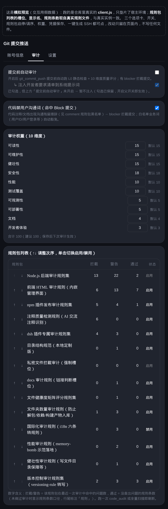
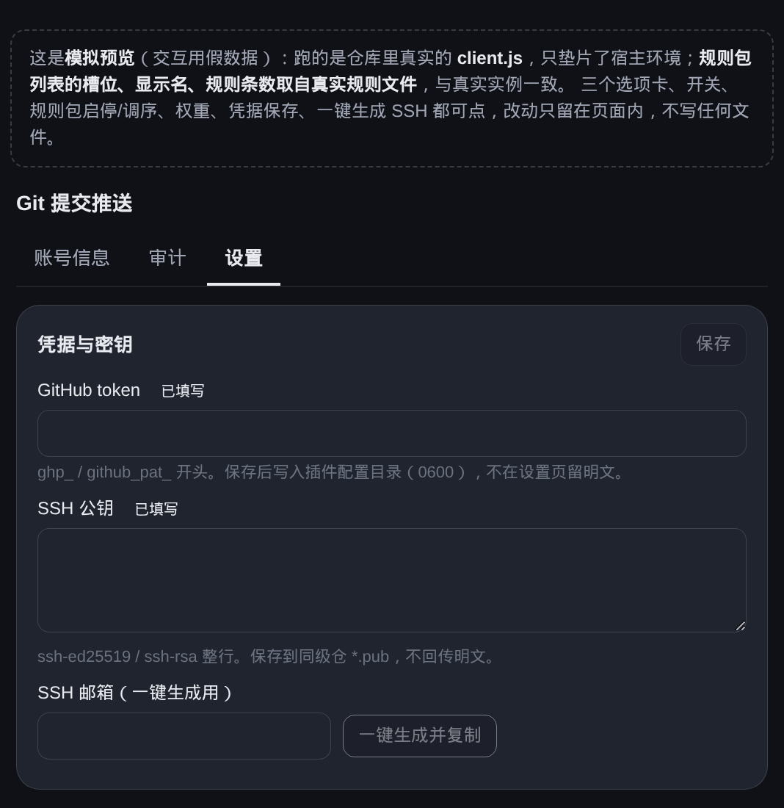

# dsh-git-push

DSH（DeepSeek Harness）git 提交推送与代码审计插件——提交前自动审计门禁，提交推送全链路自动化。


审计面板（14 个规则包 + 按包命中数，上下调次序、单击启停）：



设置面板（凭据 / SSH 公钥 / 审计开关与 10 维度权重）：



> **公开仓库**：EIGHTfs/dsh-git-push（2026-09-13 转 public）｜全量测试 490 全绿（`npm test` 一条命令可复现）
> **界面模拟页**：`assets/preview.html`（单文件自包含，双击即可打开；跑的是真实 `client.js` + 假数据，三选项卡全部可点）
> **截图声明**：`screenshots.json`（仓库根、与 `package.json` 同级，列出 `assets/panel-*.png`）——DSH 插件榜单按此文件自动收录截图，作者推自己的仓库即生效，无需到榜单仓库提 PR

## 快速开始（第一次用——不用查源码）

插件装上并重启后，**三种方式直接可用**：

**① AI 直接用**（DSH 会话里——不用记命令）
- 工具已自动注册：`git_scan` / `code_audit` / `git_commit_push` / `git_account_check` 等
- 直接说人话即可：「扫描我的仓库」「审计 Pawchive」「提交推送 xx 仓库」

**② 独立 CLI**（`git-sluice`——脱离 DSH 也能跑）
- `git-sluice account-check` —— 先校验 GitHub 凭据（第一步）
- `git-sluice scan <目录>` —— 看有哪些 git 仓库
- `git-sluice audit <仓库> --full` —— 全量审计（`--json` 拿明细）
- `git-sluice commit <仓库> -m "msg"` —— 提交推送（自动过审计门禁）
- 全部命令：`git-sluice help`

**③ 侧边栏面板**
- 审计面板：14 个规则包开关/排序/命中数
- 设置：凭据 / SSH 公钥 / 审计开关与权重

## 目录

- [快速开始（第一次用）](#快速开始第一次用不用查源码)
- [功能总览](#功能总览)
- [一、提交推送](#一提交推送)
- [二、代码审计](#二代码审计)
- [三、系统提示词注入](#三系统提示词注入)
- [侧边栏设置](#侧边栏设置)
- [独立 CLI（git-sluice）](#独立-cligit-sluice)
- [独立脚本：清洗用户沟通措辞](#独立脚本清洗用户沟通措辞)
- [独立脚本：运行时检测（三层审计 L3）](#独立脚本运行时检测三层审计-l3)
- [安装与要求](#安装与要求)
- [版本列表](#版本列表)
- [注意事项](#注意事项)

## 分体式文档（docs/）

长文档不直接内嵌 README，各自存独立 md（README 仅链接引用），由 doc- 前缀脚本自动维护：

| 文档 | 位置 | 维护脚本 | 说明 |
|---|---|---|---|
| 版本列表 | [docs/CHANGELOG.md](docs/CHANGELOG.md) | `scripts/doc-version.mjs` | git log 聚合版本表（gen/apply/check） |
| 函数列表 | [docs/FUNCTIONS.md](docs/FUNCTIONS.md) | `scripts/doc-func.mjs` | 扫描 lib/scripts/test 函数表（gen/apply/check） |
| 文件目录树 | README「目录结构」节 | `scripts/doc-tree.mjs` | 目录树（原 tree-doc，2026-09-29 改名统一 doc- 前缀） |

每个脚本命令统一：`gen`（打印）/ `apply`（写宿主 md，自动探测带标记块的 md）/ `check`（查漂移）。宿主 md 带标记块（`dshgp-version` / `dshgp-functions` / `dshgp-tree`），审计按标记块探测并纳入检查。

### 功能介绍文档（手写，面向使用者）

讲「这个功能是什么、怎么用、边界在哪」，与上表的生成物分开维护：

| 文档 | 讲什么 |
|---|---|
| [docs/SPEC.md](docs/SPEC.md) | **当前有效规格唯一入口**：身份 / 14 个工具 / 28 条 HTTP 接口 / 18 个设置键 / 4 个数据文件 / 审计规则体系 / 文档产物 / 版本纪律 / 测试基线 |
| [docs/功能-审计规则体系.md](docs/功能-审计规则体系.md) | 21 个规则槽位 / 122 条规则的组织方式、作用域字段、三层结构、运行入口、结果怎么读、怎么豁免 |
| [docs/功能-历史提交审计.md](docs/功能-历史提交审计.md) | 逐提交回放审计：解决什么、怎么跑、与普通审计的差异与成本 |
| [docs/功能-文档与结构追踪.md](docs/功能-文档与结构追踪.md) | tree-doc / doc-func / doc-version 三份自动生成文档怎么更新、漂移怎么办 |
| [docs/功能-仓库索引与账号状态.md](docs/功能-仓库索引与账号状态.md) | `dsh-repo-index.json` 与 `account-status.json` 的写入时机、读取入口、统一收口约定 |
| [docs/DETAILS-EXEMPT-AND-RULES.md](docs/DETAILS-EXEMPT-AND-RULES.md) | 豁免注释与规则 yml 的写法全录（参考手册） |

## 功能总览

插件围绕 DSH 日常开发的两个高频动作，分为**提交推送**与**代码审计**两大块：

| 功能块 | 做什么 | 入口 |
|---|---|---|
| **提交推送** | token / SSH 密钥管理、提交、推送、clone、建仓、可见性切换、force 强推、版本历史 | `git_commit_push` 工具 / CLI / 侧边栏 |
| **代码审计** | 提交前自动审计门禁、14 个规则槽位 107 条规则、10 维度质量评分、豁免机制、链接检查、**三层审计管线（L1 正则初筛 / L2 AST 数据流 / L3 运行时检测）** | `code_audit` 工具 / CLI / 侧边栏 / 输入框 `/git-audit` |
| **任务完成自动推送** | 监听 AI 回合结束→检测回复含「✅任务完成」→自动 commit+push（复用审计门禁，不裸提交） | 侧边栏开关 `autoPushEnabled`（默认关）+ 自定义触发文本 |
| **审计结果 API** | `/api/git-push/audit`——请求时自定义聚合审计结果：按**规则类型 / 文件名 / 严重级 / 规则包**分组，`severity` 白名单过滤，`top` 截断，`withFindings` 附明细 | HTTP `GET/POST /api/git-push/audit` |

## 一、提交推送

Git 全链路自动化，token / SSH 凭据管理 + 提交推送，无需手动敲 git 命令。

### 凭据管理

- **Token**：GitHub token（`ghp_` / `github_pat_` 开头），保存即写入插件配置目录 `credentialsDir()/github-token`（**0600 权限**），不落 settings.yaml 明文
- **SSH 公钥**：保存写入 `credentialsDir()/*.pub`（按类型 id_rsa.pub / id_ed25519.pub）；**一键生成密钥对**（邮箱 → `ssh-keygen` 4096 位，公钥自动填入并复制剪贴板，私钥只落本机）
- **账号检测**：`GET /api/git-push/account-check` 在线校验（token 调 api.github.com + SSH 指纹 + 绑定关系），侧边栏账号面板实时显示登录态

### 提交推送能力

| 能力 | 说明 |
|---|---|
| `git_commit_push` | 一键提交+推送（审计门禁默认开启；敏感文件自动 .gitignore；`--push/--no-push/--dry-run/--force/--req-confirm/--json`） |
| 推送通道 | `ssh（默认）`= 只走 SSH 私钥 / `token`= 先走 Git Data API（用 token 推）失败回落 SSH / `auto`= 先 ssh 失败回落 token；远端分叉时不静默回落，如实报错 |
| force 强推 | API 通道重建 commit 去旧 parent / SSH 通道 `git push --force` |
| clone / 建仓 | `cloneViaApi`（trees+blobs 写文件转 git 仓）/ `ensureRemoteRepo`（建仓+设 origin） |
| 可见性 | `setVisibility` PATCH 切换 public/private |
| 网络硬闸 | 只允许 api.github.com（`githubFetch` 拒绝非该域名，不跟随 302） |

### 提交前自动门禁

提交推送前自动跑代码审计（见下节）：**有 blocker 拦截提交**（退出码 2），warning 只提示不拦截。审计通过才执行 commit + push。

### 任务完成自动推送

监听 AI 会话回合结束（`turn/end`），提取最后一条回复，检测是否含完成标记——默认「**✅任务完成**」（侧边栏可自定义触发文本/正则，如 `✅(任务完成|已解答)`）——含则触发**自动 commit + push**交付物（`autoPushEnabled` 开关，**默认关**）。

- **复用完整门禁**：自动推送走 `commitWithAudit`（L0 审计 blocker 拦截 / requirements 核对 / pushGate 放行），**不裸提交**绕过门禁；用户开启开关即一次性授权该自动化通道
- **范围**：`session`（默认，仅会话 cwd 所在仓库）/ `all`（workspace 全部有变更仓库）；范围、开关、触发文本经 `config.json` 持久化
- **并发与去重**：同时只跑一个推送 + 同回合只触发一次 + 防抖
- 阻断标记（`❌` / `⚠️ 未完成`）不触发；无完成标记不触发

## 二、代码审计

提交前自动审计 + 独立全量扫描，规则可扩展，质量可评分。

### 审计入口

- `auditChanged`：变动范围（git diff）——提交前默认
- `auditFull`：全量扫描（非 git 目录可查）
- `code_audit` 工具 / `git-sluice audit` CLI：强度、规则包、权重全覆盖

### 扫描忽略语义（黑名单初筛 + 白名单补充）

全量/变更扫描的目录跳过分三层（lib/skip-dirs.js 统一）：

1. **硬编码基线**（只允许 `node_modules`、`.git`）——机器依赖/内部元数据，**绝对跳过**，不受 gitignore 影响；
2. **yml 黑名单关键词**（规则 yml 的 `exclude_dirs` 并集，如 folder 规则的 `dist/build/vendor/.dsh/.trash` 等）——候选跳过，但若 gitignore 用 `!` 白名单恢复了该目录（如 `server/project/*` + `!server/project/blueprint/`、`/build/*` + `!/build/keep/`），则保留进入（黑名单不压过白名单）；
3. **gitignore 忽略判定**（`git check-ignore`）——被忽略目录整棵跳过；被 `!` 恢复的目录照常进入。

**`.auditignore` 审计豁免文件（2026-09-16，2026-09-18 补非 git 兜底）**：仓库根放一个 `.auditignore`，用 **gitignore 语法**声明「不审计但可入库」的文件/目录：

```
# .auditignore 示例：以下内容照常 git 跟踪/提交，但审计扫描跳过
generated/          # 整棵目录豁免审计
src/vendor.js       # 单文件豁免审计
*.lock              # 匹配 yarn.lock 等 .lock 结尾文件
*.sh                # 按文件类型豁免：所有层级的 .sh（gitignore 语义：无 / 的模式匹配任意深度）
```

- **目录规则**（`generated/`）在遍历时整棵剪枝；**文件级规则**（`src/vendor.js`、`*.lock`、`*.sh`）收集后判定剔除
- **按扩展名豁免**：`*.sh` / `*.png` / `*.min.js` 均可，语义与 gitignore 一致——`*.sh` 匹配**任意层级**的 `.sh`（不是只根目录）；只要根目录用 `/*.sh`。实测 `*.sh` 能命中 `deep/nested/dir/run.sh`
- **否定与恢复**：`!` 前缀恢复审计，且**后面的规则覆盖前面的**（`*.sh` + `!keep.sh` = 只豁免 keep.sh 之外的 .sh）
- **git 仓库**：走 `git check-ignore -c core.excludesFile`，语义与 git 100% 一致
- **非 git 目录（2026-09-18 新增兜底）**：解压的源码包、临时导出目录、未 `git init` 的工程同样生效——改用纯 JS 匹配器 `lib/audit/gitignore-match.js`（零依赖，语义逐条与真 git 对拍，见 `test/test-gitignore-match.mjs`）。此前这类目录下 `.auditignore` **形同不存在**，同一个规则在 `git init` 前后行为相反
- 与 `.gitignore` **叠加生效**（各自独立、互不覆盖）：`.gitignore` 管「不入库」，`.auditignore` 管「不入审计」
- **豁免的文件依旧能入库**——`.auditignore` 只作用于审计扫描，不写进任何 git 配置，`git add` 照常跟踪
- **CLI 与插件天然一致**：`git-sluice audit` / 插件 `code_audit` 共用同一 collector，同一份 `.auditignore` 双端生效
- 与 yml `exclude_dirs` 黑名单的区别：yml 黑名单是**全局规则**（所有仓库都跳）；`.auditignore` 是**仓库级**（仅本仓库豁免，且仍可入库）

新增跳过目录一律改 yml（exclude_dirs），不改代码。要调整各层行为见 `lib/skip-dirs.js` 顶部注释。

### 规则引擎（yml 管理）

规则槽位由目录文件驱动：目录里每个 `audit-rules-<名>.yml` 即一个槽位，**放文件即生效、删文件即移除**，无需改代码。内置 14 个槽位：

| 槽位 | 规则数 | 检查内容 |
|---|---|---|
| nodejs | 37 | 凭据硬编码 / 路径穿越 / 魔数 / 依赖 / 异步等 |
| java | 7 | Java/Kotlin 专属：短名 / 魔数 / 嵌套 / 方法长度 / 文件长度 / 注释密度 / 圈复杂度（exts: [java, kt]，2.1.0 新增） |
| python | 7 | Python 专属：短名 / 魔数 / 嵌套 / 函数长度 / 文件长度 / 注释密度 / 圈复杂度（exts: [py]） |
| go / rust / swift / cpp / php | 各 0（占位） | 语言专用规则占位槽位——放 yml 即生效，规则待补（AST 语言路由已预留，2.1.0） |
| frontend | 19 | 前端安全 / a11y / 依赖 |
| npm | 12 | 依赖声明 / npmrc 凭据 / 测试入口 / **包版本语义**（`npm/version-format-triple` 只查 package.json、`npm/version-commit-mismatch`） |
| ~~version~~ | 0 | **已撤销**：原 5 条全是自家提交/发布纪律（「一次提交=一个小版本」等），不该固化成对任何仓库生效的审计规则——纪律留在 skill（`versioning-rule` / `git-commit-discipline`）；其中 2 条 npm 通用约定迁入 npm 槽位 |
| dsh | 7 | DSH 插件契约 / 注入通道（仅 dsh- 前缀插件项目加载——非 dsh 项目 require node 内置不误报，2.1.2） |
| comment | 6 | 注释措辞 / 对话残留 |
| folder | 6 | 目录总数 / 单目录文件数 / 解包特征 / .gitignore / cd 到可能不存在的目录 / 写文件到 .gitignore 忽略目录 |
| i18n | 3 | 硬编码文案 / 插值 / 语言包 |
| performance | 2 | memory-bomb / busy-wait |
| docs / robustness / structure / template / private | 各 0-4 | 链接检查 / 写前 mkdir / 循环依赖 / 规则模板 / 私密文件拦截 |

**加规则 = 放文件**；**加字段类型（新 kind）才需加函数**（compilers.js 注册制：`registerCompiler(kind, detect, compile)`，加字段=加函数+注册一行，`compileRule` 主体永不修改）。

#### 规则作用域字段（写规则时最容易漏、也最容易误报）

| 字段 | 语义 | 典型用途 |
|------|------|----------|
| `exts` | 扩展名白名单（如 `["json"]`） | 只对某类文件跑 |
| `include_paths` | **路径白名单**：不含 `/` 按**文件名**匹配（任意层级），含 `/` 按路径相等 / 前缀 / 后缀匹配 | 只对 `package.json` 跑（`include_paths: ["package.json"]`） |
| `exclude_paths` | 路径黑名单（前缀匹配） | 排除 `server/`、`test/` 等目录 |
| `file_patterns` | **文件内容**初筛正则（不是路径！L1 只求召回） | 只在正文含某特征时才做重检查 |

**为什么要有 `include_paths`**：`exts`（指定后缀）本来就支持，但它只能收窄到**扩展名级**——`.json` 这个粒度太粗：同一个 `.json` 既可能是 npm 的 `package.json`，也可能是 Live2D 的 `model.json`、Unity 的 `.asset` 清单。`npm/version-format-triple`（package.json 的 version 必须 SemVer 三段）原先是 `exts: ["json"]`，于是把规则套到了**所有 json**——第三方资源仓库（实测 0 个 package.json）被报 **1435 条 error**。补上 `include_paths: ["package.json"]`（**文件名级**作用域）后规则只对真正的 package.json 生效。

**规则设计原则**：**自家提交/发布纪律不要固化成审计规则**——审计规则对任何仓库生效，而自家纪律（「一次提交=一个小版本」「README 必须有版本记录」等）只适用于本机自研项目，写进规则必然在第三方仓库上大面积误报。这类约定放 skill，规则只保留**生态通用**的检查（如 npm 的 SemVer 格式）。

### 目录结构（自动生成）

> 由 `scripts/doc-tree.mjs` 维护：`gen` 生成 / `check` 查漂移 / `apply` 覆盖本节 / `sync` 索引自动同步（2026-09-29 自 tree-doc.mjs 改名，统一 doc- 前缀）。
> 注释来源 `tree-doc.json`（路径 → 一句话介绍）：**键集合自动同步**（`sync`/`gen --write` 新增文件自动补键、删除文件自动删键），**描述由 AI/人补**（新键标「（待注释）」）。

<!-- dshgp-tree:start -->
```text
dsh-git-push/
├── lib/ — 核心实现（10 总入口 + 审计引擎 + git 执行层 + 规则编译层）
│   ├── ARCHITECTURE.md — 架构说明文档
│   ├── BUGFIX-NOTES-2026-09-14.md — Bug 修复说明（diff 审计提速 / 凭据文件拦截三层根因）
│   ├── audit-defaults.js — （待注释）
│   ├── client.js — 侧边栏设置 UI 源码（账号卡片/审计/规则包三选项卡，零依赖手写 DOM）
│   ├── commit-push.js — 审计提交总入口（commitWithAudit + runAudit 同步审计）
│   ├── fsx.js — 文件系统适配层（CIFS/SMB 兼容：copyFile 读写回退、chmod 尽力而为、元数据能力探测）
│   ├── index.js — 插件入口（DSH 接线，再导出全部能力）
│   ├── skip-dirs.js — 跳过目录统一判定（硬编码基线 + yml exclude_dirs 并集 + gitignore 白名单恢复）
│   ├── tool-probes.json — 工具探测清单模板（工具为 key、值为空；运行时实测生成运行目录 tools.json）
│   ├── user-requirements.json — 开发者特殊要求清单（提交推送前逐条核对）
│   ├── app/ — 插件入口层（apply/HTTP 处理/工具调用分发/注入文本/默认扫描根）
│   │   ├── apply.js — 插件装载入口（注册 schema/工具/HTTP/注入钩子）
│   │   ├── audit-api.js — 审计结果 API 聚合层（/api/git-push/audit：按规则/文件/严重级/规则包分组 + severity 过滤 + top 截断）
│   │   ├── command-registry.js — 工具命令注册表（方案 B——CLI/宿主工具/帮助同源，免维护）
│   │   ├── constants.js — 插件名与设置命名空间常量
│   │   ├── http-handlers.js — HTTP 路由分发（薄 router：前置校验 + switch 各端点调 handlers/ 模块）
│   │   ├── index.js — 插件入口再导出（宿主 main 指向）
│   │   ├── inject-text.js — 注入文本（工具用法提示 FUNCTION_USAGE_HINT）
│   │   ├── scan-root.js — 默认扫描根解析（配置优先→DSH 家根自动识别）
│   │   ├── schema.js — 配置 schema（宿主导出缺失时兜底）
│   │   ├── settings-bridge.js — 设置读写桥（host scope 共享；绕开 client isLoopback=memory 落盘陷阱）
│   │   ├── slash-commands.js — 用户输入框斜杠命令（目前只注册 /git-audit）
│   │   ├── slot-stats.js — 规则槽位命中统计（模块级状态）
│   │   ├── tool-call.js — 工具调用分发（git_scan/commit_push/audit/status 等全部工具）
│   │   ├── tools.js — 工具定义清单（名称/描述/参数 schema）
│   │   └── …（8 个更深文件）
│   ├── arch/ — （待注释）
│   │   ├── aggregate.js — （待注释）
│   │   ├── extract.js — （待注释）
│   │   ├── ir.js — （待注释）
│   │   ├── lists.js — （待注释）
│   │   ├── to-json.js — （待注释）
│   │   ├── validate-facts.js — （待注释）
│   │   ├── validate.js — （待注释）
│   ├── ast/ — AST 实现层（token 级判定：括号/控制流/数据流/凭据/魔数/命名/规模/分词）
│   │   ├── brace.js — 括号配对与区间包含工具
│   │   ├── callgraph.js — 调用链追踪（单文件调用图 + isInRequestPath，io-risk 请求路径判定升级）
│   │   ├── code-lines.js — 代码行判定（真代码 vs 注释/字符串）+ 字符串字面量提取
│   │   ├── consts.js — （待注释）
│   │   ├── control-flow.js — 控制流检查（同步 fs/空 catch/圈复杂度/嵌套深度）
│   │   ├── credential.js — 凭据标识符判定（硬编码/引用/类型检查）
│   │   ├── dataflow.js — 数据流检查（清空后访问，三层审计 L2）
│   │   ├── dup-code.js — （待注释）
│   │   ├── index.js — AST 层统一出口
│   │   ├── io-risk-const.js — IO 风险分级·常量与档位工具：fs 调用名集/操作类别/风险标签/搜索窗口与阈值 + raise 升档
│   │   ├── io-risk-fn.js — IO 风险分级·函数边界识别与 token 配对：认普通/箭头/方法简写/类方法，圆括号花括号方括号前后向配对
│   │   ├── io-risk-loop.js — IO 风险分级·循环判定：循环内/迭代器表达式（只执行一次）/小字面量数组降级/collectRanges 范围收集
│   │   ├── io-risk.js — IO 风险分级（四级）判定与评分：scanIoRiskAst 判定上下文/类别 → summarizeIoRisk 统计 → rankIoFixList 优先级清单；并再导出下列三个从属模块的公共符号
│   │   ├── lang.js — 语言路由（2026-10-06）：detectLang 内容启发式检测 + javaKtFuncRanges（Java/Kotlin 方法签名+括号配对函数范围）+ LANG_FUNC_RANGES 主流语言占位
│   │   ├── magic-number.js — 硬编码魔数识别（豁免版本号/日期/状态码）
│   │   ├── naming.js — 命名检查（标识符长度/函数名过短/受控小文件读取）
│   │   ├── scope.js — 变量作用域分类器（module/function/loop 行号区间 + 模块常量赋值判定）
│   │   ├── shell.js — shell 精筛（cd 动态路径/写操作命中 .gitignore）
│   │   ├── size.js — 规模检查（函数长度/文件长度/重复字符串）
│   │   ├── tokenizer.js — 分词器（token 流 + LRU 缓存）
│   ├── audit/ — 审计编排层（文件收集/逐文件检查/槽位聚合/审计出口）
│   │   ├── audit-file.js — 单文件审计执行（跑检查+豁免）
│   │   ├── checks.js — 检查器入口（纯引用表）
│   │   ├── collector.js — 文件收集（gitignore 感知）
│   │   ├── ext-runner.js — 审计扩展运行器（audit-ext 统一入口动态加载/契约执行/失败降级）
│   │   ├── file-context.js — 文件上下文豁免（外部调用超时/mkdir 同函数/版本路径）
│   │   ├── finding.js — 统一问题对象构造器（makeFinding）
│   │   ├── gitignore-match.js — gitignore 语法匹配器（非 git 目录 .auditignore 兜底，语义与 git 对拍）
│   │   ├── glob.js — glob→RegExp 转换（**/*/? 子集）
│   │   ├── history-report.js — （待注释）
│   │   ├── history.js — （待注释）
│   │   ├── ignore-blind.js — 审计静默失明检测（本地 git 排除配置把整仓判成忽略时告警）
│   │   ├── index.js — 审计层统一出口（auditFull/auditChanged）
│   │   ├── orchestrate.js — 审计编排（收集→检查→汇总）
│   │   ├── repo-level.js — 仓库级语义规则
│   │   ├── report-yaml.js — （待注释）
│   │   ├── slot.js — 按规则包聚合审计命中（拦截/警告/通过）
│   ├── audit-rules/ — 规则包 yml（nodejs/npm/frontend/comment/dsh/private/structure 等动态槽位）
│   │   ├── audit-rules-comment.yml — 注释类规则（黑名单措辞/对话残留）（规则包 comment）
│   │   ├── audit-rules-cpp.yml — C/C++ 规则包（占位：规则待补，槽位就绪）（规则包 cpp）
│   │   ├── audit-rules-docs.yml — 文档类规则（README/文档措辞）（规则包 docs）
│   │   ├── audit-rules-dsh.yml — DSH 生态规则（宿主/插件约定）（规则包 dsh）
│   │   ├── audit-rules-filehealth.yml — 文件健康度规则（三维分级）（规则包 filehealth）
│   │   ├── audit-rules-folder.yml — 目录级规则（目录数/单目录文件数）（规则包 folder）
│   │   ├── audit-rules-frontend.yml — 前端规则（按钮绑定/魔数）（规则包 frontend）
│   │   ├── audit-rules-go.yml — Go 规则包（占位：规则待补，槽位就绪）（规则包 go）
│   │   ├── audit-rules-i18n.yml — i18n 规则（文案硬编码检查）（规则包 i18n）
│   │   ├── audit-rules-java.yml — Java/Kotlin 规则（短名/魔数/方法长度/复杂度，exts: [java,kt]）（规则包 java）
│   │   ├── audit-rules-nodejs.yml — Node.js 规则（同步 fs/空 catch）（规则包 nodejs）
│   │   ├── audit-rules-npm.yml — npm 规则（package.json 规范）（规则包 npm）
│   │   ├── audit-rules-performance.yml — 性能规则（规则包 performance）
│   │   ├── audit-rules-php.yml — PHP 规则包（占位：规则待补，槽位就绪）（规则包 php）
│   │   ├── audit-rules-private.yml — 私密文件规则（凭据/私密清单）（规则包 private）
│   │   ├── audit-rules-python.yml — （待注释）
│   │   ├── audit-rules-robustness.yml — 健壮性规则（规则包 robustness）
│   │   ├── audit-rules-rust.yml — Rust 规则包（占位：规则待补，槽位就绪）（规则包 rust）
│   │   ├── audit-rules-structure.yml — 结构规则（命名/规模/复杂度）（规则包 structure）
│   │   ├── audit-rules-swift.yml — Swift 规则包（占位：规则待补，槽位就绪）（规则包 swift）
│   │   ├── audit-rules-template.yml — 规则模板（新规则包起点）（规则包 template）
│   ├── checks/ — 检查层（按 kind 调用检查器：正则/语义/结构/文件健康/按钮绑定/私密文件）
│   │   ├── button-bind.js — 按钮事件绑定交叉比对（声明了但没绑定）
│   │   ├── common.js — 检查器公共设施（豁免提示/severity 封顶/分组）
│   │   ├── credential-file.js — 凭据文件检查（.env/密钥文件）
│   │   ├── dataflow.js — 数据流规则包装（L2 token 级→finding）
│   │   ├── dispatch.js — 调度（runChecks 按 kind 分发汇总）
│   │   ├── dup-code.js — （待注释）
│   │   ├── dup-const.js — 同名常量跨文件重复定义检查（DRY：findConstDefs 多语言常量提取 + 模块级过滤 + checkDuplicateConst 跨文件聚合——2026-10-02 新规则）
│   │   ├── file-health.js — 文件健康度（行数/字节/行长三维打分）
│   │   ├── filter.js — 规则作用域过滤（exts/exclude_paths）
│   │   ├── folder.js — 目录级检查（文件夹数/单目录文件数/解包特征）
│   │   ├── index.js — 检查层统一出口
│   │   ├── io.js — IO 风险分级包装：checkIoRisk → lib/ast/io-risk.js（转 warning finding，取代 quality/sync-fs）
│   │   ├── magic-number.js — 魔数检查包装（token 判定→finding）
│   │   ├── npm-json.js — package.json 检查（依赖版本/私有包豁免）
│   │   ├── private.js — 私密文件检查（私有仓可见性核对）
│   │   ├── regex.js — 正则类规则执行（regex/path-regex/blacklist）
│   │   ├── semantic.js — 语义类规则执行（patch insert/仓库级语义）
│   │   ├── structural.js — 结构类规则（函数长度/复杂度/嵌套/同步 fs）
│   ├── cli/ — （待注释）
│   │   ├── commands-account.mjs — （待注释）
│   │   ├── commands-audit.mjs — （待注释）
│   │   ├── commands-doc.mjs — （待注释）
│   │   ├── commands-vcs.mjs — （待注释）
│   ├── client/ — 客户端配置（DEFAULT_CONFIG + SETTINGS_SCHEMA 侧边栏设置项定义）
│   │   ├── index.js — 侧边栏设置 UI 总入口（DEFAULT_CONFIG + SETTINGS_SCHEMA）
│   ├── context/ — 上下文注入（给 AI 会话注入环境：目录映射/工具路径/skill 入口）
│   │   ├── index.js — 上下文注入入口（环境注入文本）
│   ├── exempt/ — 豁免机制（dsh-skip-* 注释标记解析与文件头/行内语义）
│   │   ├── index.js — 豁免注册表（dsh-skip-* 全标记消费）
│   ├── git/ — Git 执行层（runGit/账号/API/克隆/凭据/推送/扫描/索引维护/敏感扫描/传输通道）
│   │   ├── account-status.js — （待注释）
│   │   ├── account.js — 账号校验（token 在线 + SSH 公钥指纹，输出账号状态块）
│   │   ├── api.js — GitHub REST 调用（githubFetch 统一 token/错误识别）
│   │   ├── atomic-json.js — 统一 JSON 原子读写（readJson/writeJsonAtomic/updateJsonAtomic/writeTextAtomic）
│   │   ├── browse.js — 目录浏览（账号卡片路径选择器后端）
│   │   ├── clone-download.js — 并发下载 + .part 断点续传 + 体积守卫 + 进度回调
│   │   ├── clone-jobs.js — clone 进度/预览内存态（供前端轮询）
│   │   ├── clone.js — 克隆（Git Data API，不依赖本地凭据）
│   │   ├── cloud.js — 云端仓库列表（/user/repos 供手动 clone）
│   │   ├── config.js — 路径与配置（PLUGIN_ROOT + 开发者要求清单读取）
│   │   ├── cred-env.js — 凭据传递工具（SSH 私钥路径 GIT_SSH_COMMAND / HTTPS askpass 脚本，AI 执行外部 git 不接触明文）
│   │   ├── credentials.js — 凭据解析（token/SSH 私钥：环境变量→凭据文件→settings）
│   │   ├── endpoints.js — （待注释）
│   │   ├── exec.js — git 进程调用（runGit 统一超时/错误规整 + gitRaw 原始字节）
│   │   ├── ignore.js — .gitignore 兜底（DEFAULT_IGNORE_PATTERNS 补齐）
│   │   ├── index.js — Git 执行层统一出口
│   │   ├── module-splitter.js — （待注释）
│   │   ├── post-push.js — 推送后增强（remote-tracking ref/aux remote/tag）
│   │   ├── push.js — 提交推送编排（commitAndPush 全流程：敏感扫描→add/commit→推送）
│   │   ├── remote.js — 远端仓库管理（建仓默认 private/可见性切换）
│   │   ├── repo-index.js — dsh-repo-index 自动维护（扫描 workspace 生成索引 JSON）
│   │   ├── repos.js — 仓库扫描与展示（describeRepo 分支/远端/领先落后/未提交）
│   │   ├── scan-runner.js — （待注释）
│   │   ├── sensitive.js — 敏感信息扫描（提交前拦截密钥/凭据/私密文件）
│   │   ├── transport.js — 推送通道（dispatchPush 决策：SSH/API/auto + 结果核对）
│   │   ├── visibility.js — （待注释）
│   │   ├── wrapped-git.js — 浅包装 git（自动凭据透传：SSH 私钥/HTTPS token，git-sluice git <args> 与未知命令透传）
│   ├── http/ — HTTP 总入口（鉴权中间件 + 端点处理器骨架）
│   │   ├── index.js — HTTP 总入口（Origin/CSRF/写确认/413/路由分发）
│   ├── link-check/ — 链接判断（文档链接有效性，只 warning 永不 blocker）
│   │   ├── index.js — 链接判断总入口（分级扣分，断网不拦）
│   ├── plugin/ — Host 侧接线层（插件注册到 DSH：工具/HTTP/配置 schema）
│   │   ├── auto-detect.js — 任务完成自动推送·检测层（纯函数：✅任务完成 触发/❌⚠ 阻断/自定义正则/许可合成判断）
│   │   ├── auto-push.js — 任务完成自动推送·核心（turn/end 监听→检测→autoPushEnabled 开关→调 commitWithAudit 完整门禁，不裸提交）
│   │   ├── index.js — Host 侧接线（插件注册：工具/HTTP/配置注入宿主）
│   ├── readme-templates/ — README 模板 yml
│   │   ├── readme.yml — README 章节模板（git_gen_readme 用）
│   ├── rule/ — 规则引擎（yml 装载/编译注册表/同形字符检测/槽位启停）
│   │   ├── compilers.js — 规则编译器注册表（纯引用文件）
│   │   ├── homoglyph.js — 同形字符检测（yml kind/id 防 ASCII 混淆）
│   │   ├── loader.js — 规则总入口（yml 装载/解析/槽位启停）
│   │   ├── registry.js — 规则编译注册表核心（compileRule 主体）
│   │   ├── scope.js — 审计作用域机制层（scope_rules 规范化 + resolveScopeAction）
│   │   └── …（12 个更深文件）
│   ├── score/ — 10 维度加权评分总入口
│   │   ├── docs-score.js — 文档加分制检查器（文档集结构信号 + 版本一致性交叉验证，0 分起上限 10；不进 findings）
│   │   ├── index.js — 评分总入口（10 维度加权）
│   ├── self/ — 插件自身总入口（VERSION/versionInfo/CLI 帮助）
│   │   ├── index.js — 自身总入口（VERSION 一致性/versionInfo）
│   ├── vendor/ — （待注释）
│   │   └── …（2 个更深文件）
├── scripts/ — 开发工具脚本（版本校验/双副本同步/预览服务/README 目录树维护）
│   ├── arch-mcp.mjs — （待注释）
│   ├── archify-gen.mjs — （待注释）
│   ├── archify-imports.mjs — （待注释）
│   ├── archify-preview.mjs — （待注释）
│   ├── audit-runner.mjs — 审计扩展 CLI 统一入口（独立跑 scripts/audit-ext/ 全部扩展）
│   ├── audit-runtime-check.mjs — 三层审计 L3 运行时检测脚本
│   ├── browser-page-probe.mjs — （待注释）
│   ├── check.mjs — 语法检查脚本（npm run check）
│   ├── clean-date-comments.py — （待注释）
│   ├── doc-func.mjs — （待注释）
│   ├── doc-tree.mjs — （待注释）
│   ├── doc-version.mjs — （待注释）
│   ├── gen-preview.mjs — preview.html 槽位数据自动生成器（gen 打印 / --write 写盘 / check 查漂移——__SLOTS__/__FAKE__ 从 listRuleSlots 真实生成，新增规则槽位不再手工维护）
│   ├── module-splitter.py — 巨型单文件按顶层块拆分脚本（analyze/split/verify 三命令，python3 零依赖；module_splitter 工具与 CLI 的底层实现）
│   ├── preview-server.mjs — 本地真实后端测试服务（preview.html 接真实 handleHttp）
│   ├── probe-recheck.mjs — 探针：「重新检测」按钮链路实测（在线校验 token/SSH）
│   ├── readme-gen.mjs — README 生成独立脚本（git_gen_readme 抽出：模板渲染/版本表/目录）
│   ├── rename-locator.mjs — 变量重命名位置定位工具（按作用域聚合引用——单字母变量人工重命名辅助）
│   ├── rule-switch.mjs — 规则槽位手动启停 CLI
│   ├── rules-solo-audit.mjs — 规则单启控制变量扫描（基准全关+逐规则单启+全量对照，报告供 AI/人工审规则有效性与局限，按需运行非常驻）
│   ├── scan-file-io.mjs — 文件读写扫描器（列出所有 fs 读写调用位置 + 路径参数）
│   ├── scan-repos.mjs — （待注释）
│   ├── scan-version.mjs — 版本一致性校验脚本
│   ├── scrub-user-wording.mjs — 清理「用户沟通措辞」独立脚本
│   ├── sync-plugin.mjs — 双副本同步脚本（源仓库 → 部署安装副本）
│   ├── verify-prestep.mjs — 上下文注入自检脚本（真实触发 agent/pre-step 验证注入）
│   ├── watch-preview.mjs — preview.html 自动重生成监听（源码变更即重建）
│   ├── __pycache__/ — （待注释）
│   │   ├── module-splitter.cpython-38.pyc — （待注释）
│   ├── audit-ext/ — （待注释）
│   │   ├── _example-readme-present.mjs — 审计扩展契约示例（_ 前缀：演示不参与实际审计）
│   │   ├── variable-min-length.mjs — 审计扩展：variable-min-length（内置规则抽出试点——统一动态入口）
├── assets/ — 预览页与配图（preview.html 交互模拟页 + 面板截图）
│   ├── minihost.sh — （待注释）
│   ├── panel-account.png — 账号卡片面板截图（README 配图）
│   ├── panel-audit.png — 审计面板截图（README 配图）
│   ├── panel-settings.png — 设置面板截图（README 配图）
│   ├── preview-gen.mjs — 生成 preview.html（真 client.js + 假数据垫片）
│   ├── preview-local-runner.mjs — （待注释）
│   ├── preview.html — 侧边栏交互模拟页（可点，支持 ?backend= 接真实后端）
│   ├── start-preview.mjs — 预览反代服务器（模板 bench-template server/lib/preview 下发改用：本地服务 preview.html，/api/git-push/* 转发 DSH 真实后端 + token 认证）
│   ├── start.sh — 预览服务器启停脚本（start/stop/restart/status + --port + PID/日志/健康检查 /preview-ping）
├── test/ — node:test 全量单元测试（541+ 条，覆盖审计/推送/账号/HTTP/后台任务）
│   ├── .test — 空文件豁免标记（目录级豁免 .test 目录）
│   ├── regression-2.4.1.mjs — （待注释）
│   ├── test-account-refresh-on-push.mjs — （待注释）
│   ├── test-account-ssh.mjs — 账号检查 + SSH 密钥测试
│   ├── test-arch-func-source.mjs — （待注释）
│   ├── test-arch-generic.mjs — （待注释）
│   ├── test-arch-ir.mjs — （待注释）
│   ├── test-arch-json-fresh.mjs — （待注释）
│   ├── test-archify-imports.mjs — （待注释）
│   ├── test-audit-api-http.mjs — （待注释）
│   ├── test-audit-api.mjs — （待注释）
│   ├── test-audit-bad-file.mjs — 审计拦截门禁测试（硬编码密码/API key/.env 凭据文件）
│   ├── test-audit-defaults.mjs — （待注释）
│   ├── test-audit-empty.mjs — （待注释）
│   ├── test-audit-ext.mjs — 审计扩展自动接入测试（契约加载/降级/match/auditFull 并入）
│   ├── test-audit-scope.mjs — 审计作用域/凭据占位符回归测试
│   ├── test-audit.mjs — 审计总入口测试（auditFull/changed/豁免/gitignore）
│   ├── test-auditignore.mjs — （待注释）
│   ├── test-auto-push.mjs — 任务完成自动推送测试（检测纯函数 + registerAutoPush 门控监听注册）
│   ├── test-build-artifact-skip.mjs — 构建/混淆产物跳过专项测试（Pawchive 样本 fixture）
│   ├── test-button-bind.mjs — 按钮绑定交叉比对（jsx 工厂形态/注释过滤/行号归属）
│   ├── test-cli-audit-parity.mjs — CLI 与源码全量审计一致性测试（audit --full --json vs 直接 auditFull，含忽略排除）
│   ├── test-client.mjs — 侧边栏测试（手写 DOM/零外部资源/开关默认）
│   ├── test-clone-concurrency.mjs — clone 并发互斥/可中止/失败保留文件（14 项，CIFS 对照用例可跳）
│   ├── test-clone-maxfilemb.mjs — （待注释）
│   ├── test-clone-parts-keep.mjs — （待注释）
│   ├── test-clone-preview-buttons.mjs — clone 预览确认框按钮可点（真渲染+真点击）
│   ├── test-clone-token.mjs — （待注释）
│   ├── test-collector-ignore.mjs — （待注释）
│   ├── test-command-registry.mjs — 命令注册表测试（工具入表/查找/parseRegistryArgs/清单生成）
│   ├── test-context.mjs — 上下文注入测试
│   ├── test-conv-rule-scope.mjs — （待注释）
│   ├── test-cred-env.mjs — git_cred_env 凭据传递测试（双通道/无明文/askpass 调用/无凭据兜底）
│   ├── test-dataflow.mjs — 三层审计 L2 数据流测试
│   ├── test-doc-func.mjs — （待注释）
│   ├── test-doc-version.mjs — （待注释）
│   ├── test-docs-score.mjs — 文档加分制测试（文档集圈法/四检查/公式/不一致 review/不冲突）
│   ├── test-dup-code.mjs — （待注释）
│   ├── test-dup-const-idiom.mjs — （待注释）
│   ├── test-dup-const.mjs — duplicate-const 规则测试（多语言提取 JS/Kotlin/Java/Go/Rust/Python、模块级过滤、跨文件聚合、test 目录排除、同值不同名不报）
│   ├── test-empty-catch-promise.mjs — （待注释）
│   ├── test-empty-catch-single-source.mjs — （待注释）
│   ├── test-exempt-hint-classify.mjs — （待注释）
│   ├── test-exempt.mjs — 豁免总入口测试（7 标记 + 位置语义）
│   ├── test-ext-variable-min-length.mjs — （待注释）
│   ├── test-false-positive-fixes.mjs — 误报修复回归测试
│   ├── test-file-health.mjs — 文件健康度矩阵评分测试
│   ├── test-folder-scope.mjs — 目录级审计作用域回归测试
│   ├── test-func-doc-drift.mjs — （待注释）
│   ├── test-generated-html-artifact.mjs — （待注释）
│   ├── test-git.mjs — git 总入口测试（runGit/commitAndPush/凭据/克隆）
│   ├── test-gitignore-match.mjs — gitignore 兜底匹配（与真 git 对拍 + 非 git 端到端）
│   ├── test-gitignore-nongit-dir.mjs — （待注释）
│   ├── test-history-audit.mjs — （待注释）
│   ├── test-http.mjs — HTTP 总入口测试（Origin/CSRF/413/路由）
│   ├── test-inject-switch.mjs — 注入开发者要求清单子开关回归
│   ├── test-inject-system-prompt.mjs — 注入系统提示词回归
│   ├── test-io-risk.mjs — IO 风险分级测试（四级判定/字段完整性/汇总/排序/finding 转换）
│   ├── test-java-rules.mjs — Java/Kotlin 语言路由与专项规则测试（javaKtFuncRanges/短名/复杂度/规则联动/聚合型降级）
│   ├── test-link-check.mjs — 链接判断测试（分级扣分/断网不拦）
│   ├── test-magic-number.mjs — 硬编码魔数检测测试
│   ├── test-module-splitter.mjs — module_splitter 工具 + CLI 接入测试（契约 + 行为 + 脚本随插件发布）
│   ├── test-persist-credentials.mjs — 凭据持久化测试
│   ├── test-plugin.mjs — 插件接线测试（入口导出/工具清单/双副本同步）
│   ├── test-private-gate.mjs — （待注释）
│   ├── test-project-type-filter.mjs — 项目类型规则适配测试（非 dsh 项目不加载 dsh 槽位/0.x 版本规则、timeout 限 js 系、folder 尊重 gitignore——Pawchive 误报消除驱动）
│   ├── test-push-false-success.mjs — （待注释）
│   ├── test-push-transport.mjs — 推送通道回归（SSH 优先/一致性语义）
│   ├── test-quality.mjs — 评分总入口测试（AST 质量检查器）
│   ├── test-quota-write.mjs — （待注释）
│   ├── test-readme-gen.mjs — README 生成测试（模板渲染/版本表）
│   ├── test-remote-name-ascii.mjs — （待注释）
│   ├── test-rename-locator.mjs — rename-locator 测试（同名不同作用域分组/模块级/过滤）
│   ├── test-repo-list.mjs — 仓库列表测试（本地扫描/索引读写/HTTP 端点/远端状态）
│   ├── test-rule-include-paths.mjs — （待注释）
│   ├── test-rule-packs.mjs — 规则总入口测试（编译注册/字段指派）
│   ├── test-rule-slots-render.mjs — 规则包列表统计渲染回归
│   ├── test-scope.mjs — 作用域最小实验测试（分类器/机制/magic 接入）
│   ├── test-self.mjs — 自身总入口测试（VERSION/CLI/help 比对）
│   ├── test-settings-persistence.mjs — 设置侧边栏持久化专项测试（L1 提交/L2 白名单/L3 回读/L4 消费四层断言）
│   ├── test-settings-roundtrip.mjs — （待注释）
│   ├── test-sidebar-interaction.mjs — 侧边栏规则包列表交互自检
│   ├── test-sidebar-state.mjs — 设置侧边栏状态自检（设置键回读/凭据已填写判断/统一刷新入口/产物同步）
│   ├── test-slash-commands.mjs — 用户输入框 /git-audit 斜杠命令（解析/接线/对本仓库跑 quick）
│   ├── test-smart-hint.mjs — 扫描智能提示 + 评分对数衰减测试
│   ├── test-status-secret.mjs — token 明文不下发安全回归
│   ├── test-symlink-resolution.mjs — 软链安装依赖解析回归测试（默认失败/--preserve-symlinks/NODE_PATH/真实副本四种场景）
│   ├── test-task-queue.mjs — 后台化回归测试（官方 job 注册 / 无 jobs 同步保底 / blocker 拦截）
│   ├── test-tokenizer-multiline-template.mjs — （待注释）
│   ├── test-tool-contract.mjs — （待注释）
│   ├── test-tool-probes.mjs — （待注释）
│   ├── test-tools-e2e.mjs — （待注释）
│   ├── test-tree-doc.mjs — README 目录树脚本测试（gen/check/apply 闭环）
│   ├── test-version-metrics.mjs — （待注释）
│   ├── test-visibility-unified.mjs — （待注释）
│   ├── fixtures/ — （待注释）
│   │   ├── TimeZoneComboBox-CRnoCikG.js — Pawchive 混淆产物样本（hash 文件名——跳过判定 fixture）
├── docs/ — 开发文档
│   ├── ARCH-FACTS-SPEC.md — （待注释）
│   ├── CHANGELOG.md — 版本列表宿主（doc-version apply 写 dshgp-version 标记块）
│   ├── DETAILS-EXEMPT-AND-RULES.md — 细节补充：豁免注释与规则 yml 用法全录
│   ├── FUNCTIONS.md — 函数列表宿主（doc-func apply 写 dshgp-functions 标记块）
│   ├── SPEC.md — （待注释）
│   ├── 功能-仓库索引与账号状态.md — （待注释）
│   ├── 功能-历史提交审计.md — （待注释）
│   ├── 功能-审计规则体系.md — （待注释）
│   ├── 功能-文档与结构追踪.md — （待注释）
├── skills/ — 插件权威 skill（功能手册/规则/使用说明，安装副本的 skills/ 同步）
│   ├── dsh-repo-index.md — dsh-repo-index skill（源码索引权威说明）
│   ├── dev/ — （待注释）
│   │   ├── dsh-git-push.md — （待注释）
│   │   ├── git-push-live-fix.md — （待注释）
│   ├── guide/ — （待注释）
│   │   ├── guide-audit.md — （待注释）
│   │   ├── guide-cli-scripts.md — （待注释）
│   │   ├── guide-clone-repos.md — （待注释）
│   │   ├── guide-commit-push.md — （待注释）
│   │   ├── guide-inject-ui.md — （待注释）
│   │   ├── guide-slash-completion.md — （待注释）
│   ├── workflow/ — （待注释）
│   │   ├── README.md — （待注释）
│   │   ├── git-commit-discipline.md — （待注释）
│   │   ├── git-project-startup.md — （待注释）
│   │   ├── git-rebuild-process.md — （待注释）
│   │   ├── github-operations.md — （待注释）
│   │   ├── readme-sync-git-md.md — （待注释）
│   │   ├── task-completion-report.md — （待注释）
│   │   ├── tool-json-add-ask.md — （待注释）
│   │   ├── versioning-rule.md — （待注释）
├── .archify/ — （待注释）
│   ├── dsh-git-push.architecture.json — （待注释）
│   ├── dsh-git-push.html — （待注释）
├── .auditignore — 审计豁免清单（不影响 git 入库，仅跳过审计扫描）——排除内置第三方代码
├── .gitignore — 忽略规则（node_modules/产物/备份/回收站等）
├── CONTRIBUTING.md — （待注释）
├── README.md — 插件 README（功能总览/用法/版本记录）
├── SECURITY.md — （待注释）
├── archify-preview.example.json — （待注释）
├── assemble.json — bench-template 下发清单（键=模板仓库相对路径，值=本插件落点；preview 启动两件套 → assets/）
├── cli.mjs — 独立 CLI（git-sluice，不依赖宿主可独立运行）
├── cordis.patch.yml — DSH 插件组合 patch（loader 注入定义）
├── package.json — 包声明（零依赖、files 白名单、scripts）
├── screenshots.json — 截图清单（README 配图引用）
├── tree-doc.json — 目录结构注释映射（路径→一句话介绍，AI 维护）
├── version-metrics.json — （待注释）
```
<!-- dshgp-tree:end -->

### 代码架构：lib/ 各文件夹各司其职

> 分层速查文档：`lib/ARCHITECTURE.md`（三层审计架构四层落地位置：规则声明 → AST 实现 → 检查包装 → 编排调度）

`lib/` 下**每个文件夹只负责一件事**，改审计逻辑前先分清所属层，避免在错误的层里打补丁
（尤其不要用「跳过某类行」的补丁去修误报）：

| 层 | 位置 | 职责 |
|---|---|---|
| ① 规则声明 | `lib/audit-rules/*.yml` | 阈值 / severity / 豁免清单 / 上下文关键字 / `astConfirm` 开关——**改阈值先改 yml，不改代码** |
| ② 具体实现（AST） | `lib/ast/*.js` | **token 级精准判断**：轻量 tokenizer（区分 ident / num / str / tmpl / comment）→ 括号平衡 → 判定 |
| ③ 调用包装 | `lib/checks/*.js` | **把判定转成 finding**：统一 `file/line/rule/severity/message/dimensions/exemptHint/scoreImpact`，不重复造检查逻辑 |
| ④ 编排调度 | `lib/audit/*.js` | 采集文件（`collector.js`）、glob 转换（`glob.js`）、单文件审计（`audit-file.js`）、豁免消费与汇总（`finding.js`/`slot.js`）、入口编排（`orchestrate.js`）；`index.js` 只做再导出 |
| — 插件入口 | `lib/app/*.js` | 宿主接线：配置 schema（含 schemastery 兜底）、工具声明、注入文本、工具与 HTTP 处理、`apply` 注册编排（`lib/index.js` 只做再导出） |
| — 规则编译器 | `lib/rule/compilers/*.js` | yml 字段类型 → 编译函数（注册制，按维度分模块；`compilers.js` 只做引用） |
| — git 能力 | `lib/git/*.js` | 命令执行 / 凭据 / GitHub API / 传输（SSH+API）/ 提交推送 / 克隆 / 仓库与可见性 / 账号校验 |
| — 规则装载 | `lib/rule/*.js` | 规则加载 / 编译 / 注册（yml → 编译后规则对象） |
| — 评分 | `lib/score/index.js` | 10 维度对数衰减评分 + 权重（**本目录只放评分，不含 AST**） |
| — 呈现 / 交互 | `lib/client/` | 侧边栏 UI、审计面板、规则包列表 |

**为什么拆这么细**：原先 `lib/score/ast.js`（1029 行）与 `lib/audit/checks.js`（1259 行）把「评分」「实现」「调用」「调度」全混在一起——
`lib/score/` 本应只管评分权重，却装着全部 AST 实现；`checks.js` 本应只做调用，却塞了 25 个检查实现。拆分后每个文件只做一件事，
新增检查时「实现写哪、调用写哪、调度写哪」一眼可见。

1.1.4 把这套「实现归位到各文件夹」的规则推广到另外五处同类问题：`lib/git/index.js`（1036 行）
拆成 12 个能力模块 + 35 行出口，`lib/rule/compilers.js`（459 行）拆成 10 个编译器模块 + 17 行出口，
`lib/audit/index.js`（482 行）拆成 6 个编排模块 + 32 行出口，`lib/index.js`（683 行）拆成 `lib/app/` 8 个模块 + 24 行出口。
**入口文件从此只做再导出、不含实现**——新增能力改对应模块即可，入口不再随功能增长而膨胀。

⛔ **替代手改的硬约束**：这类拆分靠人眼搬运极易静默丢代码（实测踩过：注册表类文件里大量匿名
`registerCompiler('kind', ...)` 语句被误并进上一个声明的正文；`Schema = makeFallbackSchema()` 这类
顶层语句被排到使用它的 `Config` 之后导致运行期崩溃）。拆分后有四项必查，缺一不可：

1. **导出面逐项比对**——拆前后 `Object.keys(module)` 集合与顺序必须一致；
2. **双态行为对比**——用同一探针先跑拆分后、再把原文件还原跑一次，`diff` 必须为空；
3. **裸副作用 import 保留**——如 `lib/audit/index.js` 的 `import '../rule/compilers.js'` 是编译器注册的
   唯一触发点，丢了不报错但检查项全不出，属于「静默失效」，比崩溃更难查；
4. **全量测试**——测试数不能变少（变少即说明有测试文件加载失败）。

#### ② `lib/ast/`：具体实现（token 级）

| 模块 | 职责 |
|---|---|
| `tokenizer.js` | 分词器 + 按文本内容的 LRU 缓存（全部 token 级检查的公共底座） |
| `brace.js` | 括号配对、区间包含判定（供复杂度/嵌套/函数行数复用） |
| `control-flow.js` | 同步 fs 调用、空 catch、圈复杂度、嵌套深度 |
| `size.js` | 函数长度、文件长度、重复字符串 |
| `naming.js` | 标识符长度、函数名过短（含 i18n 缩写豁免）、受控小文件读取 |
| `code-lines.js` | 判断某行是否「真在代码里」、取出代码中的字符串字面量 |
| `magic-number.js` | 硬编码魔数（豁免版本号/日期/HTTP 状态码/命名常量） |
| `credential.js` | 凭据值判定、前缀型密钥串的占位符精筛 |
| `dataflow.js` | **三层审计 L2**：同函数「清空后访问」数据流（clear()/=[]/=null/length=0/splice(0) 后 .get()/[0]） |
| `index.js` | 统一出口（只做再导出，不含实现） |

#### ③ `lib/checks/`：调用包装

| 模块 | 职责 |
|---|---|
| `common.js` | 公共设施（豁免提示、severity 封顶、各 astConfirm 精筛集合的取值函数） |
| `dispatch.js` | **调度 `runChecks`——只写引用**：按 kind 依次调用各检查器并汇总，不含任何检查逻辑 |
| `filter.js` | 规则作用域过滤（`exts` / **`include_paths`** / `exclude_paths` / `file_patterns`）——yml 声明的作用域唯一落地点 |
| `regex.js` | 正则类规则（含 astConfirm 精筛消费） |
| `structural.js` | 结构类（函数长度/复杂度/嵌套/文件行数/同步 fs/空 catch） |
| `semantic.js` | 语义类（yml 声明的语义检查、patch insert） |
| `dataflow.js` | **三层审计 L2 包装**：`checkDataflow` → `lib/ast/dataflow.js`（空规则短路防崩） |
| `npm-json.js` · `folder.js` · `credential-file.js` · `private.js` · `button-bind.js` · `magic-number.js` · `file-health.js` | 各自对象的检查器 |
| `index.js` | 统一出口（只做再导出） |

`lib/audit/checks.js` 已退化为**纯引用文件**（`export * from '../checks/index.js'`，17 行），保留它只为让原有调用方
（`lib/audit/index.js` 与各测试）导入路径稳定。

**检查器标准样式 = 薄包装**（`checkEmptyCatch` → 调 `checkEmptyCatchAst`、`checkMagicNumberSmart` → 调 `checkMagicNumberSmartAst`）。

⛔ **反模式**：在检查器里自己写正则/逐行扫描重新实现一遍检查逻辑。逐行文本无法区分代码与注释/字符串，必然误报——
历史教训：magic-number 曾在调用层逐行扫，导致注释里的版本号（`// v1.8.0`）、CSS 字号、i18n 字典值全被误报为魔数。
**新检查一律写在 `lib/ast/`**（token 级实现），再在 `lib/checks/` 加薄包装，最后在 `dispatch.js` 加一行调度。

#### 两层判定：正则初筛 → AST 精准判断

文本型检查统一采用两段式（`astConfirm: true` 开启）：

```
正则初筛（快）         AST 精筛（准）
pattern 扫全文          makeCodeLineFilter(text, 候选行)
→ 得到候选行号列表   →   token 级确认「命中行确实是代码行」
                        注释 / 字符串 / 模板串行 → 丢弃（不是硬编码）
```

- **为什么两段式**：正则快但无法区分代码与注释/字符串（单用必然误报）；tokenizer 准但全量 token 化成本高于正则。两段式 = 正则筛候选行 → 只对候选行做 token 判定。
- **典型收益**：注释里的版本号/日期（`// v1.8.0`、`2026-09-13`）、字符串里的 CSS 字号（`'.x{font-weight:650}'`）、i18n 字典值不再报——无需任何「跳过注释行」的补丁。
- **不适用**：凭据/敏感/对话残留类规则**不**加 `astConfirm`（这些恰恰要查注释里的内容，例如注释里贴的 token、`// TODO 修复`）。

| 实现方式 | 位置 | 例子 |
|---|---|---|
| 正则初筛 + AST 精筛 | yml 的 `astConfirm: true` + `makeCodeLineFilter` | `readability/magic-number` |
| 纯 token 级（无需正则） | `lib/ast/`（各模块，见上表） | `checkMagicNumberSmartAst` / `checkSyncFs` / `checkEmptyCatchAst` / `checkComplexityAst` / `checkNestingDepthAst` / `checkNameLengthAst` / `checkFuncLinesAst` / `checkRepeatedStringsAst` / `checkClearAccessAst` |
| 纯正则（本质是文本特征） | `lib/checks/regex.js` 的 `checkRegexRules` | 凭据硬编码、路径穿越、对话残留、黑名单 |

#### 三层审计管线（2026-09-14：L1 正则初筛 → L2 AST 数据流 → L3 运行时）

按**检测模式的成本**分层，解决「正则命中面宽但 AST 精判成本高」的取舍：

| 层 | 工具 | 管什么 | 成本 | 产出 |
|---|---|---|---|---|
| **L1 正则初筛** | `filter.js` 的 `filterRulesByFileText` | 规则声明 `file_patterns`（正则数组）时，先对**文件文本**做一次纯正则扫描——命中任一 = 候选文件，才进 L2；未命中 = 该规则剔除（检查器空规则短路，顺带防 rule.severity 崩溃） | 极低（每文件一次正则） | 候选文件集合 |
| **L2 AST+YAML 数据流** | `lib/ast/dataflow.js` + `lib/checks/dataflow.js` | 只对候选文件做**同函数内**数据流判定：清空（`clear()`/`reset()`/`=[]`/`=null`/`length=0`/`splice(0)`）后访问（`.get()`/`.at()`/`[下标]`）——`dataflow/clear-then-access` 规则 | 中（只扫候选，非全量 tokenize） | 真实发现（文件:行 + 清空/访问证据） |
| **L3 运行时检测** | `scripts/audit-runtime-check.mjs`（独立 CLI） | 兜住**跨文件、闭包、异步时序**静态盲区：动态 import 被测模块，先调清空方法再调访问方法，实测是否拿到 undefined/空 | 高（要跑代码，按需触发） | 运行时确认（退出码 1 = 命中） |

**L2 判定保守（宁漏不误报）**：
- 清空与访问必须命中**同一函数体区间**（顶层作用域排除函数体，防「模块级清空 → 另一函数访问」跨函数误连）
- 清空后**写回撤销**：`push`/`set`/重新赋值/引用传参填充（`walkVideos(root, files, 0)`）→ 撤销清空标记，其后访问不算
- `var x = []` **声明初始化**不算清空；`.length` 读、`shift`/`pop` 消费式访问不报（`while (len) { shift() }` 保护模式）
- 真实跨分支/异步时序无法静态确定 → 交给 L3 运行时确认

**yml 声明示例**（`audit-rules-nodejs.yml` 的 `dataflow/clear-then-access`）：

```yaml
- id: dataflow/clear-then-access
  kind: "dataflow"
  severity: "warning"
  file_patterns:   # L1：命中任一才进 L2（纯正则，成本极低）
    - "\\b(?:clear|reset|flush|purge|splice)\\(0?\\s*\\)"
    - "\\b\\w+\\s*=\\s*(?:\\[\\]|null|undefined)"
    - "\\b\\w+\\.length\\s*=\\s*0"
    - "\\b(?:get|at|first|last|peek|head)\\(0?"
```

**L3 用法**：

```
node scripts/audit-runtime-check.mjs <被测 js 文件> [--obj 对象名] [--verbose]
node scripts/audit-runtime-check.mjs --all <目录>
```

退出码：0=全部通过（无运行时命中）；1=存在运行时命中（L3 确认的 bug）；2=无法检测。


### 10 维度质量评分

可读性 / 可维护性 / 健壮性 / 安全性 / 性能 / 测试覆盖 / 可观测性 / 可部署性 / 文档 / 开发者体验，默认合计 100，可在侧边栏调权重（`weightOverrides` JSON）。

- 单维度评分对数衰减防零分塌陷：`max(0.1, 10 - k*ln(1+errorCount))`，k 按维度分级（安全性 1.8 衰减最快）
- 总分 = Σ(维度得分×权重)/Σ权重×10；A/B/C/D/E 五档

### 审计范围（固定完整流程，无强度档位）

每次审计都跑**完整的静态初筛 + AST 语义检查**，不提供可调强度：

| 阶段 | 检查内容 |
|---|---|
| 静态初筛 | 正则 / 凭据 / 路径 / 黑名单 / 空 catch / 同步 IO |
| AST 语义 | func-lines / max-complexity / max-depth / max-lines / repeated-string / min-occurrences / semantic / credential-file / min-length |

扫描范围由 `auditScanScope`（diff / full）与 `maxScanFiles`（全量上限）决定；**硬编码检查与审计共用同一范围**——审计扫多少，硬编码就扫多少。

> 2026-09-17：移除「审计强度」「自定规则目录」「硬编码全量扫」三个设置项。它们并非用户可配项：强度固定为完整流程；自定规则目录只保留工具 `ruleset` 参数；硬编码全量扫此前从未接上审计实现（空开关）。

### 豁免机制

审计豁免按作用粒度分**四大类**：文件/行注释标记（`dsh-skip-*`）、目录标记（`.test` 空文件）、路径类别（test/scripts 刻意用法）、私有库级别（私密文件降级）。安全红线不可豁免：`secret-*` / `cred*` / `security/*` 类规则即使标 disabled 也强制加载（`lib/exempt/index.js` 为豁免总注册表，`lib/audit-rules/audit-rules-private.yml` 为强制加载清单）。

#### ① `dsh-skip-*` 注释标记（文件头=整文件 / 行内=单点）

| 标记 | 位置 | 豁免内容 |
|---|---|---|
| `dsh-skip-sensitive` | 文件头=整文件 / 行尾=本行 | 凭据/私密类（`[FUNC]`/`credential-file`/`credential-ref`/`path-regex` 及 `security`、`secret`、`password`、`hardcoded` 等安全词规则） |
| `dsh-skip-size` | 只能文件头 | 大文件/二进制（`large-file`） |
| `dsh-skip-func-length` | 文件头=全文件 / **函数定义行行尾=单函数** | 函数超长（`func-lines`） |
| `dsh-skip-syntax` | 只能文件头 | 语法类（`syntax`/`json-parse`/`yaml-parse`） |
| `dsh-skip-quality` | 只能文件头 | 质量评分（`func-lines`/`empty-catch`/`sync-fs`） |
| `dsh-skip-residue` | 行尾=本行 / 文件头=整文件 | 残留类（`debugger`/`todo`/`console` 规则，按规则名前缀细分） |
| `dsh-skip-style` | 只能文件头 | 数值风格规则（`min-length`/`max-lines`/`max-complexity`/`max-depth`/`min-occurrences`/`repeated-string`） |
| `dsh-skip-i18n` | 行尾=本行 / 文件头=整文件 | i18n 硬编码文案审计 |

写法（文件头前 3 行内注释 → 整文件豁免；行尾注释 → 本行豁免，仅支持 `sensitive`/`residue`/`func-length`/`i18n`）：

```js
// dsh-skip-sensitive: 文件含 mock 凭据字面量（仅占位示例，非真实凭据）
const t = "AKIA—占位示例（示例刻意避开密钥检测正则的 16 位字母形态）";

// dsh-skip-func-length: 故意构造的超长函数样本
function longFn() { /* ... */ }

console.log(x); // dsh-skip-residue: 本行为刻意保留的调试输出样本
```

#### ② `.test` 空文件目录豁免（目录级，最强）

在目录内放一个 **0 字节 `.test` 文件**，该目录（含全部子目录）**整目录跳过扫描、不出任何结果**——比 `.samples`（照常出结果但不拦截）更强。专为测试 fixture 目录设计：`test/` 目录放 `.test` 空文件后，整个测试目录不再被审计（测试用例里故意构造的黑名单词样本/超长函数样本不会被误拦）。**全仓收集与变更审计（diff/changed scope）同样生效**——以前者为准，改动若涉及 `test/` 下文件（如新增测试用例），整个 test 目录自动不进变更审计，不会因样本词被误拦提交。

#### ③ 路径类别豁免（test / scripts 刻意用法）

- `test/` 目录下文件：`residue` / `console-log` / `sync-fs` / `empty-catch` / `performance` 类问题自动豁免
- `scripts/` 目录与 `cli.mjs`：`residue` / `console-log` / `sync-fs` 自动豁免

#### ④ 私有库豁免（private 槽位按远端可见性分级）

仓库跟踪到私密文件（清单见 `audit-rules-private.yml`：`**/id_ed25519`、`**/.ssh/**`、`**/.env`、`**/.npmrc` 等）时按**远端可见性**分级：

- **public** → `blocker` 拦截提交（私钥/凭据已可被任何人获取，必须移除或转私有）
- **private / unknown** → `warning` 仅提醒（私有边界内放行，转公开前须先移除）——即「私有库豁免」：私密文件与工作留痕（会话记录/凭据/留痕）在**私有仓库可正常提交推送**，不需要额外豁免标记；单文件想彻底不报再用 `dsh-skip-sensitive` 注释

**门禁级豁免（同一可见性分级，覆盖全部槽位）**：拦截判定同样按远端可见性分级——`private` 仓库的审计**只报告不拦截**（返回 `privateExempt` 标记，明细仍可在审计 API 查），`public` / `unknown` 保守拦截（不误放公开库）；可见性取 `origin` 的 GitHub 查询结果，探测失败按 `unknown`。此前门禁只看「示例目录」、没有任何可见性分级，而 comment / docs / security 等槽位规则不受 private 槽位（凭据 glob）约束，于是私有留痕仓库会被 `conv-*` 等 blocker 拦下（回归，见 `test/test-private-gate.mjs`）。

**技能/规则文档豁免**：`skills/` 与 `rules/` 目录下的 md 文档里的沟通措辞（如触发场景描述）是设计文本而非代码残留，不触发用户沟通词规则。

### 代码禁用户沟通词（Block 拦截）

侧边栏 → 审计选项卡开关「代码禁用户沟通词」，默认开启：代码注释/文档出现「用户说/用户要求/用户原话」等沟通残留措辞（黑名单见 `audit-rules-comment.yml`）→ **blocker 拦截提交**；白名单业务词（用户ID/用户登录/用户角色等）命中则整行豁免。规则文档与测试目录按上述豁免机制自动放行。

### 链接检查

扫描 md/文本中的 URL 并访问验证（404/403→-3、DNS→-2、超时→-1 分级扣分），只 warning 永不 blocker（网络不可靠防假阳性拦截）。

### 正则初筛 → AST 精筛（`astConfirmKind`）

审计的每条规则（`lib/audit-rules/*.yml`）先跑**正则初筛**拿到候选行，再由 `lib/ast/` 里的 **AST 实现**做语义确认——正则快但看的是字符，AST 慢但看的是结构，两层配合才能既不漏报又不误报。

规则通过 `astConfirmKind` 声明「这条规则命中后还要精筛什么」，`lib/checks/regex.js` 按名字分派到对应 AST 实现（yml 是规则、`lib/ast/` 是实现、`lib/checks/` 是调用，各层各司其职）：

| `astConfirmKind` | AST 实现 | 精筛语义 | 豁免（不报）的例子 |
|---|---|---|---|
| `small-file-read` | `checkSmallFileReadAst` | 读文件是否属受控小文件（配置/缓存/字典） | 读 `package.json`、locale 字典、cache 文件 |
| `short-func-name` | `checkShortFunctionNameAst` | 函数名是否真过短且非公认缩写 | `tr`/`t`/`L`（i18n）、`el`/`cb`/`fn` |
| `credential-value` | `checkCredentialRefAst` | 凭据标识符右侧**是否直接是有效字面量** | 类型检查 `typeof cfg.token === 'string'`、透传 `cfg.token = init.token`、`process.env.KEY`、占位符 |
| `shell-cd-dynamic` | `shellCdDynamicLines` | cd 目标是否动态路径（含 `$VAR`/`$()`）且无失败兜底（同行无 `\|\|`、非 `&&` 链、非注释/字符串） | `cd "$(dirname "$0")"` 自我定位（目录必然存在）、`cd "$X" \|\| exit 1` 有兜底、`cd dist` 字面量路径 |
| `write-into-gitignored` | `writeIntoGitignoredLines` | 写操作（writeFile/mkdir 等）目标路径是否命中仓库 `.gitignore`（需 repoPath 上下文；单文件审计无上下文不报、不臆测） | `node_modules` 内写入（安装产物）、`/tmp` 临时目录、`.gitignore` 里 `!` 取反的路径 |

两种模式：`mode: 'deny'` 把 AST 判定出的行加入豁免集（集合内不报）；`mode: 'allow'` 要求只有 AST 判定出的行才报（集合外不报）。`credential-value` 用 allow 模式——只有当「凭据变量右侧直接跟着非占位字符串字面量」才算硬编码。

**为什么必须这么做**：正则 `token\s*[=:]+\s*['"]...` 会把 `typeof cfg.githubToken === 'string'`（类型检查）当成硬编码凭据报出来；`function\s+\w{1,2}\(` 会把 i18n 的 `tr()` 报成「函数名无法猜出含义」。这些都是真实误报——修的是审计代码（把判定从字符级提升到 token 级），而不是给业务代码加豁免注释。

## 大仓库性能降级

全量审计按文件逐个跑检查，单文件约 40ms；文件数上万时（实测某检出目录 29921 个文件）总耗时会到分钟级，弱 CPU 机器上表现为「提交推送卡住不动」。降级策略：

| 环节 | 做法 | 效果 |
|---|---|---|
| 分词结果缓存 | `lib/ast/tokenizer.js` 对 `tokenize()` 结果做 LRU 缓存（上限 512 份） | 同一文件被 5 处检查重复分词 → 只算 1 次；单文件 139ms → 42ms |
| 文件数上限 | 新增配置 `maxScanFiles`（默认 3000，`0` = 不限） | 29921 文件不再全量硬扫 |
| 变动文件优先 | 截断时先纳入 `git status` 里的变动文件，再按顺序补足到上限 | 正要提交的内容**不会被截断漏审** |
| 截断告知 | 超限时产出一条 `audit/scan-truncated` 说明（`severity: notice`、`scoreImpact: 0`） | 明确告知「只审了多少 / 总数多少」，且**不扣分** |

配置入口：侧边栏 → 审计 → `全量扫描文件上限`，或 `git-sluice audit <root> --full` 时由插件配置读取。

> 截断只影响 `scope: 'full'` 的全量扫描；默认的 `scope: 'diff'`（只审本次变动）不受影响——日常提交推送走的就是 diff。

## 界面预览页（assets/preview.html，真实后端数据）

`assets/preview.html` 由 `assets/preview-gen.mjs` 生成（内联真实 `client.js`，只垫片宿主环境 `window.__ModuleLoader__`/`react`/`settingsScope`/`fetch`，界面与真实插件一致）；**用 `assets/start.sh` 启动本地反代服务访问**（启动脚本与反代服务器来自模板仓库 bench-template `server/lib/preview/`，经 `assemble.json` 文件清单下发）：

```
./assets/start.sh start [--port 31000]   # 启动（默认 30999；已有项目占用时用 --port 错开）
./assets/start.sh status / restart / stop
```

- **完全真实后端数据**：`assets/start-preview.mjs` 反向代理——`/api/git-push/*` 全部转发到 DSH 真实后端（默认 http://127.0.0.1:30800 反代，`--dsh` 可覆盖），并自动完成 token 认证（`--token` > 环境变量 `DSH_PREVIEW_TOKEN` > 解析 `dsh-proxy.log` 兜底）。预览里的账号信息 / 本地仓库 / 云端仓库 / 规则包 / 审计结果 / 设置**全部来自真实后端**（读取与写入都真实）。
- **离线调试**：URL 加 `?mock=1` 切回内置假数据（改动只留页面内、不写文件）；跨后端实测用 `?backend=http://127.0.0.1:端口`。
- **全部可点**：三选项卡切换 · 审计开关 · **注入系统提示词开关** · 「注入开发者要求清单」子开关（含置灰联动）· 规则包启停与 ↑↓ 调序 · 权重编辑 · token/SSH 保存 · 邮箱一键生成 SSH 并回填
- 健康检查 `GET /preview-ping`（start.sh 启动判定）；PID 落 `dsh-git-push.pid`（插件根）；日志 `assets/preview-server.log`（超 10MB 轮转）

重新生成（改了 `client.js` 后同步）：

```
node assets/preview-gen.mjs
```

## 三、系统提示词注入

插件在宿主装配系统提示词时注入四段（`ctx.inject(['systemPrompt'], …).section({ name, order, text })`；**`text` 必须同步返回**——async 会让模型读到 `[object Promise]`）。总开关在 **设置 → 侧边栏 → Git 提交推送 → 审计 → 注入系统提示词**，**默认开**。

| 段名 | order | 注入内容 | 生效条件 |
|---|---|---|---|
| `dsh-git-push-usage` | 990 | 插件功能用法：10 个工具各做什么、参数要点、调用纪律 | `injectSystemPrompt` |
| `dsh-git-push-env` | 980 | 当前 cwd · 项目 git 根 · **skills 总入口一行** · 工作区根 + 直接子目录 · 工具安装路径（实测探测） | `injectSystemPrompt` |
| `dsh-git-push-readme-check` | 991 | 提交前必须核对 README（功能表/版本记录/用法）的提醒 | `injectSystemPrompt` |
| `dsh-git-push-requirements` | 992 | 开发者特殊要求清单正文 | `injectSystemPrompt` + 审计开关 + `injectRequirements` |

### 内容只到「目录级」

环境段只给路径、不给正文：**skill 只注入总入口一行**（`<projectRoot>/skills（存在：true/false）`），不列 skill 文件清单、不注入 skill 正文——正文由 AI 按需读取，避免每步烧 token。工作区段给「根目录 + 直接子目录」（子目录跳过 `.git` / `node_modules` / `dist` / `build` / 隐藏目录），便于直接定位项目。

### 功能用法段（解决「AI 不知道插件有什么、绕开插件自己找凭据」）

把 10 个工具的一句话用法连同**凭据归属**一起常驻：

```
· git_scan —— 列工作区（含额外路径）所有 git 仓库：分支/remote/未提交与未推送数/最近活动
· git_commit_push —— 一键提交并推送（审计同步拦截，通过后 commit+push 走宿主官方后台 job：立即返回 async:true+jobId，结果完成会自动返回、无需特意查询；如需主动查用宿主 job_output <jobId>）
· code_audit —— 审计仓库（L0 静态检查 + 质量评分），scope=full 全量，可传 ruleset / weights
· git_account_check —— 校验 GitHub 账号与凭据（token 在线校验 + SSH 公钥指纹）
· git_sluice —— 浅包装 git 透传（AI 直接调用任意 git 命令，凭据自动注入）：args 传与 git 一致的参数串，返回 status + stdout/stderr；git 的 log/diff/branch/tag 等其余能力用它
· git_gen_ssh_key / git_remote_create / git_set_visibility / git_clone / link_check
【凭据由插件托管，不要到处找凭据】GitHub token 与 SSH 私钥存放在插件配置目录
（git-push/ 下 github-token、id_rsa；0600 权限），由插件的推送/校验流程自动读取与选择通道
（默认 SSH，token 401 回退 SSH）。判断登录态 → 调 git_account_check；推送 → 调 git_commit_push。
【调用纪律】提交类操作先 git_scan 确认目标仓库；提交前核对 README；审计 blocker 先修复再提交。
```

### 环境段的工具路径是实测探测的

`collectToolPaths()` 用 `which`（Windows 走 `where`）逐项探测 git / node / npm / python3 / curl / ssh / unzip / rsync / 7z 的**实际安装路径**，只把探测到的工具写进注入文本；结果**惰性缓存**（首次注入算一次，避免每次装配系统提示词都 spawn 一轮）。探测异常时降级为静态兜底清单，注入不中断。

注入文本还带 **`运行主机：<主机名>（<局域网 IP>）`** 行（`os.hostname()` + `os.networkInterfaces()` 过滤回环/内网保留地址，多网卡全列，仅 IPv4）——AI 可直接拿到「当前跑在哪台机器、局域网地址」，用于跨机任务/给用户可访问地址。主机名探测异常时该行省略，注入不中断。

### 关闭开关的行为

关掉「注入系统提示词」→ 四段**全部返回空串**（段仍注册、内容为空）：AI 不再看到功能用法与环境目录，插件工具本身照常可用。切换开关会清掉环境注入缓存，下一轮装配即按新状态生效，**无需重启实例**。

### 已废弃的两个开关

`injectFullSkill`（注入全部 skill 正文）与 `injectRepoIndexFull`（注入 `dsh-repo-index.json` 全文）**已移除**：注入固定为目录级，不提供全量正文注入档位——长文正文交给 skill 按需加载。

## 侧边栏设置

设置 → 侧边栏 → **Git 提交推送**，三选项卡（对齐插件市场样式）：

- **账号信息**：渐变卡片 + GitHub 图标 + 状态徽标（已连接/检测中/未连接）+ 检测结果块 + Token/SSH 凭据状态标签 + `⟳ 重新检测`
  - 凭据块 **Token 行尾显示 API 配额剩余**（如 `（配额剩余5000/h）`）：实时查 GitHub `GET /rate_limit`（**不消耗配额**），打开页面自动刷新（后端 60s 缓存，`?refresh=1` 强制刷新）；Token/SSH 的登录名与校验时间只在凭据块内各列一遍，不重复展示
  - 卡片下方为**仓库管理卡片**（本地 / 云端 两子选项卡，2026-09-14）：
    - **本地**：默认扫描根 = **DSH 家根**（由 DSH_HOME / workspaceRoot **动态推导**，非写死）——覆盖 工作区 / 用户 / profiles / workspace 下全部 **git 仓库（遍历所有 `.git` 文件夹，含嵌套子仓库、depth 20）**；可手动指定路径（文本框 + 📂 目录选择器弹窗浏览），**浏览器路径与扫描路径都记住**（localStorage，刷新后恢复）。列表显示 路径 / 分支 · 远端子状态 / 未提交数 / 最近提交 + **索引登记**；**只显示登录同作者的仓库**（有远端则 owner=登录账号；无远端按索引归属判定；无登录态时不过滤）。仓库「有远端 + 有未推送提交（ahead>0 或状态未知）」即可点 `push`（工作树脏不脏不影响）；**点击后行内绿/红反馈**（✅ 推送成功 / ⚠️ 失败原因，含通道 `push.reason`）；领先比较优先 live `ls-remote`（origin 为 https 时本地 fetch 常失败，过期的 `origin/<分支>` 缓存不再当真）。仓库路径长时自动省略号截断
    - **云端**：`加载仓库列表` 用 token 拉账号名下所有 GitHub 仓库（GET /user/repos，按最近更新），显示 名称 / 私有·公开 / 默认分支 / 最近更新；点行尾 `clone` 弹出目录选择器选目标目录后克隆（走 Git Data API，不直连 github.com）。**克隆在服务端后台运行**：提交后立即返回，进度条由轮询驱动，页面刷新后会自动接回仍在跑的任务
- **审计**：审计开关 + 注入系统提示词开关 + 代码禁用户沟通词开关 + 10 维度权重编辑 + 规则包列表
  - **`注入系统提示词`**（默认开）：控制整组注入段启停——功能用法（每个工具怎么用 + 凭据由插件托管）· 环境（工作区目录映射 + 工具安装路径 + skill 总入口一行）· 提交前 README 核对提醒；关闭后这些段全部返回空串，工具本身照常可用。详见 [三、系统提示词注入](#三系统提示词注入)
  - 子开关 **`↳ 注入开发者要求清单到系统提示词`**：挂在「提交前自动审计」下面，**随时可勾选（一遍即可）**；审计关闭时该行只置灰表示「暂不生效」、勾选保留，实际是否注入由 host 侧 `injectSystemPrompt && auditEnabled && injectRequirements` 三重门控（省掉每次提交推送时 AI 被门禁拦下再回读清单的一轮往返）
  - 规则包行：↑↓ 调次序 · **按住行内信息区悬停显示详情浮层**（描述/作者/规则条数口径）· 启停**只点行尾按钮**
  - 状态底色一眼可辨：**启用 = 绿底 + 绿左条**，**禁用 = 红底 + 红左条**（按钮同为绿/红实色胶囊）
  - 拦截级/警告级/提示级 三列显示该规则包内**各严重级的规则条数**（取自 yml，三档之和 = 规则总数；与是否跑过审计无关）
- **设置**：GitHub token + SSH 公钥 + 邮箱 + 一键生成并复制

设置项以 `lib/app/schema.js` 的 `Config` 为单一事实源（`lib/index.js` 只再导出），`settingsScope` 读写。凭据保存**同时写插件配置目录**（见「凭据管理」）。

### 账号信息 / 本地仓库列表：读取时机（2026-09-16 收敛）

账号信息（token/SSH 有效性 + account-status.json 快照）与本地仓库列表（dsh-repo-index.json 索引）**只在下面三种时机读取**，不做轮询/不监听索引文件。**读取一律纯离线读 json（秒级），网络操作只在需要时单独触发**：

| 时机 | 账号信息 | 本地仓库列表 | 说明 |
|---|---|---|---|
| **插件启动时** | ✅ 离线读 json | ✅ 离线读 json | 侧边栏插件加载即读（模块级标记整页只执行一次），读的是 json 文件，不直接改 UI |
| **云端 push 完成后** | ✅ 离线读 | ✅ 离线读 | push 本身**在线**更新 json（重建索引 + 账号校验落盘），前端接着离线读回最新 |
| **手动刷新** | ✅ `重新检测` = **在线**校验写 json，再离线读回 | ✅ `扫描` = **独立进程后台离线扫描**，逐条追加 | 两个按钮都是「更新 json 后再读」，读取端仍走离线 json |

#### 本地「扫描」：独立进程后台 + 只读新增 diff（2026-09-16）

扫描全程不占前台、不卡界面，也不再一次性等全量扫完：

1. 点 `扫描` → 前端 `POST /api/git-push/repos-local-scan`，后端以 `child_process.spawn(detached)` 拉起**独立进程** `scripts/scan-repos.mjs`（系统级后台，扫描 CPU 密集全在子进程，不拖宿主机）。响应立即返回，**扫描中按钮禁用、不可重复点击**（`alreadyRunning` 兜底）。
2. 独立进程纯离线逐仓扫描（只扫设置路径、`--depth`/`--max` 限性能，owner 用离线账号 json 比对，不联网）：**每登记一个仓库**就 ① 递增写 `scan-live.json`（`version` +1、`found` 追加）、② 读-改-写把该仓库 entry **追加**进 `dsh-repo-index.json`（不覆盖其他条目）。
3. 宿主用 `fs.watchFile` 监听 `scan-live.json`，文件一变就唤醒等待者——前端 `POST /api/git-push/repos-local-scan-wait { from: 已见数 }` 挂起直到有新仓库，**只返回「新增的那几条」**（`newest`），前端只把这些**追加**进列表，**不全量重读**。非轮询：有新数据才返回。
4. 全部扫完 → `scan-live.json` `done:true` → 前端收到收尾，恢复按钮并读一次索引对齐（补全领先/落后字段）。

- 进度文件：`$DSH_HOME/git-push/scan-live.json`（`{ version, found:[仓库名…], done, startedAt }`）。
- 索引由独立进程**逐仓追加**（`path` 为该仓库真实本地路径），扫描结束即为最新；索引文件不为扫描而整篇重写。
- **扫描尊重 `.gitignore`（2026-09-16 修复）**：被 git 忽略的目录整棵跳过，不再登记为独立仓库——此前 `DeepSeekHarness-NAS` 的 `/src/`（官方源码）、`/assets/`、`/build/master-build/`（构建产物，内含独立 `.git`）会被误当仓库扫入。实现为每进入一个仓库根**一次** `git ls-files --others --ignored --exclude-standard --directory` 取忽略目录集合，遍历时整棵跳过（单次 git 调用，全量扫描 ~0.6s）。
- **索引按本轮扫描结果收敛（同批修复）**：扫描结束会剔除「owner 一致但本轮未扫到」的条目（`SCAN pruned …`）——此前只追加/更新不删除，被 `.gitignore` 忽略后不再扫到的仓库会永远留在索引里。索引 = 本次扫描结果。

- **读取与写分离**：启动 / push 后 / 渲染 → 全部离线读 json（毫秒级）；`push`、`重新检测` → 在线更新 json；`扫描` → 独立进程离线扫描（逐仓写进度 + 追加索引，界面只追加新增）。三种读取时机都只读 json。
- **不监控索引、不轮询**：读取全部由上面三个事件显式触发（startup / push 成功 / 手动按钮），页面内切 tab **不会**反复刷新。
- **登录 = 或逻辑**：`ssh` 或 `token` **任意一个有效即视为已登录**（`loggedIn = tokenValid || sshValid`），账号 json 快照与在线校验都按此判定，username 取有效者。
- **默认扫描路径 = 本地仓库列表选择的路径**：前端记住本地面板输入框的路径（localStorage `dshgp-scan-path`），启动读取与后续扫描都复用该路径；没有则后端自动识别 DSH 家根。
- **推送通道设置保留**（`pushMethod`：ssh=推本地 HEAD / api=Git Data API 重建提交 / auto=有私钥走 ssh）；`defaultScanRoot`/`commitMessage` 两项设置已移除（前者复用本地列表路径，后者留空由调用方/AI 生成）。
- 单测网络隔离：`DSH_GIT_PUSH_OFFLINE=1` 时 GitHub API 与 SSH 探测全部快速失败，测试不依赖真实网络（`test-plugin.mjs` 等）。

## 仓库索引联动（dsh-repo-index.json）

账号卡片与「自动生成的仓库索引」双向联动（2026-09-14，移植 v1 的 `lib/repo-index.js` 全量生成实现进 v2 `lib/git/repo-index.js`）：

- **读取（标注）**：本地扫描为每个仓库附 `indexed`（索引登记的 owner/repo/可见性）——即使本地未设 remote/上游，也能一眼看出它在 GitHub 的归属；未登记显示无
- **更新（自动生成）**：`git_commit_push` 手动推送 与 账号卡片的 `repo-push` **推送成功后全量重建**索引——可见性走 GitHub API（并发 4，token 缺失回退既有标注/未知）、skills 从 package.json `dsh.skills` / `skills/*.md` frontmatter 收集、`localOnly` 维护 workspace 顶层无远端目录；索引写入 `工作区/dsh-git-push-User/<owner>/dsh-repo-index.json`（权威源，dsh-repo-index skill 一致），版本+1、generatedAt 刷新、DO NOT EDIT
- **云端扫描写索引（2026-09-16）**：账号卡片「云端」`加载仓库列表` 也写索引（`mergeCloudReposIntoIndex`）——云端仓库登记进 dsh-repo-index.json（含 defaultBranch/pushedAt/description/visibility 云端真源、`cloudOnly` 标记本地无副本），本地已有副本的条目保留本地 path/skills 并刷新云端状态；本地列表透传 `defaultBranch/cloudPushedAt/cloudOnly`，前端显示「默认分支 / 云端更新 / 仅云端」——云端扫描一次，本地远端状态同步刷新
- 索引缺失/损坏全链路静默降级，不阻塞扫描与推送

## 独立脚本：规则启用/禁用（scripts/rule-switch.mjs）

侧边栏 UI 的规则包启停（写规则 yml 顶层 `disabled: true` / 删除该行）以命令行方式复用同一套实现（`lib/rule/loader.js setSlotDisabled`），**不依赖 GUI**。规则装载每次审计实时读 yml——改完**立即生效、无需重启实例**。

**目标目录**：默认操作**安装版本**（部署副本 `<DSH>/.dsh-home/.dsh/profiles/web/node_modules/dsh-git-push/lib/audit-rules`，即 GUI 实际加载的规则）；`--workspace` 指工作区 `lib/audit-rules`；`--target <目录>` 任意指定。

用法：

```bash
node scripts/rule-switch.mjs list                      # 列出全部槽位状态（✔ 启用 / ✖ 禁用）
node scripts/rule-switch.mjs status <槽位>             # 单槽位状态
node scripts/rule-switch.mjs disable <槽位>            # 禁用（yml 顶层写入 disabled: true）
node scripts/rule-switch.mjs enable <槽位>             # 启用（删除 disabled 行）
```

示例：

```bash
node scripts/rule-switch.mjs disable comment    # 禁用安装版本的 comment 槽位（用户沟通词审计）
node scripts/rule-switch.mjs enable comment     # 重新启用
```

边界：`nodejs` / `private` 属安全红线强制槽位，禁用会被拦截（返回错误、不写 yml），与 UI 行为一致。注意与 `scripts/sync-plugin.mjs --write` 的协作：同步会按工作区规则文件覆盖部署副本的 disabled 状态（工作区文件里没有 disabled 行则同步后恢复启用）。

## 用户输入框斜杠命令

会话输入框打 `/` 会弹出官方发现菜单。本插件注册 **6 条只读命令**：

| 命令 | 作用 | 参数 |
| --- | --- | --- |
| `/git-audit` | 审计仓库（规则 + 质量评分） | `[路径] [--full]` |
| `/git-scan` | 列出各仓库分支 / 未提交 / 未推送 | `[路径]` |
| `/git-io-scan` | 扫描脚本里读写文件的调用与路径，标四级风险 | `[路径] [--write]` |
| `/link-check` | 检查文档内链接有效性 | `[文件或目录]` |
| `/git-account` | 校验 GitHub 账号与凭据 | — |
| `/git-clone-preview` | 预览 clone 将下载 / 跳过哪些文件（不落盘） | `<owner/repo> [--branch 名]` |

**为什么只有只读命令**：输入框一条命令就改远端（提交、建仓、改可见性）风险过高——写类操作仍走 agent 工具，会经过审计门禁、开发者要求清单与推送门禁。唯一的「远端交互」是 `/git-clone-preview`：它只读远端文件树并回报将下载什么，**不下载、不落盘**。

示例：

```
/git-audit                            审当前会话工作区的本次变动
/git-audit /path/to/repo --full       指定仓库全量审计
/git-scan                             扫默认扫描根（插件配置）
/git-io-scan --write                  只看写类 I/O 的调用与路径
/link-check README.md                 检查单个文档的链接
/git-clone-preview EIGHTfs/dsh-git-push
```

共同规则：

- **默认路径 = 当前会话工作区**（`session.header.cwd`，与指挥家按工作区分组同一字段）；`/git-scan` 不带路径时用插件配置的默认扫描根
- **未分类**（cwd 空）必须写路径，否则报错退出，**不会**扫 DSH 家根
- 相对路径接到会话 cwd；无 cwd 时相对路径不可用，改给绝对路径
- `/git-audit` 的目标必须是 git 仓库（含 `.git`，或向上找到仓库根）；非仓库直接拒绝——`code_audit` 对无 `.git` 目录会走全量 `auditFull`，扫家根会把进程打爆
- `/git-io-scan` 复用 `scripts/scan-file-io.mjs`（AST 四级分级，与审计 `robustness/io-risk` 同一标准），默认跳过注释行
- 结果只显示在命令层，**不进模型历史**（官方 `dsh-commands` 协议）

Host 注册走 `ctx.inject(['commands'])`；无命令适配器的宿主静默跳过。改动需重启主实例后输入框才能看到。

## 独立 CLI（git-sluice）

脱离 DSH 独立运行（零第三方依赖，仅需 Node ≥18 与本机 git）。

```
git-sluice version              查看版本
git-sluice ruleset [槽位...]    编译规则包并输出统计
git-sluice scan <root> [--depth N]   全量扫描目录（非 git 目录可查）
git-sluice repos <root> [--depth N] [--max N] [--json]
                                扫描本地 git 仓库（尊重 .gitignore：被忽略目录整棵跳过）
git-sluice index <root> [--owner <账号>] [--depth N] [--max N] [--offline] [--json]
                                重建仓库索引 dsh-repo-index.json（--offline=纯离线不查 GitHub API）
git-sluice audit <root> [--full] [--level quick|standard|deep] [--ruleset <目录>] [--weights <JSON>] [--include-ignored] [--json]
git-sluice commit <repo> -m <msg> [--push|--no-push] [--dry-run] [--force] [--req-confirm] [--json]
git-sluice link-check <路径>    检查 md/文本中的链接有效性（只 warning）
git-sluice yaml-template        输出规则 yml 模板
git-sluice readme-template      输出 README 模板
git-sluice self-check           版本一致性 + HELP↔parseArgv 机器比对
```

### CLI 与插件「功能一致、结果一致」（2026-09-16 收敛）

CLI 是引擎的独立入口，**功能与结果必须与插件一致**——同一份实现、同一份配置、同一套参数：

- **同一实现**：`repos` → `lib/git/repos.js` 的 `scanRepos`（与插件本地扫描同函数）；`index` → `lib/git/repo-index.js` 的 `maintainRepoIndex`；`audit`/`scan` → `lib/audit/orchestrate.js` 的 `auditFull`/`auditWithScope`。CLI 不另写一份逻辑。
- **同一配置**：CLI 读**同一份** `$DSH_HOME/git-push/config.json`（经 `readSettings` + `applySettingsToCfg`，与插件启动回读同一映射），因此 `maxScanFiles`、规则包顺序 `auditRuleOrder`、禁用槽位 `auditDisabledSlots`、权重 `weightOverrides` 全部生效。
- **全量走同一入口**：`--full`（或目录非 git 仓库）走 `auditFull`，与插件 `code_audit` 的全量分支同路径；参数优先级同插件：显式 `--weights` > 配置 `weightOverrides` > 默认权重表。
- **结果实测一致**（同一仓库同一参数）：CLI `audit . --full` 与插件 `code_audit{repo,scope:'full'}` 均输出 `quality 76.8/B`、`summary {blocker:0, warning:388, notice:45, total:433}`、findings 433 条。
- 修复前的差异根因：CLI 只传 `scope`+`depth`，不带插件配置 → 跑了已禁用规则包、用默认权重与不同文件上限，表现为「CLI 全量扫描分更低、文件更多」。

`audit` 参数与服务端设置对应：`--full` ↔ `auditScanScope=full`、`--weights` ↔ `weightOverrides`、`--include-ignored` ↔ 连 `.gitignore` 忽略的文件也扫。（2026-09-17：`--level` / `--ruleset` 已随设置项移除；`--ruleset` 仅作为当次调用的自定规则目录参数。）

## 独立脚本：清洗用户沟通措辞（scrub-user-wording.mjs）

v1.27~v1.44 曾内置 `autoCleanCommentWording`（提交前自动改写代码注释里的沟通残留措辞为中性描述），
v1.45.0 因「commentStartOf 字符串不感知」**三次静默篡改事故**（把测试夹具字符串里的 `# 用户说…` 当注释改掉）废除，
确立「只警告、不删改」总原则。改写表与审计共用 `lib/audit-rules/audit-rules-comment.yml` 顶层 `rewrites`（match/replace；审计只读 `rules`，不消费改写表）。脚本启动时从该 yml 装载：
**插件不注册任何入口**（不进 lib/、不注册工具/API/设置项），仅作为可执行脚本，供 AI / 用户手动调用；
脚本随插件发布，在安装副本目录里同样可跑（见「安装与要求」）。

```
node scripts/scrub-user-wording.mjs <路径...>                  # dry-run 报告（默认）
node scripts/scrub-user-wording.mjs <路径...> --apply           # 逐条预览确认后写盘（每文件 .bak）
node scripts/scrub-user-wording.mjs <路径...> --apply --yes     # 非交互强制全改（AI/CI 用）
node scripts/scrub-user-wording.mjs --repo <git仓库路径> [--apply [--yes]]   # 只处理未提交 diff 涉及文件
```

退出码：0=无命中或已处理；2=dry-run 有命中；3=非交互环境未带 `--yes` 拒绝写盘。改写规则改 `audit-rules-comment.yml` 的 `rewrites` 即可，不必改脚本。

相比旧实现的关键修复（三次事故根因）：

- **词法感知**：逐字符扫描区分「字符串字面量 / 注释 / 代码」，只改写注释段——字符串里的 `'# 用户说…'`、`"// 用户要求"` 不会被误伤
- **md 文档跳过 ``` 围栏代码块**：测试夹具/示例代码里的措辞是数据，不是沟通残留；且 md 措辞可能是来源署名/名词用法（如「是否符合用户要求」），交互确认时会标注风险提示
- **先预览再删改**：`--apply` 逐条 `y/n/a/q` 确认后才写盘（a=改余下跨文件、q=退出），每文件先写 `.bak` 备份
- **豁免与审计同规则**：文件头前 3 行含 `dsh-skip-sensitive`/`dsh-skip-residue` 整文件跳过；行尾含 `dsh-skip-sensitive` 本行跳过

AI 调用建议：先跑 dry-run 看报告 → 人工/审计核对命中是否真是沟通残留（private 仓库的工作留痕措辞通常**不需要**清洗）→ 需要清洗时 `--apply --yes`。

## 独立脚本：运行时检测（三层审计 L3）

三层审计管线的**第三层**——兜住静态盲区（跨文件引用、闭包捕获、异步时序），用运行时实测确认 L2 报告的「清空后访问」是否真的拿到 undefined/空。独立脚本，插件不注册入口
（脚本随插件发布，在安装副本目录里同样可跑，见「安装与要求」）：

```
node scripts/audit-runtime-check.mjs <被测 js 文件> [--obj 对象名] [--verbose]
node scripts/audit-runtime-check.mjs --all <目录>
```

原理：动态 import 被测模块 → 找到导出的容器对象（对象/数组/Map/Set）→ 依次调用其清空方法（clear/reset/flush/purge）再调用访问方法（get/first/peek/at/shift/pop）→ 返回值是 undefined/null/空数组即命中。

退出码：0=全部通过（无运行时命中）；1=存在运行时命中（L3 确认的 bug）；2=无法检测（文件不可 import / 无导出对象 / 用法错误）。

局限（如实标注）：只能测模块**导出**的入口（内部闭包需测试钩子）；依赖被测文件能安全 import（副作用不能炸进程）；异步时序建议用 `node:test` 写专门用例。

## 安装与要求

- **环境**：DSH（DeepSeek Harness）｜Node ≥18 ｜本机 git
- **安装**：`dsh plugin add EIGHTfs/dsh-git-push`（仓库已声明 `dsh.bundle`，可安装）
- **随插件发布的脚本**：`scripts/` 在发布白名单内（`package.json` 的 `files` 与 `scripts/sync-plugin.mjs` 的 `SYNC_ENTRIES` 两处一致，由 `test-self.mjs` 的「SYNC_ENTRIES 覆盖 files 白名单」测试守住），装好插件后 5 个脚本在**安装副本目录内**同样可直接运行（零外部依赖，只用 node 内置模块）：
  - `scripts/scan-version.mjs`：版本一致性自检（lib/self 的 VERSION ↔ `package.json` `version` ↔ README 版本列表 ↔ cli HELP 模板），不一致 exit 1
  - `scripts/audit-runtime-check.mjs`：三层审计的 L3 运行时检测（见「独立脚本：运行时检测」）
  - `scripts/scrub-user-wording.mjs`：清洗注释里的沟通残留措辞（见「独立脚本：清洗用户沟通措辞」）
  - `scripts/check.mjs`：全仓语法检查（`node --check` 批量）
  - `scripts/sync-plugin.mjs`：源码仓库 → 安装副本的双副本同步（默认 dry-run，`--write` 才写）
- **测试**：`npm test` 一条命令复现全绿（524 断言，0 失败）

## archify 架构图（产出合法 JSON + 防漂移）

> **职责边界（重要）**：本插件**只负责产出 JSON**（事实层）——把仓库的真实结构导出成符合
> [archify](https://github.com/tt-a1i/archify) 规范的 `architecture.json`。**渲染 HTML 不归我们**：
> 把这份 JSON 喂给 archify（或任何兼容渲染器）即可。本仓库里的 `.archify/*.html` 与预览服务
> 只是「顺手喂一次」的便利，**不是本插件的职责**。
>
> 三种取 JSON 的方式（同一份事实层，口径一致）：
> · 工具 `arch_json`（宿主工具，也可经 MCP server 供**任意 agent** 调用）
> · CLI `node cli.mjs arch-json <仓库>`
> · 脚本 `node scripts/archify-gen.mjs gen <仓库>`
>
> **红线**：组件与连线**全部来自确定性事实提取**（目录 + git 跟踪状态 + 真实 import + IO 调用），
> **AI 不参与拓扑**；`component.id` 必须能反查到真实文件/模块。

`scripts/archify-gen.mjs`：把仓库**真实结构**（顶层源码目录 + git 仓库证据）产出成符合
[archify](https://github.com/tt-a1i/archify) 规范的 `architecture.json`，并复用本插件的防漂移口径做校验。

```bash
node scripts/archify-gen.mjs gen   <仓库>        # 打印 JSON
node scripts/archify-gen.mjs apply <仓库>        # 写入 <仓库>/.archify/<名字>.architecture.json
node scripts/archify-gen.mjs check <仓库>        # 两层校验：规范层 + 事实层
```

- **产物落在被分析仓库的 `.archify/`**（生成物，已加入 `.gitignore`，不入库）
- **两层校验**：规范层内置 archify schema 的关键约束（必填字段、`type`/`variant`/`kind` 枚举、
  引用完整性、`sources` 形状与仓库证据要求）；事实层比对真实目录（声明的路径必须存在、
  顶层源码目录必须都有组件）——**这就是「复用防漂移检验」的落点**
- **实测踩坑（都写进脚本注释）**：`sources` 必须是**对象数组**（每项含 `path`）、**不能带尾斜杠**、
  必须指向 **pinned revision 下真实存在的文件**（故优先取 git 已跟踪的代表文件）；
  组件带 `sources` 时**必须**给 `meta.repository`（`url` + 40 位 `revision`），且 `url` 要与本地 origin
  逐字一致——本插件按约定把 origin 写成 `api.github.com/repos/o/r`，故用 `link_mode: "local-only"`
  且不声明 `provider`（公开主机 `github.com` / `gitee.com` 才声明 provider）；组件需给 `pos`/`size`
  （否则其渲染器内部报错）；连线文字标签在自动网格下易与组件矩形重叠，故默认不写 `label`

**渲染（archify 零依赖：克隆下来直接跑，无需安装）**：

```bash
node <archify>/archify/bin/archify.mjs validate architecture <仓库>/.archify/<名字>.architecture.json --repo-root <仓库>
node <archify>/archify/bin/archify.mjs render   architecture <仓库>/.archify/<名字>.architecture.json <输出.html> --repo-root <仓库>
```

实测：本插件自身产出的 JSON 通过 archify 官方 `validate`（9 项产物检查，0 error / 0 warning），
并渲染出 752 KB 的自包含交互式 HTML。

### 细化计划（待办：从粗到细 + 增加图类型）

现状问题：图只到**顶层目录**一层（8 组件 / 4 连线），看不出插件真实结构。

目标（四项，全部**从代码自动推导**，以便 `check` 能查漂移）：

| # | 要做的 | 推导口径（都来自真实代码，不手写） |
|---|--------|-----------------------------------|
| 1 | architecture 细化到 `lib/` 子模块 | 组件 = `lib/` 下 18 个子模块 + 顶层目录；**连线 = 解析各模块实际 import 关系**（谁 import 谁）；分组 = 用 `boundaries` 按目录语义分层（入口层 app/cli/http、规则层 rule/audit-rules、检查层 checks/ast、审计层 audit/score/exempt、git 层 git、客户端层 client/plugin/readme-templates、基础层 context/self/vendor） |
| 2 | 加上工具 / 路由 / 数据文件 | 工具名 = 解析 `lib/app/command-registry.js` 的注册项；路由 = 解析 `lib/app/http-handlers.js` 的 `case '/api/git-push/...'`；数据文件 = 4 个（config / account-status / dsh-repo-index / scan-live）——各归到其所属模块下 |
| 3 | 新增 `dataflow` 数据流图 | 仓库扫描 → 索引落盘 → 审计 → 评分的真实数据流（字段级：路径/分支/ahead-behind → dsh-repo-index.json → findings → 评分） |
| 4 | 新增 `sequence` 时序图 | 「提交 → 审计 → 拦截/放行 → 提交 → 推送」的真实时序（参与者 = 工具入口 / 审计编排 / git 层 / 远端） |
| 5 | 新增 `lib/arch/to-html.js`（**自带折叠**的第二渲染器）—— **2.5.0 不做，留到以后** | 用 ArchFacts IR 直接渲染单文件 HTML：每张函数卡用 `<details>/<summary>` 包裹、可按模块折叠、样式内联、零依赖。**为什么需要**：① 实测 archify 的 `cards` 是静态列表——其 `render-architecture.mjs` 里 `details`/`summary`/`toggle`/`collapse` 一处都没有，不可折叠 ② 用它验证「渲染器可插拔」这个设计：**加渲染器 = 加一个文件**，不动 `extract.js` / `aggregate.js` / `validate.js`。**前置**：事实层已取消数量上限（全部模块、全部函数都进 IR），折叠只由渲染器负责。**状态**：明确留到 2.5.0 之后；2.5.0 只交付「事实导出 + 交给 archify 渲染」这条主线 |

#### 布局优化待办（2026-10-05 记录）

一批布局优化在讨论中提出，实测后有明确受阻点，统一记在这里备查（均未实施）：

| # | 想做的 | 实测结论 / 受阻原因 |
|---|--------|---------------------|
| 6.1 | 换 dagre / ELK 分层布局（「自顶向下或从左到右，让流程有方向感，而不是散落一地图」） | **archify 3.0.1 只支持 `layout.mode: "grid"`**——`schemas/architecture.schema.json` 的 `mode` 枚举只有 grid，`renderers/architecture/grid.mjs:36` 明确报 `layout.mode must be "grid" when layout is set`。⇒ **换不了布局引擎**。当前用 grid 的 `row`/`col` + 依赖层排序模拟分层方向感 |
| 6.2 | 加 boundaries 分组框、表达语义分层（「缺少抽象层级：没有明显的 boundaries 或语义分层」） | 归并视图里组件本身已是顶层目录，再套 region 是重复表达；细粒度视图实测 24 个框里大量是单节点框（`{"wraps":["app"]}`）等于没分组。需要按「**顶层目录 = region、子模块 = 框内节点**」两级结构重新设计 |
| 6.3 | 点击节点展开子文件夹（「单节点，但是能点击后显示里面含的文件夹文件」） | **archify 无节点级详情**：`references/viewer-runtime.md` 的 Semantic Passport「opens on focus」但只展示**作者编写的上下游关系事实**，不展示节点内部构成；`cards` 是**顶层**字段，挂到组件上会被 schema 拒绝（实测 `must NOT have additional properties {"additionalProperty":"cards"}`）。要做需自研第二渲染器（见上面第 5 项 to-html.js） |
| 6.4 | 减少连线拐弯（「线不要拐太多弯，组件给线上下左右让路，不是改半径」） | 需按契约的连接语义放置：主路径邻居相邻（阅读顺序）、分支/存储放**正上/正下并居中**（边才是一条直线）、返回放无分支侧、二次入边换一侧、扇出按 `32 + 14×(k−1)`px 分散。当前只做到「按依赖层排序」，未按连接语义逐条 trace |
| 6.5 | 细粒度图直接渲染通过（保留全部组件、不归并） | showcase 档下 36 组件 / 98 连线报 8 条几何诊断（6×edge-through-node + ambiguous-corridor + arrowhead-collision），standard 档也报 8×edge-through-node ⇒ **两种档位都过不了**，多次有依据的修复均无效。当前用「抽象层级自适应」绕过：组件少则细粒度、多则归并为子系统 |

实现要点（沿用现有 `scripts/archify-gen.mjs` 的三段式与两层校验）：

- 每种图一个生成函数 + 一份**类型对应的规范层校验**（archify 的 `dataflow` / `sequence` schema 约束需实测其 schema 后内置）
- 事实层校验扩展到新图：子模块列表与目录一致、import 边与真实 import 一致、工具/路由条数与注册表一致
- 仍未定：是否需要把生成器包成插件工具（`archify_gen`）

## 注意事项

- **审计默认关闭**：提交前自动审计默认不开，由侧边栏开启
- **规则加载器铁律**：加字段 = 加函数 + 注册一行，`compileRule` 主体永不修改
- **命名格式统一**：一个功能一个根词，各层只做格式转换，对外 API 与函数名完全一致
- **npm 发布完整性**：真正零运行时依赖（js-yaml 已内置 `lib/vendor/`，见版本记录），files 白名单含 cli.mjs，npm test 一条命令可复现
- **凭据卫生**：token 只写插件配置目录 0600；测试用占位符（`ghp_testtokenplaceholder123`），无真实凭据入库
